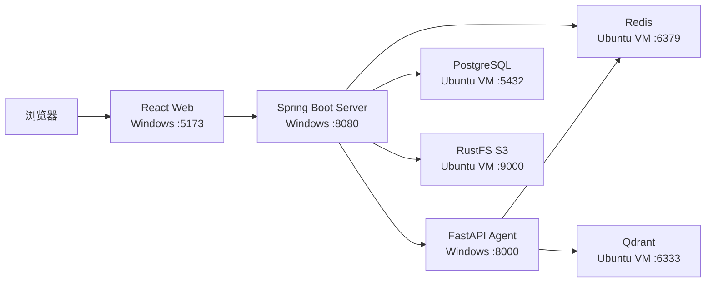

# Purple Nexus

Purple Nexus 是一个以个人展示、作品集、沉浸式博客和 AI Agent 为目标的个人网站项目。

项目采用 Monorepo 组织 React Web、Spring Boot Server 和 FastAPI Agent，并通过 PostgreSQL、Redis、Qdrant 与 RustFS 提供本地基础设施。

当前仓库已完成 Day 1 工程基线，包括三端应用骨架、配置契约、健康检查、质量门禁和 GitHub Actions。正式业务页面、数据模型和 Agent 工作流将在后续阶段实现。

## 运行拓扑

- Windows 开发机运行 Web、Server 和 Agent。
- Ubuntu VM 通过 Docker Compose 运行 PostgreSQL、Redis、Qdrant 和 RustFS。
- Web 只访问 Server。
- Server 访问基础设施和 Agent。
- Agent 访问 Redis 与 Qdrant。
- 浏览器不直接访问 Agent 或基础设施。



## 仓库结构

```text
purple-nexus/
├── apps/
│   ├── web/       # React + TypeScript 前端
│   ├── server/    # Spring Boot 核心业务服务
│   └── agent/     # FastAPI AI 编排服务
├── docs/          # 长期设计与开发文档
├── plans/         # 分阶段任务规划
├── .github/       # GitHub Actions
└── compose.yaml   # 本地基础设施编排
```

## 前置环境

### Windows 开发机

- Git 2.x
- Node.js 24 LTS
- pnpm 11.x
- Python 3.13.x
- uv
- JDK 21
- Windows 默认 Java 保持 Java 17
- JDK 21 已在 Maven Toolchains 中注册
- 不需要安装全局 Maven

Maven Toolchains 的本地配置位于 `%USERPROFILE%\.m2\toolchains.xml`，其中的 `jdkHome` 指向开发者自己的 JDK 21 安装目录。

该文件和 JDK 绝对路径不得提交到仓库，也不得通过修改全局 `JAVA_HOME` 或 `PATH` 切换 Purple Nexus 的 Java 版本。

### Ubuntu VM

- Git 2.x
- Docker Engine
- Docker Compose v2
- 能够通过 NAT 与 Windows 开发机通信
- 当前仓库的一份检出，用于运行根级 `compose.yaml`

Windows 与 Ubuntu VM 中的仓库检出应指向同一提交。

## 配置准备

所有 `.env` 都是未跟踪的本地文件。首次启动时从安全示例创建，不要修改或提交 `.env.example` 来保存个人配置。

在 Ubuntu VM 的仓库根目录创建基础设施配置：

```bash
cp .env.example .env
```

在 Windows 仓库根目录创建三端应用配置：

```powershell
Copy-Item apps/web/.env.example apps/web/.env
Copy-Item apps/server/.env.example apps/server/.env
Copy-Item apps/agent/.env.example apps/agent/.env
```

编辑这些本地文件时需要保证：

- Server 的 PostgreSQL、Redis 和 S3 凭据与根 `.env` 一致。
- Server 和 Agent 使用同一个 `AGENT_SERVICE_TOKEN`。
- Server 和 Agent 中的基础设施地址指向 Ubuntu VM 的 NAT 地址。
- Web 的 API 地址默认指向本机 Server。
- 所有密码、Token 和访问密钥使用非空的本地值。
- 个人 VM 地址、真实凭据和本机绝对路径不得写入受 Git 跟踪的文件。

## 首次启动

以下四组操作分别在独立终端中执行。

### 1. 启动基础设施

在 Ubuntu VM 的仓库根目录执行：

```bash
docker compose up -d
docker compose ps
```

确认 PostgreSQL、Redis、Qdrant 和 RustFS 均达到健康状态，并且 RustFS 初始化任务成功完成，再启动 Windows 应用。

### 2. 启动 Agent

在 Windows 仓库根目录打开一个 PowerShell 终端：

```powershell
Set-Location apps/agent
uv sync --locked
uv run uvicorn purple_nexus_agent.main:app --reload
```

### 3. 启动 Server

Agent 启动后，在 Windows 仓库根目录打开另一个 PowerShell 终端：

```powershell
Set-Location apps/server
.\mvnw.cmd spring-boot:run
```

### 4. 启动 Web

Server 启动后，在 Windows 仓库根目录打开第三个 PowerShell 终端：

```powershell
Set-Location apps/web
pnpm install --frozen-lockfile
pnpm dev
```

Web 默认访问地址为 `http://localhost:5173`。

## 健康检查

### Agent

- `http://localhost:8000/health/live`：只检查 Agent 进程。
- `http://localhost:8000/health/ready`：检查 Redis 和 Qdrant。

### Server

- `http://localhost:8080/actuator/health/liveness`：只检查 Spring Boot 进程。
- `http://localhost:8080/actuator/health/readiness`：检查 PostgreSQL、Redis、RustFS 和 Agent。

### Web

打开 `http://localhost:5173`。Web 是浏览器应用，不额外伪造服务端健康端点。

Readiness 返回失败时，应检查对应依赖和本地配置；不能用 Liveness 成功代替整个系统就绪。

## 质量检查

在提交变更前，根据修改范围执行对应检查：

| 范围 | 工作目录 | 检查 |
| --- | --- | --- |
| Web | `apps/web` | `pnpm lint`、`pnpm test`、`pnpm build` |
| Server | `apps/server` | `.\mvnw.cmd verify` |
| Agent | `apps/agent` | `uv run ruff check .`、`uv run ruff format --check .`、`uv run pytest` |
| 基础设施 | 仓库根目录 | `docker compose config` |

GitHub Actions 会在面向 `develop`、`main` 的 Pull Request 和集成分支更新时执行同一组质量门禁。

## 停止环境

先在三个 Windows 终端中按 `Ctrl+C` 停止 Web、Server 和 Agent，再在 Ubuntu VM 的仓库根目录执行：

```bash
docker compose down
```

普通关闭会保留 PostgreSQL、Redis、Qdrant 和 RustFS 的命名卷。

不要在日常关闭流程中添加卷删除选项。删除卷属于破坏性数据重置，必须单独确认。

## 项目文档

- [产品范围](docs/01-product-scope.md)
- [系统架构](docs/02-architecture.md)
- [开发指南](docs/03-development-guide.md)
- [设计系统](docs/04-design-system.md)
- [Agent 设计](docs/05-agent-design.md)
- [决策记录](docs/06-decisions.md)
