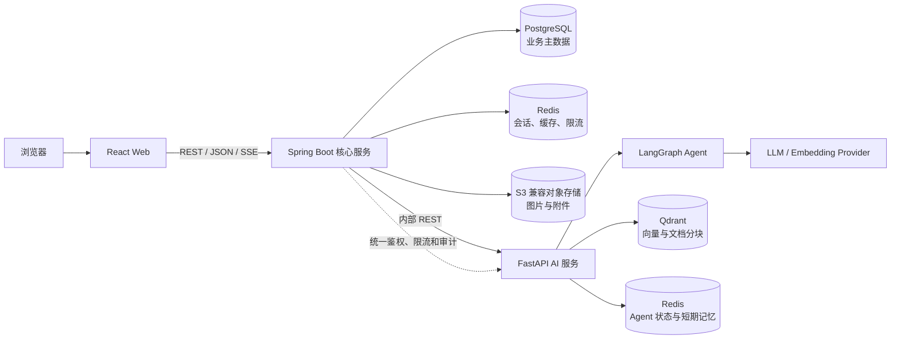
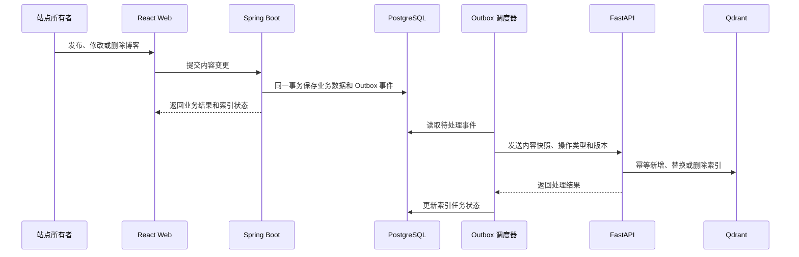
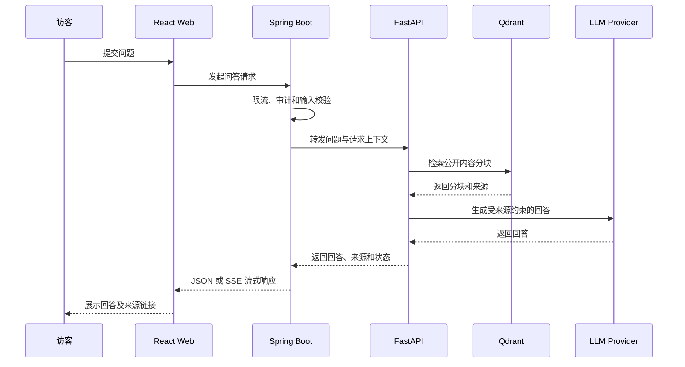

# Purple Nexus 系统架构

## 1. 文档职责

本文档定义 Purple Nexus 的系统边界、组件职责、数据归属、服务通信、安全边界和部署拓扑。

本文档不记录软件版本、API 字段、数据库表结构、Redis 参数、Agent 节点或具体部署命令。

## 2. 架构原则

- Spring Boot 是公开业务请求的统一入口和安全边界。
- 浏览器不直接访问 FastAPI、Qdrant、数据库或 LLM Provider。
- Spring Boot 管理业务主数据，FastAPI 管理可重建的 AI 派生数据。
- 服务之间通过明确契约通信，不跨服务读写对方的数据存储。
- Redis 只保存缓存、会话和运行状态，不作为业务事实来源。
- 初始部署保持简单，各服务仍应能够独立扩展和替换。

## 3. 系统拓扑

## 4. 组件职责

| 组件 | 核心职责 | 不承担的职责 |
| --- | --- | --- |
| React Web | 公开页面、管理界面、交互状态和流式内容展示 | 业务鉴权、AI 编排和密钥管理 |
| Spring Boot | 个人资料、作品、博客、发布流程、所有者认证、长期记忆治理、缓存、限流、审计和 AI 请求代理 | Embedding、向量检索和 Agent 编排 |
| FastAPI | 文档切分、Embedding、向量检索、RAG 和 LangGraph 编排 | 公开用户鉴权和业务主数据维护 |
| PostgreSQL | 业务主数据、发布状态、索引任务和 Outbox 事件 | 向量检索和临时会话状态 |
| Qdrant | 文档分块、向量、来源标识、内容版本和检索元数据 | 博客与作品的业务主数据 |
| Redis | 会话、缓存、限流、Agent 检查点和短期记忆 | 不可重建的长期业务数据 |
| 对象存储 | 图片和附件的二进制内容 | 文件关联关系和业务权限 |

Spring Boot 和 FastAPI 可以共用一个 Redis 实例，但必须使用独立命名空间隔离数据。

## 5. 数据归属

| 数据 | 所有者 | 存储位置 |
| --- | --- | --- |
| 个人资料、作品、博客、标签和发布状态 | Spring Boot | PostgreSQL |
| 所有者身份、管理会话和访问控制 | Spring Boot | PostgreSQL / Redis |
| 所有者确认的跨会话长期记忆 | Spring Boot | PostgreSQL |
| 图片、封面和博客附件 | Spring Boot | 对象存储，引用信息保存在 PostgreSQL |
| 索引任务、处理状态和重试记录 | Spring Boot | PostgreSQL |
| 文档分块、Embedding 和检索元数据 | FastAPI | Qdrant |
| Agent 检查点和短期记忆 | FastAPI | Redis |

PostgreSQL 中的已发布博客是知识库的唯一业务事实来源。Qdrant 中的数据属于派生索引，必须能够通过源内容重新构建。

## 6. 通信与一致性

| 场景 | 通信方式 | 一致性要求 |
| --- | --- | --- |
| 页面查询和内容管理 | React → Spring Boot，REST / JSON | 同步 |
| AI 问答 | React → Spring Boot → FastAPI，SSE 或 JSON | 同步请求，可流式响应 |
| 知识库索引 | Spring Boot → FastAPI，内部 REST | 异步、最终一致 |
| 服务健康检查 | 服务间内部 HTTP | 实时 |

首版统一采用 HTTP，不同时维护 REST 与 gRPC 两套服务契约。只有在出现明确的性能或强类型通信需求后，才重新评估 gRPC。

### 6.1 内容发布与知识库索引

博客保存和索引事件必须在同一个 PostgreSQL 事务中提交。后台调度器读取 Outbox 事件并调用 FastAPI，失败时安全重试。

索引状态至少应能表达待处理、处理中、成功和失败。重复事件不得产生重复分块，旧版本事件不得覆盖新版本索引。

### 6.2 RAG 问答

FastAPI 只检索允许公开的内容。检索不到可靠依据时，返回明确的无法回答状态，而不是生成无来源结论。

## 7. 安全与缓存边界

### 7.1 安全边界

- 公开内容允许匿名读取，但需要基础限流和输入校验。
- 所有写操作必须由 Spring Boot 验证站点所有者身份。
- 管理会话由 Spring Boot 管理，通过安全的 HttpOnly Cookie 传递，并保护状态变更请求免受 CSRF 攻击。
- FastAPI、Qdrant、PostgreSQL 和 Redis 只允许内部网络访问。
- Spring Boot 调用 FastAPI 时必须携带服务凭证。
- LLM、Embedding 和对象存储密钥只保存在对应后端服务中。

### 7.2 缓存边界

- Redis 不作为业务数据或向量数据的最终来源。
- 只缓存公开且读取频繁的内容，写操作完成后主动失效相关缓存。
- Spring Boot 缓存与 FastAPI 状态使用独立命名空间。
- 缓存有效期和具体 Key 结构由配置与代码维护，不在本文档中固定。

## 8. 部署边界

- React Web 以静态资源形式部署，通过统一域名访问 Spring Boot。
- Spring Boot 是唯一公开的动态服务；FastAPI 和基础设施保持内部访问。
- 初始阶段允许在单台主机上使用容器部署，但各服务保持独立进程和独立配置。
- MVP 可以使用单节点 Qdrant，并保留快照或全量重建索引的能力。
- 当公开服务需要更高可用性时，Qdrant 应升级为托管服务或具备副本的多节点集群。
- Spring Boot、FastAPI 和 Qdrant 应能够根据业务流量分别扩展。
