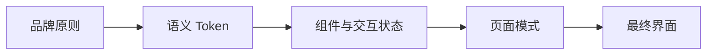

# Purple Nexus 设计系统

## 1. 文档职责

本文档定义 Purple Nexus 的视觉语言、语义 Token、组件组织、主题元素、动画规则和无障碍基线。

本文档不记录具体字体、渐变参数、Tailwind 类名、组件属性、页面线框、设计稿或素材文件清单。

## 2. 设计原则

- MVP 以浅色主题为主，通过语义 Token 保留扩展其他主题的能力。
- 视觉美感、强二次元风格和主题契合度优先，其次保证必要的可读性与操作识别。
- 丁香紫、浅青与纯白构成基础倾向，允许按角色和场景使用丰富色彩与渐变。
- Glassmorphism、发光和主题装饰服务于画面层次，阅读页和管理页保持克制。
- 采用桌面优先策略，桌面端承载完整构图与动效，移动端保证核心内容和操作可用。
- 加载性能服从视觉方案，运行卡顿、交互延迟和资源泄漏仍必须避免。
- 各页面按目标独立设计布局，不强制复用固定栏数或统一页面骨架。
- 页面和组件只使用语义 Token，不直接写入临时颜色、阴影或动画数值。

## 3. Token 体系



具体值只在前端 Token 配置中维护，本文档只定义语义和使用边界。

### 3.1 颜色

| Token 类别 | 用途 |
| --- | --- |
| `canvas` | 页面基础背景 |
| `surface` | 普通内容容器 |
| `surface-glass` | 毛玻璃容器 |
| `primary` | 丁香紫品牌与主要操作 |
| `secondary` | 浅青色辅助信息与能量效果 |
| `gradient` | 背景、描边、文字、光晕与场景过渡 |
| `text-primary`、`text-secondary` | 主要与辅助文字 |
| `border`、`focus` | 边界与键盘焦点 |
| `success`、`warning`、`danger` | 语义状态 |

### 3.2 字体与排版

- 具体字体在页面开发前结合角色素材、实际文案和构图确认，不在设计阶段预先锁定。
- 字体首先满足二次元主题、美感和氛围，其次保证正文、信息层级与操作文字可辨识。
- 标题、正文与代码可采用不同字体，但中文、西文和数字的组合必须协调。
- 字体层级保留 `display`、`heading`、`body`、`label` 和 `code`。
- Markdown 正文宽度控制在约 65～75 个字符，避免过长行影响阅读。

### 3.3 渐变

- 渐变是主题的重要表现手段，可用于背景、文字、描边、按钮、光晕和场景过渡。
- 具体颜色、角度、色标和使用范围在对应页面开发前确认。
- 已确认的渐变通过语义 Token 复用，不在页面中散落临时值。

### 3.4 间距与形状

- 使用 4px 基础间距网格。
- 页面可按内容采用不同构图，但间距等级和响应式留白保持一致。
- 圆角是主要界面形状，切角、缺口和机械边框只作为科技感点缀。
- 圆角使用 `small`、`medium`、`large` 和 `full` 四个语义等级。
- 响应式断点和具体数值由前端 Token 配置维护。

## 4. 组件组织

基础组件采用 shadcn/ui 与 Radix Primitives，并通过 Tailwind CSS 和语义 Token 统一主题。

```text
src/
├─ app/
├─ components/
│  ├─ ui/
│  └─ shared/
├─ features/
├─ layouts/
├─ pages/
├─ hooks/
├─ services/
├─ styles/
└─ utils/
```

- `ui` 保存无业务含义的基础组件，`shared` 只保存跨业务复用的组合组件。
- 博客、作品、Agent 和管理功能的组件、Hooks 与服务由各自 `features` 目录维护。
- `layouts` 维护页面外壳，`pages` 只负责路由页面组装。
- 不建立重复包装基础组件的品牌层；Purple Nexus 风格由 Token、全局样式和组件变体实现。
- 组件只在产生真实跨业务复用后提升到 `shared`。

## 5. 玻璃与发光层级

| 层级 | 使用位置 |
| --- | --- |
| `subtle` | 导航、普通卡片和轻量分隔 |
| `interactive` | Hover、Focus 和选中状态 |
| `hero` | 首页主视觉和关键 Agent 入口 |

- 长篇正文和主要表单使用稳定、接近不透明的背景。
- 同一区域只保留一个主要发光焦点。
- 发光不能代替文字、边框或状态标识。
- 毛玻璃必须提供不透明降级样式。

## 6. 页面模式

| 模式 | 设计策略 |
| --- | --- |
| 欢迎 | 首页同时承担欢迎页职责，采用滚动叙事，不使用固定三栏或强制跳过的启动画面 |
| 展示 | 作品页允许较强的主题装饰与动画，但布局按内容单独设计 |
| 阅读 | 博客页降低装饰密度，优先保证排版和代码可读性 |
| 管理 | 强调信息密度、操作反馈和稳定布局，减少持续动画 |
| Agent | 使用数据流、能量聚合和状态变化表达检索与生成过程，具体交互布局延后确认 |

每个页面在开发前依次确认目标、素材、字体与渐变、桌面线框、动效、移动端降级和组件拆分。

## 7. 主题素材

项目允许使用或改编以下素材：

- 官方角色立绘、剪影和角色专属徽标。
- 游戏截图、官方 UI、音效和动画素材。
- 对官方图标、纹理和边框的描摹或改编。
- 原创 D-pad、能量轨道、扫描线、全息边框和机械展开元素。

使用约束：

- 项目保持个人非商业性质，不宣称官方认证或合作关系。
- 官方素材与原创素材分开管理，并保留简单的来源说明。
- 音频必须由用户主动播放，并提供暂停和静音能力。
- 对官方 UI 的改编仍需映射到统一 Token 和组件状态。
- 页脚注明相关角色与素材版权归原权利方所有。

## 8. 动画

| 实现 | 职责 |
| --- | --- |
| Motion | 页面切换、组件状态、布局和常规交互动效 |
| GSAP + ScrollTrigger | 首页等少量重点滚动演出 |
| CSS | 流光、扫描线、呼吸光和背景渐变等环境效果 |

首版不引入 Three.js、Rive 或大型粒子引擎；只有页面方案出现明确需求时再评估。

| 类型 | 建议时长 | 场景 |
| --- | ---: | --- |
| 即时反馈 | 120～160ms | 按钮、开关和颜色变化 |
| 组件过渡 | 180～240ms | 卡片、菜单和浮层 |
| 展开与变身 | 320～480ms | 页面区块和 Agent 面板 |
| 环境动画 | 2～6s | 呼吸光和能量循环 |

- 进入使用减速曲线，离开使用加速曲线。
- 弹簧动画只用于拖拽、展开和少量强调交互。
- 同一组件不混用多套动画系统。
- 首页滚动动画不得劫持滚动速度；其他页面按功能控制动效强度。
- 移动端可移除复杂 Sticky、视差和滚动场景，只保留核心内容与必要反馈。
- 用户启用 `prefers-reduced-motion` 后，移除粒子、持续运动和大幅位移，只保留必要反馈。

## 9. 组件状态

所有交互组件至少覆盖默认、Hover、Focus Visible、Active、Disabled、Loading 和 Error 状态。

- Hover 不能是发现功能的唯一方式。
- 图标按钮必须提供可访问名称，装饰性图标不进入无障碍树。
- 同一界面不混用多个图标体系。
- Loading 状态不得导致主要布局明显跳动。
- 组件完整清单由源码或 Storybook 维护。

## 10. 桌面优先与无障碍

界面采用桌面优先策略，并以 [WCAG 2.2 AA](https://www.w3.org/TR/WCAG22/) 为最低目标：

- 桌面端提供完整视觉、布局和动效体验；具体目标分辨率在首页开发前确认。
- 移动端保证公开核心内容和主要操作可用，不要求复制桌面构图与演出。
- 管理端以桌面使用为主，不将完整移动端体验作为首版目标。
- 普通文字对比度至少为 4.5:1，大字号文字至少为 3:1。
- 交互目标优先达到 44×44 CSS px，不得无理由低于 24×24 CSS px。
- 键盘焦点必须持续可见，不得只依赖颜色表达状态。
- 移动端核心功能不得依赖 Hover，缩放后不得遮挡关键内容。
- 玻璃、纹理和发光不得降低正文及控件的可读性。
