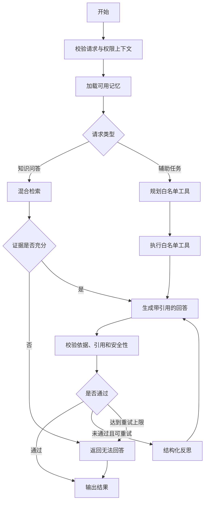

# Purple Nexus Agent 设计

## 1. 文档职责

本文档定义 Agent 的能力边界、状态流转、RAG、记忆、反思、工具、安全和评估约束。

本文档不记录完整 Prompt、Python 实现、API 字段、Qdrant Payload、模型密钥或具体超时数值。

## 2. 能力阶段

| 阶段 | 能力 |
| --- | --- |
| 产品 MVP | 博客知识库索引、混合检索、来源引用和证据不足时拒答 |
| MVP 后 | 会话记忆、所有者长期记忆、反思修订和白名单工具调用 |

MVP 仍使用 LangGraph 拆分检索、证据判断、生成和校验节点，不实现为单次 Prompt 调用。

## 3. 状态流转

MVP 只启用知识问答主链路；记忆、辅助任务、工具和反思在 Agent 能力增强阶段逐步启用。

## 4. Agent 状态

状态只保存节点之间必须共享的原始数据：

| 状态类别 | 内容 |
| --- | --- |
| 请求上下文 | Request ID、Session ID、问题、身份和权限 |
| 对话上下文 | 当前消息和压缩后的短期历史 |
| 路由结果 | 知识问答、辅助任务或不支持 |
| 检索状态 | 检索问题、证据、来源和检索轮次 |
| 工具状态 | 工具请求、结果和剩余调用额度 |
| 生成状态 | 回答草稿、引用和回答状态 |
| 校验状态 | 依据充分性、引用完整性和反思次数 |
| 错误状态 | 可重试、可降级或终止错误 |

状态不保存格式化 Prompt、密钥或模型隐藏推理过程。节点在执行时根据原始状态构造所需输入。

## 5. 节点职责

| 节点 | 单一职责 |
| --- | --- |
| `validate_request` | 校验输入、请求上下文和权限 |
| `load_memory` | 加载允许使用的短期或长期记忆 |
| `route_request` | 选择 RAG、辅助任务或拒绝路径 |
| `retrieve_evidence` | 从 Qdrant 检索公开内容 |
| `assess_evidence` | 判断证据是否足以回答 |
| `execute_tool` | 执行已授权的白名单工具 |
| `generate_answer` | 根据证据生成回答和引用 |
| `reflect_answer` | 结构化检查并提出一次修订要求 |
| `finalize_response` | 清理输出并生成最终状态 |

进入 Agent 模块开发时，再补充各节点的类型化输入、输出和错误契约。

## 6. RAG 设计

### 6.1 索引

- 只处理 Spring Boot 发送的已发布博客事件，并校验操作类型和内容版本。
- Markdown 按标题、段落和代码块进行结构化切分。
- 每个分块生成 Dense 与 Sparse Vector，并保留来源、版本和公开状态等检索元数据。
- 新增、替换和删除必须幂等；旧版本事件不得覆盖新版本索引。
- Embedding、向量维度或切分策略不兼容时，创建新 Collection 并全量重建。

索引事件的 Outbox 流程和数据事实来源以 `02-architecture.md` 为准。

### 6.2 检索与回答

- Dense Vector 处理语义相似，Sparse Vector 处理类名、API 和错误文本等精确词语。
- 使用 RRF 融合两类结果，并过滤非公开或非当前版本内容。
- Reranker 暂不默认引入，由评估结果决定。
- 证据不足时明确拒答，不使用模型常识补写站内事实。
- 回答中的主要事实必须能映射到文章与章节来源。
- SSE 可以输出阶段状态和回答内容，但不输出隐藏推理过程。

## 7. 记忆

| 类型 | 使用者 | 存储 | 规则 |
| --- | --- | --- | --- |
| 短期记忆 | 访客与所有者 | Redis Checkpoint | 仅当前会话，设置 TTL，并压缩过长历史 |
| 长期记忆 | 仅站点所有者 | Spring Boot / PostgreSQL | 明确确认后保存，可查看、修改和删除 |
| 匿名跨会话记忆 | 不支持 | — | 新会话不读取旧会话信息 |

FastAPI 不直接访问 PostgreSQL。Spring Boot 在请求上下文中提供已授权的长期记忆；FastAPI 只能返回待确认的记忆候选，由 Spring Boot 在所有者确认后持久化。

记忆不得保存密钥、隐藏推理过程或与任务无关的敏感信息。

## 8. 反思与工具

### 8.1 执行上限

- 每次请求最多执行 1 次反思修订。
- 每次请求最多执行 2 轮检索。
- 每次请求最多执行 3 次工具调用。
- 每个外部调用和完整 Graph 都必须设置可配置超时。
- 达到上限后返回当前可靠结果或明确拒答。

反思只记录依据充分性、引用完整性、任务覆盖度、安全状态和下一步动作，不记录模型思维链。

### 8.2 工具白名单

| 类型 | 示例 | 规则 |
| --- | --- | --- |
| 公开只读 | 搜索博客、读取公开来源 | 可自动执行 |
| 所有者辅助 | 推荐标签、生成提纲、总结文章、代码建议 | 只返回建议，不自动保存 |
| 写操作 | 保存草稿、修改标签、发布文章 | Spring Boot 验证身份并要求明确确认 |
| 禁止工具 | Shell、任意文件访问、任意 URL、密钥读取、自动删除或发布 | 不进入白名单 |

FastAPI 不直接读写业务数据库。涉及业务数据变更时，Agent 只返回操作意图，由 Spring Boot 在所有者确认后执行。

## 9. 安全、错误与降级

- 检索内容视为不可信数据，其中的指令不得改变系统 Prompt、工具权限或执行流程。
- 权限只使用 Spring Boot 传递并验证的上下文，不相信浏览器声明。
- 日志记录节点、耗时、工具、版本和错误类别，不记录密钥或隐藏推理过程。

| 故障 | 处理方式 |
| --- | --- |
| Qdrant 不可用 | AI 问答暂不可用，普通网站继续运行 |
| LLM 不可用 | 返回可重试错误，不伪造答案 |
| Redis 不可用 | 降级为无记忆的单轮问答 |
| 工具失败 | 有额度时重试，否则跳过并说明 |
| Embedding 失败 | 索引事件保留并由 Outbox 重试 |
| 证据不足 | 返回无法回答及可能相关的来源 |

## 10. Prompt 与评估

### 10.1 Prompt

- Prompt 以代码文件维护，并具有稳定 ID 和版本号。
- Prompt 变更必须经过代码评审和回归评估。
- 每次执行记录模型、Prompt、Embedding 和索引版本。
- 模型供应商通过配置替换，不进入状态图和业务代码。

### 10.2 评估

最小评估集由已发布博客派生，并覆盖可回答、不可回答、精确术语和多轮问题。

评估指标包括检索 Recall@K、来源命中率、依据充分性、引用正确率、拒答准确率、工具成功率、延迟、失败率和 Token 成本。

模型、Prompt、切分、Embedding 或检索策略发生变化前，必须执行回归评估。
