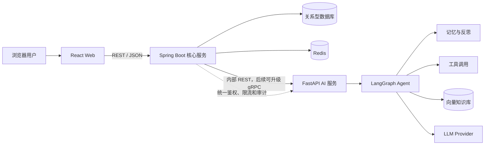

先确定一个统一、可扩展且不过度绑定原作 IP 的项目名称。

## 推荐名称

**Purple Nexus**

含义：

- **Purple**：对应 Neptune / Nepgear 女神化形态的紫色视觉基因。
- **Nexus**：代表个人内容、作品、知识库与 AI Agent 的连接中枢。
- 名称兼顾二次元气质和企业级项目的专业感，后续也适合作为个人技术品牌。

建议统一命名：

| 场景             | 名称                         |
| ---------------- | ---------------------------- |
| 网站展示名       | Purple Nexus                 |
| Git 仓库         | `purple-nexus`               |
| 前端应用         | `purple-nexus-web`           |
| Spring Boot 服务 | `purple-nexus-server`        |
| Python AI 服务   | `purple-nexus-agent`         |
| Java 根包名      | `com.<你的标识>.purplenexus` |
| Python 根包名    | `purple_nexus_agent`         |
| 数据库           | `purple_nexus`               |
| Redis Key 前缀   | `purple-nexus:`              |

网站副标题可以使用：

> Connect Creativity with Intelligence
> 连接创作、知识与智能

## 开发前的必要文档

保持精简，初始阶段只建立以下 6 份文档：

```
purple-nexus/
├── README.md
└── docs/
    ├── 01-product-scope.md
    ├── 02-architecture.md
    ├── 03-development-guide.md
    ├── 04-design-system.md
    ├── 05-agent-design.md
    └── 06-decisions.md
```

各文档只承担一个职责：

### `README.md`

项目唯一入口，只记录：

- 项目简介
- 核心功能
- 技术栈
- 仓库结构
- 最短启动步骤
- 其他文档链接

不在 README 中重复架构、接口和编码规范。

### `01-product-scope.md`

用于控制需求范围：

- 项目目标与非目标
- 用户角色
- 功能模块
- MVP 范围
- 每个模块的验收标准
- 开发顺序

初始模块顺序建议：

1. 个人主页
2. 作品列表
3. 作品新增、修改、删除
4. 博客列表
5. 博客新增、修改、删除
6. Markdown 阅读体验
7. 博客知识库构建
8. RAG 问答 Agent
9. Agent 记忆、反思与工具调用
10. 管理后台与系统完善

### `02-architecture.md`

描述系统长期稳定的整体边界：

- React、Spring Boot、FastAPI、Redis、数据库的职责
- 服务间调用方式
- 鉴权边界
- 数据归属
- 缓存策略
- 部署拓扑
- 核心调用链

初始架构如下：

````

````

架构原则：

- 浏览器默认不直接调用 AI 服务。
- Spring Boot 是统一业务入口和安全边界。
- FastAPI 只负责模型、RAG 和 Agent 编排。
- Redis 保存缓存、会话状态和短期记忆。
- 博客、作品、用户等业务数据由 Spring Boot 管理。
- AI 服务不重复维护业务主数据。

### `03-development-guide.md`

只保留开发人员真正需要执行的内容：

- JDK、Node.js、Python、Maven 版本
- 本地环境启动方式
- 环境变量名称
- Git 分支规范
- Conventional Commits 规范
- 测试和格式化命令
- 数据库迁移规则

分支规范建议：

```
main                 可发布版本
develop              日常集成
feature/<module>     功能开发
fix/<issue>          缺陷修复
refactor/<module>    重构
docs/<topic>         文档调整
```

### `04-design-system.md`

确保 Neptunia 主题不会在开发中逐渐失控：

- 基础颜色 Token
- 字体、间距、圆角和阴影
- Glassmorphism 参数
- 发光层级
- 动画时长与缓动函数
- D-pad、能量纹理等主题元素
- 无障碍和响应式规则

具体颜色最终应落到 Tailwind Token 中，文档只解释语义，不重复维护十六进制值。

### `05-agent-design.md`

AI Agent 的核心设计约束：

- Agent 能力边界
- LangGraph 状态定义
- 节点和条件边
- 短期、长期记忆策略
- RAG 数据流
- 工具白名单
- 反思循环及最大次数
- 超时、降级和错误处理
- Prompt 版本管理
- 评估指标与安全约束

这份文档先写设计骨架，等进入 Agent 模块时再补充状态图和节点契约，避免提前设计过度。

### `06-decisions.md`

使用精简的架构决策记录，不为每个决定创建一份文件：

```
## ADR-001：前端不直接调用 AI 服务

- 状态：已采纳
- 背景：需要统一鉴权、限流、审计和异常处理。
- 决策：所有公开请求先进入 Spring Boot。
- 影响：AI 服务可保持为仅内部访问的无用户鉴权服务。
```

仅记录“未来很可能会追问为什么这样设计”的决策。

## 明确不单独创建的文档

为了防止文档与代码不一致，以下内容不手写重复文档：

- REST API 文档：由 Springdoc OpenAPI 和 FastAPI OpenAPI 自动生成。
- 数据库字段文档：以 Flyway 迁移、实体和字段注释为准。
- 前端组件清单：以 Storybook 或组件源码为准。
- 项目进度表：使用 GitHub Issues/Projects。
- 测试用例总表：测试代码即执行标准。
- 部署命令副本：以脚本、Docker Compose 或 CI 配置为准。