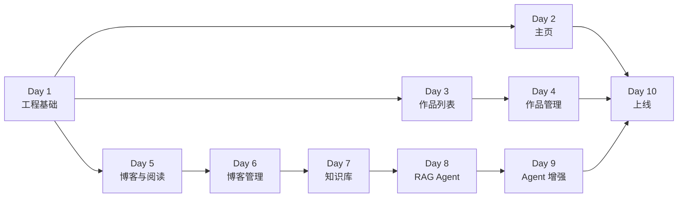

# Purple Nexus 十天上线计划

## 1. 文档职责

本文档将 Purple Nexus 拆解为十个开发日内可执行、可验收的上线任务。

本文档是一次性执行基线，不记录实时进度。仓库初始化后，各日任务转为 GitHub Issues，产品、架构和工程规范仍以 `docs/` 中的六份文档为准。

## 2. 目标与假设

十天目标是交付一个功能完整、公开可访问并具备基本安全与恢复能力的正式 MVP：

- 个人主页、作品、博客和 Markdown 阅读完整上线。
- 单所有者登录及作品、博客 CRUD 可用。
- 图片和附件可以管理。
- Qdrant 知识库支持增量同步和重建。
- RAG Agent 支持混合检索、来源引用和证据不足时拒答。
- 支持短期记忆、所有者长期记忆、一次反思和受限工具调用。
- 具备 HTTPS、限流、日志、备份、恢复和回滚能力。

计划假设一名开发者在 AI 辅助下每天投入约 8～10 小时。上线目标是单节点正式 MVP，不包含多节点高可用、大规模压测或完整商业运维平台。

## 3. 开始条件

Day 1 前应准备：

- Git 远程仓库。
- Linux 部署环境或其他确定的部署目标。
- 域名及 DNS 控制权限。
- LLM 与 Embedding 服务密钥。
- 站点所有者资料、作品和至少数篇博客内容。
- 计划使用的官方主题素材。
- 生产环境密钥保存方式。

部署环境、域名或模型密钥未就绪会直接阻塞 Day 8～10。

## 4. 关键路径



博客管理、知识库、RAG 和 Agent 增强构成连续关键路径，前置延误会直接压缩上线验证时间。

## 5. 十天总览

| 天数 | 分支 | 主要交付 | 当日验收 |
| ---: | --- | --- | --- |
| 1 | `chore/bootstrap` | Git、Monorepo、三端脚手架、Compose、CI、README 和健康检查 | 三个应用与基础设施可启动，基础检查通过 |
| 2 | `feature/home` | 组件与动效基础、滚动叙事首页、主题素材和桌面优先适配 | 桌面端体验完整，移动端核心内容与操作可用 |
| 3 | `feature/project-list` | 作品迁移、查询接口、公开列表与详情 | 列表和详情具备加载、空数据与异常状态 |
| 4 | `feature/project-management` | 所有者认证及作品新增、修改、删除 | 未授权写入被拒绝，草稿与公开内容隔离 |
| 5 | `feature/blog-list` | 博客列表、详情和 Markdown 阅读 | 已发布博客可稳定阅读，草稿不可公开访问 |
| 6 | `feature/blog-management` | 博客新增、修改、删除、发布和 Outbox | 业务数据与索引事件在同一事务提交 |
| 7 | `feature/knowledge-index` | Outbox 调度、分块、混合向量和 Qdrant 同步 | 新增、替换、删除、重复和乱序事件正确处理 |
| 8 | `feature/rag-agent` | LangGraph RAG、引用、拒答、SSE 和问答界面 | 可回答问题有来源，不可回答问题不编造 |
| 9 | `feature/agent-enhancements` | 记忆、反思、工具、版本追踪和 AI 状态管理 | 记忆、执行上限和权限边界全部通过 |
| 10 | `chore/release-v1` | 回归、安全、备份、生产部署、HTTPS 和回滚 | 公网可访问，核心流程、恢复和回滚通过 |

## 6. 每日任务

### Day 1：工程基础

- 初始化 Git，提交现有文档并创建 `main`、`develop`。
- 初始化 `apps/web`、`apps/server` 和 `apps/agent`。
- 配置 PostgreSQL、Redis、Qdrant 和对象存储。
- 建立 Flyway、MyBatis、uv、pnpm 和 Maven Wrapper。
- 创建三端最小测试、格式检查和 CI。
- 创建根 README、应用 `.env.example` 和统一健康检查。

验收：从空环境按开发指南启动所有组件，基础质量命令全部通过。

建议提交：

```text
chore: bootstrap purple nexus monorepo
```

### Day 2：设计系统与主页

- 编码前确认首页内容、素材、字体、渐变、线框和滚动动效。
- 建立 shadcn/ui、Radix、Tailwind Token、Motion 和限量 GSAP 基础。
- 建立公共页面外壳、导航和页脚，不预设其他功能页布局。
- 完成承担欢迎功能的滚动叙事首页，并展示必要个人信息与特色入口。
- 加入官方主题素材及非官方项目声明。
- 完成桌面端完整体验、移动端基础降级、键盘焦点和 Reduced Motion。

验收：主页在目标桌面视口达到完整效果；移动端可访问核心内容，无键盘阻塞和关键内容溢出。

建议提交：

```text
feat(web): build themed personal home page
```

### Day 3：作品列表

- 创建作品表和 Flyway 迁移。
- 实现 Mapper、Service、Controller 查询链路。
- 提供已发布作品列表和详情接口。
- 完成 React Query、作品卡片和详情页。
- 覆盖加载、空数据、异常和基础测试。

验收：访客只能浏览已发布作品，列表和详情状态完整。

建议提交：

```text
feat(project): add public project browsing
```

### Day 4：作品管理

- 在首个写接口前完成所有者认证。
- 实现安全 Session、CSRF 和写接口鉴权。
- 按新增、修改、删除顺序完成作品管理。
- 接入封面上传、输入校验和缓存失效。
- 验证草稿隔离和未授权访问。

验收：所有者可以完成完整 CRUD，访客无法调用管理接口或看到草稿。

建议提交：

```text
feat(project): add protected project management
```

### Day 5：博客与 Markdown

- 创建博客表和 Flyway 迁移。
- 实现已发布博客列表和详情。
- 实现 Markdown、目录、代码高亮和图片渲染。
- 完成阅读排版、响应式布局和异常状态。
- 过滤不安全 HTML 与脚本内容。

验收：已发布博客可以安全阅读，草稿和未发布地址不可公开访问。

建议提交：

```text
feat(blog): add markdown blog reading
```

### Day 6：博客管理

- 按新增、修改、删除顺序完成博客管理。
- 实现草稿、发布和撤回。
- 提供 Markdown 编辑与预览。
- 支持文章图片和附件。
- 在博客事务中写入 Outbox 事件。
- 在管理端展示知识库索引状态。

验收：发布状态、缓存失效和 Outbox 事务一致性正确。

建议提交：

```text
feat(blog): add protected blog management
```

### Day 7：知识库

- 实现 Outbox 后台调度和失败重试。
- 实现 FastAPI 索引接口和服务认证。
- 对 Markdown 执行结构化分块。
- 生成 Dense 与 Sparse Vector。
- 实现 Qdrant 幂等新增、替换和删除。
- 支持 Collection 初始化和全量重建。
- 覆盖重复、乱序、旧版本和失败事件测试。

验收：博客新增、修改、撤回和删除后，Qdrant 最终保持一致并可重建。

建议提交：

```text
feat(agent): build blog knowledge index
```

### Day 8：RAG Agent

- 实现请求校验、检索、证据判断、生成和输出节点。
- 使用 RRF 融合 Dense 与 Sparse 检索结果。
- 生成可点击的文章与章节来源。
- 证据不足时明确拒答。
- 由 Spring Boot 代理 SSE。
- 完成问答界面的加载、错误和中断状态。
- 建立覆盖可回答、不可回答和精确术语的最小评估集。

验收：答案主要结论可以追溯来源，评估集中的不可回答问题不会被编造回答。

建议提交：

```text
feat(agent): add grounded rag question answering
```

### Day 9：Agent 增强

- 接入 Redis Checkpoint 和会话历史压缩。
- 实现所有者长期记忆的查看、确认和删除。
- 实现最多一次结构化反思修订。
- 实现博客搜索、来源读取和标签建议工具。
- 限制检索、反思和工具调用次数。
- 记录模型、Prompt、Embedding 和索引版本。
- 提供最小 AI 健康和索引状态管理页面。

验收：多轮对话、记忆管理、反思上限、工具白名单和所有者权限均通过测试。

建议提交：

```text
feat(agent): add memory reflection and tools
```

### Day 10：发布

- 执行三端全部质量检查和端到端核心流程回归。
- 从空数据库执行完整 Flyway 迁移。
- 验证 Qdrant 全量重建。
- 检查 Cookie、CSRF、CORS、限流和密钥。
- 执行桌面端完整回归，以及移动端核心路径、键盘和 Reduced Motion 冒烟测试。
- 配置生产容器、反向代理、域名和 HTTPS。
- 验证 PostgreSQL、对象文件和配置备份恢复。
- 部署生产环境并执行线上冒烟。
- 记录回滚步骤并创建发布标签。

验收：公网地址可访问，核心流程、备份恢复和上一版本回滚已实际验证。

建议提交：

```text
chore(release): prepare first public release
```

## 7. 上线完成标准

只有同时满足以下条件，才视为十天项目完成：

- 首页、作品、博客和 Agent 均可通过 HTTPS 访问。
- 所有者可以安全登录并完成作品、博客 CRUD。
- 草稿和管理接口不能被访客访问。
- 博客变更能够可靠同步或重建到 Qdrant。
- RAG 回答提供来源，证据不足时拒答。
- 短期记忆、长期记忆、反思和工具边界符合设计。
- Web、Spring Boot、FastAPI 和 Compose 检查全部通过。
- 空数据库迁移、备份恢复和索引重建已经实际验证。
- 没有密钥进入 Git 或前端构建产物。
- 关键页面完成桌面端完整验证，以及移动端核心路径、键盘和 Reduced Motion 验证。
- 生产服务具有健康检查、结构化日志和基础限流。
- 存在可执行的上一版本回滚方法。

## 8. 延期裁剪顺序

进度落后时，只裁剪表现层和自动化程度：

1. 减少环境动画和额外官方素材。
2. 简化 Markdown 编辑器，保留编辑与预览。
3. 工具只保留博客搜索、来源读取和标签建议。
4. 简化管理状态页面，不制作复杂图表。
5. 首次发布使用可重复的手动部署，不强求自动 CD。

不得裁剪：

- 所有者鉴权和草稿隔离。
- 数据库迁移及作品、博客 CRUD。
- Qdrant 增量同步和重建。
- RAG 来源、拒答和 Agent 执行上限。
- HTTPS、密钥保护、备份和线上冒烟。
