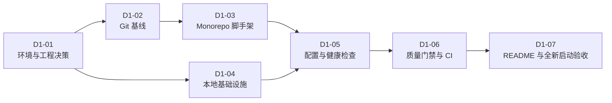

# Purple Nexus Day 1 总体任务规划

## 1. 文档职责

本文档定义 Purple Nexus 第一天开发工作的总体目标、阶段边界、依赖关系、交付物和完成标准。

本文档只作为 Day 1 的总控规划，不展开具体安装命令、脚手架参数、配置内容或代码实现。每个阶段在开始前单独创建任务规划；当前阶段执行并通过验收后，才规划下一阶段。

Day 1 严格按照以下节奏推进：

```text
当前阶段规划 -> 当前阶段执行 -> 下一阶段规划 -> 下一阶段执行
```

- 规划文档只回答“做什么、为什么做、产出什么、何时算完成”。
- 具体命令、代码、配置内容、文件修改和验证操作在执行时由用户直接询问，导师在对话中即时回答。
- 执行细节不追加到规划文档；只有实际结果改变任务边界时，才修订规划。
- 当前阶段未执行并通过验收前，不创建下一阶段规划。

产品范围、系统边界、开发规范和长期技术决策仍分别以 `docs/01-product-scope.md`、`docs/02-architecture.md`、`docs/03-development-guide.md` 和 `docs/06-decisions.md` 为准。

## 2. Day 1 总体目标

在约 8～10 小时内建立一个可重复启动、可持续扩展、具备基础质量门禁的 Monorepo 工程底座：

- Git 仓库、远程仓库和分支基线可用。
- React Web、Spring Boot Server 和 FastAPI Agent 三个应用具备最小可运行骨架。
- PostgreSQL、Redis、Qdrant 和 S3 兼容对象存储可通过 Docker Compose 启动。
- 三个应用具备最小健康检查、配置示例和基础测试。
- Web、Server、Agent 和基础设施的质量检查可在本地及 CI 中执行。
- 新开发者可以仅依据根 `README.md` 从空环境完成首次启动。

Day 1 的成功标准不是“创建了很多目录”，而是工程骨架能够被实际启动、验证和复现。

## 3. 规划时起点

规划日期：2026-07-24。

当前仓库状态：

- 已存在 `docs/`、`plans/` 和项目协作规范，尚无应用代码。
- `plans/day1/` 已创建，本文件作为该目录的总入口。
- 根 `README.md`、`compose.yaml`、三端应用和 CI 尚未建立。
- 当前 `.git` 目录为空，Git CLI 尚未将当前目录识别为有效仓库。

当前开发机状态：

| 工具 | 当前状态 | Day 1 基线 |
| --- | --- | --- |
| Git | 2.53.0，可用 | Git 2.x |
| Node.js | 24.13.0，可用 | Node.js 24 LTS |
| pnpm | 11.9.0，可用 | pnpm 11.x |
| JDK | 17.0.12，可用 | JDK 21 LTS |
| Python | 3.10.20，可用 | Python 3.13.x |
| uv | 不可用 | 项目锁定版本 |
| Docker Compose | 不可用 | Docker Compose v2 |

因此，环境对齐必须先于脚手架和基础设施验证。

## 4. 范围边界

### 4.1 Day 1 包含

- 环境与关键工程标识确认。
- Git 初始化、远程关联和分支基线。
- 三端最小脚手架及依赖锁定。
- 本地基础设施和持久化卷。
- 环境变量示例与健康检查。
- 最小测试、静态检查、构建和 CI。
- 根 README 与空环境启动验证。

### 4.2 Day 1 不包含

- 首页视觉方案、主题 Token、正式组件和动画。
- 作品、博客、用户等业务模型、数据库表和 CRUD。
- 所有者登录、Session、CSRF 和业务鉴权。
- 文档分块、Embedding、Qdrant Collection 和知识库同步。
- LangGraph 状态机、RAG、记忆、反思和工具调用。
- 生产部署、域名、HTTPS、备份和恢复。

上述内容分别属于 Day 2～Day 10，不能因为脚手架已经具备扩展位置而提前实现。

## 5. 阶段依赖



任何阶段未执行并通过自身验收时，不规划或执行依赖它的下一阶段。安装和依赖下载处于等待状态时，仍属于当前阶段，不能用未验证状态代替验收。

## 6. 阶段总览

| 阶段 | 目标 | 核心交付 | 完成闸门 | 预计时间 | 后续详细规划 |
| --- | --- | --- | --- | ---: | --- |
| D1-01 环境与工程决策 | 消除工具链和命名阻塞 | JDK 21、Python 3.13、uv、Docker Compose；远程仓库、Java 根包名和 CI 平台结论 | 所有工具版本可核验，关键决策无占位符 | 1～1.5h | `01-environment-and-decisions.md` |
| D1-02 Git 基线 | 建立可追踪的开发起点 | 有效 Git 仓库、`main`、`develop`、远程关联和 `chore/bootstrap` | 工作区状态、分支来源和远程状态正确 | 0.5h | `02-git-baseline.md` |
| D1-03 Monorepo 脚手架 | 建立三个独立可构建应用 | `apps/web`、`apps/server`、`apps/agent` 及锁文件、Wrapper 和最小测试 | 三端在不依赖业务功能时可独立启动并完成基础测试 | 2～2.5h | `03-monorepo-scaffolding.md` |
| D1-04 本地基础设施 | 提供统一的本地依赖 | PostgreSQL、Redis、Qdrant、对象存储、网络、卷和容器健康检查 | `docker compose up -d` 后所有基础设施达到健康状态 | 1～1.5h | `04-local-infrastructure.md` |
| D1-05 配置与健康检查 | 建立应用和环境的最小运行契约 | 三端 `.env.example`、配置校验、应用健康端点和依赖连通性 | 缺少必需配置时明确失败，配置完整时健康检查通过 | 1～1.5h | `05-configuration-and-health.md` |
| D1-06 质量门禁与 CI | 让错误在合并前暴露 | Lint、格式化、测试、构建、Compose 校验和 CI Workflow | 本地质量命令全部通过，CI 不依赖本地密钥 | 1～1.5h | `06-quality-gates-and-ci.md` |
| D1-07 README 与全新启动验收 | 证明工程可以被复现 | 根 README、最终目录说明、最短启动流程和全新环境验证记录 | 严格按照 README 可完成安装、启动、检查和关闭 | 1h | `07-readme-and-clean-start.md` |

阶段执行时间约为 8～9.5 小时，剩余时间作为依赖下载、镜像拉取和 Windows 环境问题的缓冲。

## 7. 关键工程决策输入

D1-01 结束前必须确认以下内容：

| 决策 | 默认建议 | 未确认的影响 |
| --- | --- | --- |
| 项目正式名称 | `Purple Nexus` | 影响 README、应用标识和包名 |
| Java 根包名 | 优先使用 `io.github.<GitHub 用户名>.purplenexus`，有自有域名时使用反向域名 | 阻塞 Spring Boot 脚手架 |
| Git 远程仓库 | 使用 `purple-nexus` 仓库 | 不阻塞本地初始化，但阻塞推送和 CI |
| CI 平台 | 远程位于 GitHub 时使用 GitHub Actions | 阻塞 CI 文件的最终格式 |
| 对象存储实现 | 本地使用 MinIO，生产保持 S3 兼容 | 影响 Compose 服务与环境变量 |
| 本地端口 | 详细阶段统一分配，禁止随脚手架临时决定 | 端口冲突会阻塞联合启动 |

未确认的决策不得以散落在代码中的临时值代替。若必须采用暂定值，应在对应阶段规划中明确记录替换条件。

## 8. Day 1 目标结构

以下仅展示 Day 1 需要形成的主要结构；框架内部文件由对应阶段规划展开。

```text
purple-nexus/
├── .github/
│   └── workflows/
│       └── ci.yml
├── apps/
│   ├── web/
│   │   ├── src/
│   │   ├── .env.example
│   │   ├── package.json
│   │   └── pnpm-lock.yaml
│   ├── server/
│   │   ├── src/
│   │   ├── .env.example
│   │   ├── mvnw
│   │   ├── mvnw.cmd
│   │   └── pom.xml
│   └── agent/
│       ├── src/
│       ├── tests/
│       ├── .env.example
│       ├── pyproject.toml
│       └── uv.lock
├── infra/
├── docs/
├── plans/
│   ├── day1/
│   │   └── 00-day1-overview.md
│   └── 10-day-launch-plan.md
├── .editorconfig
├── .gitignore
├── compose.yaml
└── README.md
```

只有当 `infra/` 中存在实际配置或脚本时才提交该目录，不为保持目录外观而创建无意义占位文件。

## 9. Git 交付策略

Day 1 使用以下分支流转：

```text
main
  └── develop
        └── chore/bootstrap
```

- 现有项目文档先形成可追踪的基线。
- Day 1 工程工作统一在 `chore/bootstrap` 完成。
- 每个提交保持可解释和可验证，不将全部工作压缩为一个无法审查的大提交。
- 具体 `git add`、`git commit` 和 `git push` 命令放入对应阶段的详细规划。

建议的提交边界：

1. 项目文档与 Git 基线。
2. 三端应用脚手架。
3. 本地基础设施和配置示例。
4. 健康检查、质量门禁与 CI。
5. README 和全新启动验证修正。

提交消息必须遵循 `docs/03-development-guide.md` 中的 Conventional Commits 规范。

## 10. Day 1 总体验收

只有同时满足以下条件，Day 1 才能标记为完成：

### 10.1 仓库与安全

- Git 仓库有效，`main`、`develop` 和 `chore/bootstrap` 的来源关系正确。
- 必需的远程分支已经推送；若远程尚未准备，必须明确记录为外部阻塞。
- `.env`、密钥、构建产物、IDE 私有文件和本地数据未进入 Git。
- 三个应用的 `.env.example` 只包含安全示例值，并与实际必需配置一致。

### 10.2 应用与基础设施

- Web、Spring Boot 和 FastAPI 可分别独立启动。
- PostgreSQL、Redis、Qdrant 和对象存储容器可以统一启动和停止。
- 所有容器健康检查通过，数据卷不会因普通 `docker compose down` 被误删。
- 应用健康端点返回明确状态，依赖不可用时能够暴露故障而不是伪装健康。

### 10.3 质量门禁

- Web：`pnpm lint`、`pnpm test`、`pnpm build` 全部通过。
- Spring Boot：`.\mvnw.cmd verify` 通过。
- FastAPI：Ruff 检查、格式检查和 Pytest 全部通过。
- 基础设施：`docker compose config` 通过。
- CI 执行与本地质量门禁保持一致。

### 10.4 可复现性

- 根 README 提供前置环境、配置准备、启动顺序、健康检查、质量检查和停止方式。
- 按 README 从未安装项目依赖的状态可以完成首次启动。
- 锁文件、Maven Wrapper 和 Compose 配置足以固定 Day 1 的依赖基线。
- 不依赖未记录的全局 Maven、全局 Python 包或人工控制台配置。

## 11. 风险与处理原则

| 风险 | 影响 | Day 1 处理原则 |
| --- | --- | --- |
| JDK、Python 与文档基线不一致 | 构建结果与 CI 漂移 | D1-01 先完成版本对齐，再生成锁文件 |
| uv 或 Docker 不可用 | Agent 与基础设施无法验收 | 作为阻塞项处理，不跳过验证 |
| Git 远程仓库尚未创建 | 无法推送分支或运行 CI | 本地工作可继续，但 Day 1 不能宣称完整完成 |
| 依赖或镜像下载缓慢 | 压缩后续验证时间 | 优先完成环境下载，并保留时间缓冲 |
| 脚手架默认引入过多依赖 | 增加维护成本和启动故障面 | 只引入 Day 1 和已确认架构必需的依赖 |
| 为健康检查编写业务逻辑 | 提前跨入后续模块 | 健康检查只验证进程、配置和必要依赖 |
| README 与真实命令不一致 | 无法从空环境复现 | D1-07 必须实际按 README 重新执行 |

## 12. 后续阶段规划规则

后续在 `plans/day1/` 中按阶段逐份创建：

```text
plans/day1/
├── 00-day1-overview.md
├── 01-environment-and-decisions.md
├── 02-git-baseline.md
├── 03-monorepo-scaffolding.md
├── 04-local-infrastructure.md
├── 05-configuration-and-health.md
├── 06-quality-gates-and-ci.md
└── 07-readme-and-clean-start.md
```

每份阶段规划必须包含：

1. 本步目标与原理。
2. 前置条件、输入和明确非目标。
3. 必要时的 Mermaid 架构或流程图。
4. 当前阶段的任务拆分和先后依赖。
5. 预期工程结构变化与交付物。
6. 验收标准、风险和阻塞条件。
7. 规划完成后的 Stop & Check。

阶段规划不得包含：

- 具体安装或执行命令。
- 完整或片段化的实现代码。
- 配置文件的具体内容。
- 逐条点击、终端操作或排错教程。
- `git add`、`git commit`、`git push` 等执行命令。
- 当前阶段的执行日志或验证输出。

上述内容在该阶段进入执行时由用户直接询问，导师在对话中根据实时环境给出。阶段文档不得复制本总览的背景说明，也不得提前规划或实现后续阶段。总览负责回答“Day 1 做什么以及何时算完成”，阶段规划负责回答“当前阶段要完成哪些任务以及用什么标准验收”。
