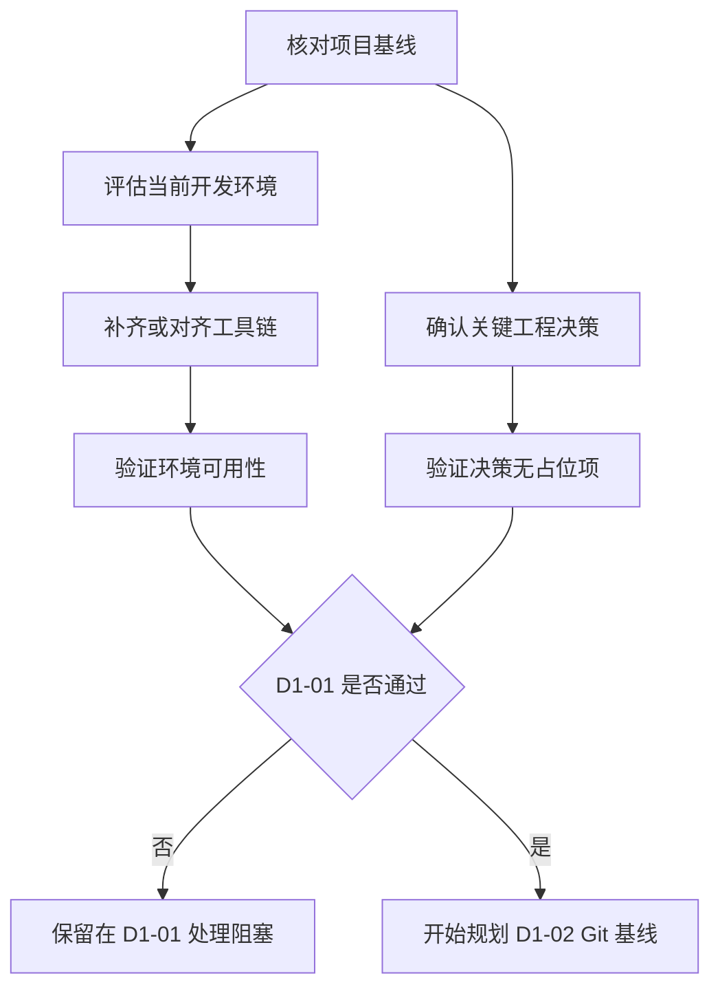

# D1-01 环境与工程决策规划

## 1. 文档职责

本文档只规划 D1-01“环境与工程决策”阶段需要完成的任务、任务边界、预期产物和验收标准。

本文档不包含具体安装命令、终端操作、配置内容、代码、Git 命令或执行日志。进入本阶段执行时，由用户直接询问，导师根据当时的真实环境逐项给出操作并完成验证。

项目推进顺序固定为：

```text
D1-01 规划 -> D1-01 执行 -> D1-02 规划 -> D1-02 执行
```

D1-01 尚未执行并通过验收前，不创建 D1-02 的详细规划。

## 2. 本步目标与原理

### 2.1 要做什么

在创建任何应用脚手架之前，完成开发工具链对齐，并确认会影响包名、仓库、CI、Compose 和后续配置的关键工程决策。

本阶段需要形成两个结果：

1. 开发机具备 Day 1 后续阶段要求的稳定工具链。
2. 后续脚手架不得再出现命名、平台、端口和基础设施实现方面的占位决策。

### 2.2 为什么先做

运行时版本会影响脚手架、依赖解析、锁文件和 CI。若先以不符合项目基线的 JDK 或 Python 创建工程，再切换版本，容易造成构建漂移和重复返工。

Java 根包名、远程仓库、CI 平台和对象存储实现也会进入后续工程文件。一旦脚手架生成后再修改，影响范围会从单一决策扩大为跨目录重命名和配置迁移。

因此，D1-01 是 Day 1 的入口闸门，必须先执行并验收。

## 3. 阶段关系



环境安装完成不代表本阶段通过；工具链和工程决策必须同时满足验收标准。

## 4. 上游依据

| 文档 | 本阶段采用的约束 |
| --- | --- |
| `docs/02-architecture.md` | PostgreSQL、Redis、Qdrant、S3 兼容对象存储及服务间 HTTP 边界 |
| `docs/03-development-guide.md` | JDK、Node.js、pnpm、Python、uv、Docker Compose 和 Git 的版本基线 |
| `docs/06-decisions.md` | Monorepo、服务间 HTTP、数据归属和独立向量数据库决策 |
| `plans/day1/00-day1-overview.md` | D1-01 的范围、时间、依赖和 Day 1 总体验收 |

具体补丁版本最终由构建文件、锁文件和 CI 固定，不在本规划中重复维护。

## 5. 当前起点

规划检查日期：2026-07-24。

| 项目 | 当前状态 | 与项目基线的关系 |
| --- | --- | --- |
| Git | 已安装并可用 | 满足 |
| Node.js | 24.x，可用 | 满足 |
| pnpm | 11.x，可用 | 满足 |
| JDK | 当前为 17 | 需要对齐到 21 |
| Python | 当前默认环境为 3.10 | 需要准备项目使用的 3.13 |
| uv | 当前不可用 | 需要补齐 |
| Docker Compose | 当前不可用 | 需要补齐 |
| Linux 容器主机 | VMware Ubuntu 26.04 VM | 采用独立 Linux VM，不依赖 WSL 2 |
| Day 1 计划端口 | 当前预检未发现占用 | 执行时仍需重新确认 |
| Git 仓库 | `.git` 不是有效仓库 | 属于 D1-02，不在本阶段初始化 |

现有 JDK、Anaconda 和其他 Python 环境属于用户已有开发资产，本阶段不得为了版本对齐而直接删除或覆盖。

## 6. 任务范围

### 6.1 本阶段包含

- 复核开发指南中的工具链基线是否仍作为 Day 1 标准。
- 保留已满足要求的 Git、Node.js 和 pnpm。
- 准备与现有 JDK 并存的 JDK 21。
- 准备 uv，并由 uv 管理项目所需的 Python 3.13。
- 在选定的 Linux 容器主机中准备 Docker Engine 和 Docker Compose v2。
- 确认 VMware Ubuntu VM、Linux Containers 和宿主机虚拟化条件满足要求。
- 确认远程仓库、Java 根包名、CI 平台和本地对象存储实现。
- 确认 Day 1 服务端口不存在未处理冲突。
- 对全部工具和决策执行阶段验收。

### 6.2 本阶段不包含

- 初始化 Git、关联远程或创建分支。
- 创建 React、Spring Boot 或 FastAPI 脚手架。
- 创建 `compose.yaml`、`.env.example`、CI 或 README。
- 拉取 Day 1 基础设施镜像。
- 安装三端应用依赖或生成锁文件。
- 修改业务架构、数据库结构或 Agent 设计。
- 删除现有 JDK、Python、WSL 发行版或用户数据。

## 7. 任务拆分

### D1-01-A：确认工具链标准

目标：确定 D1-01 执行时采用的唯一版本基线。

任务：

- 对照开发指南确认 JDK、Node.js、pnpm、Python、uv、Docker Compose 和 Git 的目标版本。
- 明确只固定主版本或次版本，补丁版本由实际安装和后续锁定文件决定。
- 明确 Java 与 Python 均采用并行环境策略，不破坏用户已有项目。
- 明确本项目不依赖全局 Maven，由 Maven Wrapper 管理。

预期结果：后续安装和脚手架阶段只存在一套项目版本标准。

### D1-01-B：完成环境准备

目标：让 Day 1 后续步骤所需工具在新的 PowerShell 会话中稳定可用。

任务：

- 保留并复验当前 Git、Node.js、corepack 和 pnpm。
- 并行准备 JDK 21，并明确项目如何选择该 JDK。
- 准备 uv 和由 uv 管理的 Python 3.13。
- 在 VMware Ubuntu VM 中准备 Docker Engine 和 Docker Compose v2。
- 确认 Docker 使用适合本项目 Linux 容器的运行方式。
- 对需要管理员权限、重启或用户协议确认的事项提前标记。

预期结果：工具不仅完成安装，还能从新终端被发现和验证。

### D1-01-C：确认项目标识

目标：消除脚手架和仓库中的命名占位符。

任务：

- 确认项目正式名称和仓库名称继续使用 Purple Nexus / `purple-nexus`。
- 确认 Git 远程平台和远程仓库地址。
- 检查远程仓库是否为空或已经存在初始提交。
- 确认稳定且符合 Java 规范的根包名。
- 复核 Web、Server 和 Agent 的应用标识。

预期结果：D1-02 和 D1-03 不需要使用临时仓库地址或临时包名。

### D1-01-D：确认平台与基础设施决策

目标：为 CI、Compose 和环境变量规划提供确定输入。

任务：

- 根据远程仓库平台确认 CI 平台。
- 确认本地使用哪种 S3 兼容对象存储实现。
- 确认 Docker 后端和 Linux Containers 策略。
- 统一分配 Web、Server、Agent 和四个基础设施组件的本地端口。
- 复查计划端口是否与现有服务冲突。

预期结果：D1-04 至 D1-06 不需要临时改变基础设施实现或默认端口。

### D1-01-E：执行阶段验收

目标：证明环境和工程决策足以支撑下一阶段。

任务：

- 在新 PowerShell 会话中重新核验全部工具。
- 验证 JDK 21 和项目 Python 3.13 可以被明确选择。
- 验证 Docker Engine 与 Compose 可用。
- 验证 Git 远程仓库可访问，并确认其历史状态。
- 验证 Java 根包名、CI、对象存储和端口决策不含占位符。
- 汇总仍需管理员权限、重启或外部账号处理的阻塞项。

预期结果：所有验收项通过，或明确停留在 D1-01 解决阻塞。

## 8. 关键决策清单

| 决策项 | 规划建议 | 执行前状态 |
| --- | --- | --- |
| 项目名称 | `Purple Nexus` | 已采用 |
| 仓库名称 | `purple-nexus` | 已采用 |
| Git 远程平台 | 根据用户实际远程仓库确认 | 待确认 |
| Git 远程地址 | 使用用户实际仓库地址 | 待确认 |
| Java 根包名 | 使用用户长期稳定的反向域名或托管平台标识 | 待确认 |
| Web 应用标识 | `purple-nexus-web` | 已采用 |
| Server 应用标识 | `purple-nexus-server` | 已采用 |
| Agent 应用标识 | `purple-nexus-agent` | 已采用 |
| CI 平台 | 与 Git 远程平台保持一致 | 待确认 |
| 本地对象存储 | 采用 S3 兼容实现，优先选择适合本地 Compose 的方案 | 待确认 |
| Docker 运行方式 | VMware Ubuntu VM 与 Linux Containers | 已采用 |
| 本地端口 | 统一分配且不得存在未处理冲突 | 待确认 |
| Java 环境策略 | JDK 21 与现有 JDK 并存 | 待执行 |
| Python 环境策略 | uv 管理 Python 3.13，不污染现有全局环境 | 待执行 |

待确认项在 D1-01 执行期间由用户直接回答。规划文档不预填用户尚未作出的选择。

## 9. 预期交付物

D1-01 完成后应形成以下结果：

- 满足项目基线的本地工具链。
- 可明确选择的 JDK 21 和项目 Python 3.13。
- 可工作的 Docker Engine 与 Docker Compose v2。
- 已确认的远程仓库及远程历史状态。
- 已确认的 Java 根包名和三端应用标识。
- 已确认的 CI、对象存储、Docker 后端和端口决策。
- 清零的 D1-01 阻塞项，或明确记录的停止原因。

本阶段不产生应用源码、配置文件或基础设施文件。

## 10. 工程结构变化

D1-01 的实际执行只改变开发环境，不改变应用工程结构。

本阶段规划完成后的目录为：

```text
plans/day1/
├── 00-day1-overview.md
└── 01-environment-and-decisions.md
```

D1-02 规划文件只能在 D1-01 执行并验收通过后创建。

## 11. 验收标准

### 11.1 工具链

- Git、Node.js 和 pnpm 继续满足开发指南。
- JDK 21 可用于 Purple Nexus，且未破坏现有 JDK 17。
- uv 和由其管理的 Python 3.13 可用于后续 Agent 工程。
- Docker Client、Docker Engine 和 Compose v2 均可用。
- Docker 运行环境满足本项目 Linux 容器需求。

### 11.2 工程决策

- Git 远程平台、地址及远程历史状态已经确认。
- Java 根包名已经确认且不包含占位符。
- CI 平台和本地对象存储实现已经确认。
- 本地端口已经统一，冲突均已解决或显式调整。
- 所有会进入 D1-02 至 D1-06 的关键输入都有唯一结论。

### 11.3 安全与边界

- 没有删除或覆盖用户已有开发环境。
- 没有将密钥、Token 或私人凭据写入规划文档。
- 没有提前初始化 Git、创建脚手架或实现后续阶段。
- 所有需要管理员权限、重启或用户协议确认的动作均由用户知情完成。

任一验收条件不满足，D1-01 保持未完成，不开始 D1-02 规划。

## 12. 风险与阻塞

| 风险或阻塞 | 影响 | 规划处理原则 |
| --- | --- | --- |
| 工具版本与开发指南不一致 | 本地、锁文件和 CI 结果漂移 | 先对齐环境，再创建脚手架 |
| VMware VM、虚拟化或容器运行条件不满足 | Docker 无法完成验收 | 保留在 D1-01 处理，不跳过 Docker 验证 |
| 远程仓库尚未创建或不可访问 | D1-02 无法可靠关联和推送 | 作为外部阻塞，不使用临时错误地址 |
| 远程仓库已有初始历史 | 本地初始化可能产生分叉 | D1-02 必须根据实际远程历史规划 |
| Java 根包名未确认 | Server 脚手架可能需要整体改名 | 未确认前禁止进入 D1-03 |
| 计划端口被占用 | Day 1 联合启动失败 | 执行阶段显式识别并重新决策，不结束未知进程 |
| 安装需要管理员权限或重启 | 阶段可能中断 | 重启后继续 D1-01 验收，不把安装动作视为自动成功 |

## 13. 规划完成与执行入口

本文件完成只表示 D1-01 的任务已经规划好，不表示环境已经安装或决策已经确认。

下一次推进应进入：

```text
D1-01 执行
```

执行时，用户直接询问当前任务，导师在对话中提供实时命令、操作、配置和验证方法；这些执行细节不写回本规划。

Stop & Check：

> D1-01 任务规划已就绪。请检查规划内容；如果没有问题，请明确回复“执行 D1-01”，我们将开始环境与工程决策的实际执行。D1-01 验收通过后，再规划 D1-02 Git 基线。
