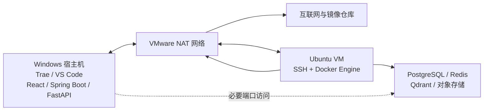

# D1-01.1 VMware 网络与主机连通性规划

## 1. 文档职责

本文档只规划 D1-01 中 VMware 网络、Ubuntu 稳定访问入口、Windows 到虚拟机的连通性与验收任务。

本文档不包含具体命令、Netplan 配置内容、VMware 界面操作教程、具体 IP 配置值、SSH 配置内容、防火墙规则或执行日志。上述内容只在用户明确要求执行本步骤后于对话中提供，不回填到本文档。

本步骤尚未执行并通过验收前，不规划 D1-01 的下一项工程决策，也不进入 D1-02 Git 基线。

## 2. 当前状态

规划基于以下已确认事实：

- 宿主机为 Windows，项目位于 `E:\MyProjects\purple-nexus`。
- 虚拟化平台为 VMware，虚拟机文件位于 E 盘。
- 来宾系统为 Ubuntu 26.04 LTS `x86_64`。
- Ubuntu 当前通过唯一网卡 `ens33` 接入 VMware NAT 网络。
- 当前 NAT 地址可以用于 Windows 与 Ubuntu 之间的开发通信。
- Docker Engine、Docker Compose 和 Buildx 已安装在 Ubuntu 中。
- 项目采用“Windows 开发应用，Ubuntu VM 承载 Linux 容器与本地基础设施”的运行拓扑。
- Docker 和 containerd 曾出现首次初始化数据损坏，后续必须验证重启稳定性。

当前地址只作为环境事实，不提前写入项目配置；是否需要固定地址在执行阶段根据 VMware DHCP 稳定性确认。

## 3. 本步目标与原理

### 3.1 要做什么

在不增加第二张虚拟网卡的前提下，复用现有 VMware NAT 网络，使 Windows 能稳定访问 Ubuntu 中的 SSH 和后续 Docker 基础设施。

本步骤需要形成三项结果：

1. Ubuntu 继续通过现有 NAT 网络访问软件源和容器镜像仓库。
2. Windows 可以通过统一入口访问 Ubuntu，不需要桥接到公共局域网。
3. Docker API 和基础设施端口只服务于本机开发，不进行额外公网暴露。

### 3.2 为什么使用单 NAT 网络

本项目是单机个人开发环境，没有多宿主机互联、局域网共享服务或生产级网络隔离需求。

VMware NAT 已经同时满足：

- Ubuntu 主动访问互联网。
- Windows 宿主机访问 Ubuntu。
- 虚拟机默认不直接暴露到外部局域网。
- 不需要维护额外网卡、路由优先级和双网段配置。

因此本步骤不增加 Host-only 或桥接网卡。只有在实际出现 NAT 地址频繁变化、VPN 路由冲突或宿主机无法稳定访问虚拟机时，才重新评估更复杂的网络方案。

## 4. 规划拓扑



不开放 Docker daemon 的未加密 TCP 端口。Docker 管理保留在 Ubuntu 内部，并通过 SSH 或编辑器远程能力操作。

## 5. 范围边界

### 5.1 本步骤包含

- 保留现有 VMware NAT 网络和 `ens33` 网卡。
- 复核 Windows 到当前 Ubuntu 地址的基本连通性。
- 判断当前 DHCP 地址是否足够稳定，必要时再规划固定地址。
- 确认 Ubuntu 默认路由、DNS、软件源和镜像下载正常。
- 建立 Windows 到 Ubuntu 的 SSH 连接入口。
- 确认 Trae/VS Code Remote SSH 可以使用同一入口。
- 规划后续 Docker 基础设施端口的最小开放范围。
- 验证 Ubuntu 和 Docker 重启后的稳定性。
- 保留正常关机和一致快照约束，降低容器数据再次损坏的风险。

### 5.2 本步骤不包含

- 增加 Host-only 或桥接网卡。
- 设计多网卡路由、双网段或复杂防火墙拓扑。
- 创建 `compose.yaml` 或启动基础设施容器。
- 开放 Docker daemon 的 `2375` 或 `2376` 远程端口。
- 将虚拟机或容器服务开放给公共局域网或互联网。
- 创建 React、Spring Boot 或 FastAPI 工程。
- 配置生产服务器、域名或 TLS 证书。

## 6. 依赖与前置条件

| 项目 | 规划要求 |
| --- | --- |
| VMware NAT | 当前 NAT 网络可以正常提供 Ubuntu 出网和宿主机访问 |
| Ubuntu 网卡 | 保留现有 `ens33`，不增加额外网卡 |
| 地址稳定性 | 普通重启后地址可保持稳定，或能以低复杂度固定 |
| Docker | Engine、containerd 和 Compose 重启后保持健康 |
| SSH | Windows 可以通过 NAT 地址连接 Ubuntu |
| 端口策略 | 后续只开放 Windows 应用真正需要访问的基础设施端口 |
| 数据安全 | VMware 关闭和快照操作不得再次破坏容器数据一致性 |

## 7. 任务拆分

### D1-01.1-A：验证单 NAT 网络

目标：证明现有网络足够支撑本地开发，不引入额外网卡。

任务：

- 验证 Ubuntu 的 NAT 地址、默认路由和 DNS 状态。
- 验证 Ubuntu 可以访问软件源和容器镜像仓库。
- 验证 Windows 可以访问 Ubuntu 当前地址。
- 检查普通重启后地址是否保持稳定。
- 仅在地址确实不稳定时选择低复杂度的固定方式。

预期结果：现有单 NAT 网络可作为唯一开发网络。

### D1-01.1-B：建立 SSH 与编辑器入口

目标：为 Windows 端维护和远程开发提供统一入口。

任务：

- 确认 Ubuntu SSH 服务可用。
- 规划基于密钥的用户认证。
- 为 Windows 建立易识别的 SSH 主机别名。
- 验证 Trae 或 VS Code Remote SSH 能够连接 Ubuntu。
- 确认 Docker 不需要开放远程 TCP API。

预期结果：Windows 可以通过 SSH 管理 Ubuntu 和 Docker。

### D1-01.1-C：明确基础设施访问边界

目标：为 D1-04 Compose 提供简单且明确的网络输入。

任务：

- 为 PostgreSQL、Redis、Qdrant 和对象存储建立待确认端口矩阵。
- 区分容器内部端口与 Windows 需要访问的发布端口。
- 只发布 Windows 应用开发所需的端口。
- 保证浏览器不能直接访问数据库、Redis、Qdrant 或 Docker API。
- 不在仓库中提交个人虚拟机地址。

预期结果：后续 Compose 不需要临时决定端口访问方式。

### D1-01.1-D：执行稳定性验收

目标：证明该简单网络能持续支持后续 Day 1 开发。

任务：

- 验证 Windows 到 Ubuntu 的连通性和 SSH。
- 验证 Ubuntu 的互联网和镜像仓库访问。
- 验证虚拟机重启后网络、SSH、containerd 和 Docker 自动恢复。
- 验证 Docker 拉取并运行最小测试镜像。
- 检查内核与 Docker 日志不存在新的文件系统或元数据库损坏。
- 确认宿主机未向局域网额外转发 Ubuntu 服务。

预期结果：全部验收项通过，或明确停留在本步骤处理唯一阻塞。

## 8. 预期产物

本步骤执行完成后应形成：

- 已确认可用的单 NAT 网络方案。
- Windows 到 Ubuntu 的稳定访问入口。
- 可复用的 SSH 主机别名。
- Trae/VS Code 到 Ubuntu 的远程连接能力。
- D1-04 可以采用的最小端口开放原则。
- VMware 正常关机与一致快照约束。

本步骤不生成应用源码、Compose 文件或业务配置。

## 9. 风险与处理原则

| 风险 | 影响 | 规划处理原则 |
| --- | --- | --- |
| NAT 地址在重启后变化 | SSH 和应用连接地址失效 | 先验证实际稳定性，只有确有需要时才固定地址 |
| VPN 与 VMware NAT 子网冲突 | Windows 无法访问 Ubuntu | 发生实际冲突时再调整 VMware NAT 子网 |
| 使用桥接网络 | 开发端口暴露到公共局域网 | 默认不使用桥接 |
| 直接开放 Docker TCP API | 获得 Docker 权限等同于获得高权限主机控制 | 只通过 SSH 管理 Docker |
| 发布过多容器端口 | 数据库和中间件暴露范围扩大 | 只发布 Windows 应用必需端口 |
| VMware 强制断电或不一致快照 | 容器元数据库或数据卷再次损坏 | 使用正常关机，并在一致状态下创建快照 |
| VM 地址写入仓库 | 配置无法在其他开发环境复用 | 使用环境变量语义，不提交个人地址 |

## 10. 验收标准

### 10.1 网络

- Ubuntu 只使用现有 `ens33` NAT 网卡。
- Ubuntu 默认路由、DNS 和互联网访问正常。
- Windows 可以访问 Ubuntu 的开发入口。
- 普通重启后连接方式仍然有效。
- 未增加 Host-only、桥接或多网卡路由。

### 10.2 远程开发

- Windows 可以通过统一 SSH 入口连接 Ubuntu。
- Trae 或 VS Code Remote SSH 能够连接。
- Docker 管理不依赖未加密远程 TCP API。

### 10.3 Docker 与安全

- containerd 与 Docker 重启后均为健康状态。
- Docker 能够拉取并运行最小测试镜像。
- 只为后续开发开放必要的基础设施端口。
- 虚拟机和容器服务未主动暴露到公共局域网。
- 内核日志不存在未处理的文件系统或 I/O 错误。

### 10.4 边界

- 没有提前创建 Compose 或应用工程文件。
- 没有把个人 VM 地址写入仓库。
- 没有为简化连接而关闭全部防火墙或放宽 Docker socket 权限。
- 没有删除 Docker 损坏数据备份，除非后续单独确认稳定并授权清理。

任一验收条件不满足，本步骤保持未完成，不进入下一项规划。

## 11. 工程结构变化

本规划阶段只修改本文件：

```text
plans/day1/
├── 00-day1-overview.md
├── 01-environment-and-decisions.md
└── 01.1-vmware-network-connectivity.md
```

执行阶段只调整 VMware、Ubuntu 和 Windows 本机连接，不创建应用工程文件。

## 12. 规划完成与执行入口

本文档完成只表示单 NAT 网络与连通性任务已经规划，不表示网络已经验收。

下一次推进只能进入：

```text
D1-01.1 VMware 单 NAT 网络与主机连通性执行
```

Stop & Check：

> 本步规划已简化为单 NAT 网卡方案。请检查范围与验收标准；确认后请明确回复“执行 D1-01.1”，我们再进入本步骤执行。在收到执行指令前，不提供具体网络配置。
