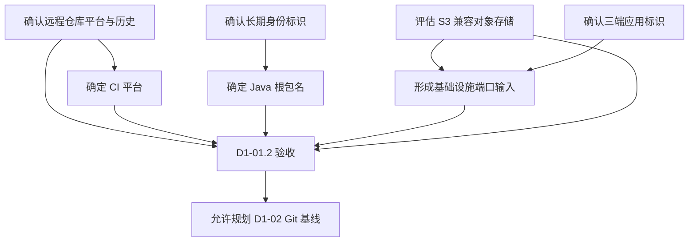

# D1-01.2 项目标识与基础设施决策规划

## 1. 文档职责

本文档只规划 D1-01 剩余的项目标识、远程仓库、CI、本地对象存储和端口决策。

本文档不包含仓库创建命令、Git 命令、平台操作教程、配置文件内容、凭据、具体安装步骤、端口检查命令或执行日志。上述内容只在用户明确要求执行本步骤后于对话中提供。

本步骤执行并通过验收前，不规划 D1-02 Git 基线。

## 2. 当前状态

| 决策项 | 当前状态 |
| --- | --- |
| 项目名称 | `Purple Nexus`，已采用 |
| 仓库名称 | `purple-nexus`，已采用 |
| Web 应用标识 | `purple-nexus-web`，已采用 |
| Server 应用标识 | `purple-nexus-server`，已采用 |
| Agent 应用标识 | `purple-nexus-agent`，已采用 |
| Docker 运行方式 | VMware Ubuntu VM 与 Linux Containers，已采用 |
| Git 远程平台 | 待确认 |
| Git 远程地址 | 待确认 |
| 远程仓库历史状态 | 待确认 |
| Java 根包名 | 待确认 |
| CI 平台 | 待确认 |
| 本地 S3 兼容对象存储 | 待确认 |
| Day 1 端口矩阵 | 待确认 |

这些待确认项会直接进入 D1-02 至 D1-06 的仓库、脚手架、Compose、配置示例和 CI 设计，因此必须在创建脚手架前形成唯一结论。

## 3. 本步目标与原理

### 3.1 要做什么

通过一次集中决策，消除后续工程文件中的平台、命名、基础设施实现和端口占位符。

本步骤需要形成五项结果：

1. 远程仓库平台、地址和初始历史状态明确。
2. Java 根包名长期稳定且符合所有权约束。
3. CI 平台与远程仓库一致。
4. 本地对象存储实现满足 S3 兼容和 Compose 开发需求。
5. Windows 应用与 Ubuntu Docker 基础设施使用统一、无冲突的端口矩阵。

### 3.2 为什么必须现在决定

远程仓库历史决定 D1-02 应采用初始化、克隆还是合并策略；Java 根包名会进入源码目录、类包声明和构建坐标；CI 平台会决定 Workflow 位置和权限模型；对象存储实现与端口会进入 Compose、环境变量和健康检查。

这些内容一旦进入脚手架再修改，就会从单一决策演变为跨目录重命名和配置迁移。

## 4. 决策依赖关系



## 5. 范围边界

### 5.1 本步骤包含

- 确认实际使用的 Git 托管平台和远程仓库地址。
- 确认远程仓库是空仓库还是已有初始提交。
- 确认 Java 根包名的长期身份来源。
- 选择与 Git 托管平台一致的 CI 平台。
- 选择一个适合单机 Compose 的 S3 兼容对象存储实现。
- 统一规划 Web、Server、Agent 和四个基础设施组件的端口。
- 检查计划端口在 Windows 和 Ubuntu VM 上是否存在冲突。
- 确认个人 VM 地址、密钥和凭据不会进入仓库。

### 5.2 本步骤不包含

- 初始化 Git、创建分支、提交或推送。
- 创建远程仓库或修改远程仓库设置。
- 创建 Spring Boot、React 或 FastAPI 脚手架。
- 创建 CI Workflow、Compose 或环境变量文件。
- 拉取对象存储镜像或创建数据卷。
- 生成密钥、Token、访问密钥或其他凭据。
- 启动 PostgreSQL、Redis、Qdrant 或对象存储。

## 6. 任务拆分

### D1-01.2-A：确认远程仓库与 CI 平台

目标：为 D1-02 Git 基线和 D1-06 CI 提供唯一平台输入。

任务：

- 确认用户实际使用的 Git 托管平台。
- 确认远程仓库的规范地址。
- 检查仓库是否为空、是否包含 README、许可证或其他初始提交。
- 确认默认分支和权限边界。
- 选择该托管平台原生或明确兼容的 CI 能力。
- 明确 CI 不依赖开发机私有路径、VM 地址或本地凭据。

预期结果：D1-02 可以根据真实远程历史规划，不会产生无关历史分叉。

### D1-01.2-B：确认 Java 根包名

目标：为 Spring Boot 脚手架提供长期稳定的命名空间。

任务：

- 优先确认用户拥有并长期控制的域名。
- 若没有自有域名，评估长期稳定的代码托管身份。
- 避免使用 `com.example`、临时用户名或无法证明所有权的域名。
- 确认根包名适合 Server 的 Controller、Service、Mapper 等分层扩展。
- 区分 Java 根包名、Maven 坐标和应用显示名称的职责。

预期结果：D1-03 创建 Server 后不需要整体迁移源码包。

### D1-01.2-C：选择本地对象存储

目标：为博客图片、作品封面和附件提供本地 S3 兼容实现。

评估标准：

- S3 API 兼容程度满足后续 SDK 接入。
- 具备可维护的容器镜像和明确版本策略。
- 支持持久化卷、健康检查和初始化存储桶。
- 资源占用适合单机 VMware 开发环境。
- 许可证和维护状态适合个人项目长期使用。
- 管理界面属于辅助能力，不作为业务依赖。
- 生产环境未来可以替换为其他 S3 兼容服务。

预期结果：D1-04 只实现一个明确方案，不同时维护多个本地对象存储。

### D1-01.2-D：统一 Day 1 端口矩阵

目标：消除 Windows 应用、Ubuntu VM 和 Docker 容器之间的端口歧义。

任务：

- 分别规划 Web、Server 和 Agent 的应用端口。
- 分别规划 PostgreSQL、Redis、Qdrant HTTP、Qdrant gRPC、对象存储 API 和管理界面的端口。
- 区分容器内部端口与 Ubuntu 发布端口。
- 优先保留生态默认端口；发生真实冲突时再调整宿主机发布端口。
- 检查 Windows 和 Ubuntu VM 上的端口占用。
- 明确浏览器、三端应用和容器之间各自允许访问的端点。
- 通过环境变量表达 VM 地址，不把个人地址写入仓库。

预期结果：D1-03 至 D1-05 不需要临时更换应用或基础设施端口。

### D1-01.2-E：决策验收

目标：证明所有后续阶段输入都已唯一确定。

任务：

- 检查远程平台、地址和历史状态不存在猜测。
- 检查 Java 根包名不含占位符并具备稳定身份来源。
- 检查 CI 与远程仓库平台一致。
- 检查对象存储只有一个本地实现结论。
- 检查端口矩阵完整且不存在未处理冲突。
- 检查所有个人地址和凭据均停留在本地配置边界。

预期结果：D1-01.2 通过验收，允许开始规划 D1-02 Git 基线。

## 7. 决策原则

| 决策项 | 原则 |
| --- | --- |
| Git 远程 | 只采用用户真实拥有或已确认可访问的仓库 |
| 远程历史 | 以远程实际状态决定后续 Git 操作，不假设空仓库 |
| Java 根包名 | 长期所有权优先于项目名称美观 |
| CI | 与托管平台保持一致，减少额外账户和权限链 |
| 对象存储 | 本地实现可替换，业务代码只依赖 S3 契约 |
| 容器端口 | 优先使用生态默认内部端口 |
| 发布端口 | 只发布 Windows 开发实际需要访问的端口 |
| 本地地址 | 不提交个人 NAT 地址、用户名或机器路径 |
| 凭据 | 只保存在未跟踪的本地环境中 |

## 8. 预期产物

本步骤执行完成后应形成：

- 唯一的 Git 托管平台和远程仓库结论。
- 明确的远程仓库历史状态。
- 唯一的 Java 根包名。
- 唯一的 CI 平台。
- 唯一的本地 S3 兼容对象存储方案。
- 完整的应用与基础设施端口矩阵。
- D1-02、D1-03、D1-04 和 D1-06 可直接采用的确定输入。

本步骤不创建源码、配置文件、远程资源或凭据。

## 9. 风险与处理原则

| 风险 | 影响 | 处理原则 |
| --- | --- | --- |
| 远程仓库尚未创建 | D1-02 无法确认关联方式 | 作为外部阻塞，不填写临时地址 |
| 远程已有初始提交 | 本地初始化可能形成无关历史 | D1-02 根据远程历史单独规划 |
| Java 根包名缺少身份来源 | 后续发布或复用时命名不稳定 | 优先使用自有域名或稳定托管身份 |
| 对象存储选择只看管理界面 | SDK、持久化和替换能力不足 | 以 S3 契约和维护状态为主 |
| 使用个人 VM 地址作为仓库默认值 | 其他环境无法复现 | 仓库只记录变量语义 |
| 端口冲突未实际核验 | 联合启动失败 | 在执行阶段同时检查 Windows 与 Ubuntu |
| CI 依赖本机环境 | 远程构建不可复现 | CI 只依赖仓库声明和安全变量 |

## 10. 验收标准

- Git 远程平台、规范地址和历史状态已确认。
- Java 根包名已确认且不包含占位符。
- CI 平台已确认并与 Git 远程平台一致。
- 本地对象存储实现已确认且满足 S3 兼容要求。
- Web、Server、Agent 与基础设施端口矩阵完整。
- Windows 与 Ubuntu 上不存在未处理的计划端口冲突。
- 个人 VM 地址、绝对路径和凭据未进入仓库规划产物。
- 未提前执行 D1-02、D1-03、D1-04 或 D1-06 的工作。

任一条件不满足，本步骤保持未完成。

## 11. 工程结构变化

本规划阶段只新增本文件，并修正主规划中的 Docker 运行方式：

```text
plans/day1/
├── 00-day1-overview.md
├── 01-environment-and-decisions.md
├── 01.1-vmware-network-connectivity.md
└── 01.2-project-and-infrastructure-decisions.md
```

## 12. 规划完成与执行入口

本文档完成只表示 D1-01.2 已经规划，不表示任何待确认决策已经由用户作出。

下一次推进只能进入：

```text
D1-01.2 项目标识与基础设施决策执行
```

Stop & Check：

> 本步规划已就绪。请检查决策范围、评估原则和验收标准；确认后请明确回复“执行 D1-01.2”，我们再逐项确认真实选择。在收到执行指令前，不创建远程仓库、配置文件或基础设施。
