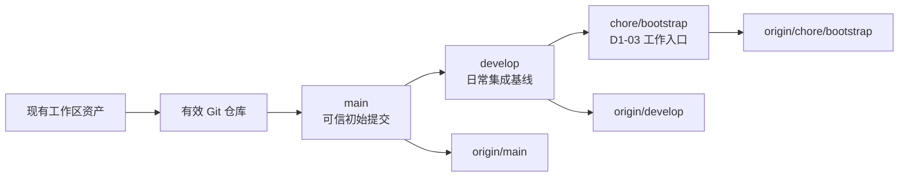

# D1-02 Git 基线规划

## 1. 文档职责

本文档只规划 D1-02“Git 基线”阶段的目标、边界、任务、交付物、风险和验收标准。

本文档不包含 Git 执行命令、远程平台操作步骤、提交输出、配置文件具体内容或排错教程。上述内容只在用户明确要求执行 D1-02 后，根据当时的本地与远程真实状态提供。

D1-02 执行并通过验收前，不规划或执行 D1-03 Monorepo 脚手架。

## 2. 前置条件与当前事实

### 2.1 阶段入口

用户已明确要求规划 D1-02，视为 D1-01 已完成阶段交接。D1-01 已确认的远程平台、远程地址和远程历史状态作为本阶段执行输入；执行开始时仍需只读复核，防止外部状态在两阶段之间发生变化。

若复核结果与 D1-01 结论不一致，应停止写入并重新选择安全的历史对齐方案，不得强行覆盖本地或远程历史。

### 2.2 当前工作区事实

| 项目 | 当前状态 | D1-02 处理原则 |
| --- | --- | --- |
| 项目目录 | 已包含 `AGENTS.md`、`docs/` 和 `plans/` | 作为需要保护的现有项目资产 |
| `.git` | 目录存在，但不是有效 Git 仓库 | 先验证内容和边界，再恢复为有效仓库 |
| 现有提交历史 | 本地不存在 | 建立唯一、可解释的初始历史 |
| `debug.log` | 本地运行日志 | 不进入版本库 |
| 应用源码 | 尚未创建 | 留给 D1-03 |

空目录不会进入 Git 历史；当前空的工具目录不作为 D1-02 交付物。

## 3. 本步目标与原理

### 3.1 要做什么

在不丢失现有文档和规划资产的前提下，建立有效的 Git 仓库、首个可信提交、标准分支链和正确的远程跟踪关系，并让后续脚手架工作从 `chore/bootstrap` 开始。

### 3.2 为什么这样做

Git 基线不仅是“让目录能提交”，还要同时回答四个问题：

1. 哪一份现有文件集合是项目的初始事实。
2. `main`、`develop` 和工作分支分别从哪个提交派生。
3. 本地历史与远程历史是否属于同一条提交链。
4. 哪些本地文件从第一天起就禁止进入仓库。

在脚手架生成前解决这些问题，可以避免把密钥、日志、构建产物或无关历史带入后续提交，也能让 D1-03 的结构变化保持独立、可审查。

## 4. 目标分支关系



约束：

- `main` 是远程默认分支和可发布基线。
- `develop` 必须直接派生自已确认的 `main` 基线。
- `chore/bootstrap` 必须直接派生自 `develop`，不从孤立历史或错误分支创建。
- 三个分支必须属于同一条可追溯提交链。
- 分支保护、Pull Request 门禁和 CI 检查留到 D1-06；本阶段只建立正确的分支与跟踪关系。

## 5. 范围边界

### 5.1 本阶段包含

- 只读复核本地目录、无效 `.git` 状态和远程仓库历史。
- 保护现有 `AGENTS.md`、`docs/` 和 `plans/` 内容。
- 安全处理当前无效的 `.git` 目录并建立有效仓库。
- 建立适用于 Monorepo 的忽略与文本规范基线。
- 检查首个提交候选清单，排除日志、密钥、环境文件和生成物。
- 建立可信初始提交。
- 建立 `main`、`develop` 和 `chore/bootstrap` 的唯一派生关系。
- 关联已确认的远程仓库并验证双向一致性。
- 确认远程默认分支为 `main`。
- 验证工作区、分支、上游和远程状态。

### 5.2 本阶段不包含

- 创建 React、Spring Boot 或 FastAPI 脚手架。
- 创建 `apps/`、`infra/`、`compose.yaml` 或应用配置。
- 安装依赖、生成锁文件或 Maven Wrapper。
- 创建 CI Workflow 或配置分支保护规则。
- 创建发布标签、Release、Pull Request 或合并业务分支。
- 重写已有的非空远程历史。
- 提交本地日志、个人绝对路径、VM 地址、凭据或真实 `.env`。

## 6. 任务拆分

### D1-02-A：执行写入前安全复核

目标：确定本地与远程状态仍满足既定初始化策略，避免把恢复操作作用于错误目标。

任务：

- 确认当前工作目录就是 Purple Nexus 项目根目录。
- 核对 `.git` 确实无效，并检查其中没有需要保留的对象、引用或配置。
- 盘点现有项目文件与待排除的本地产物。
- 复核远程规范地址、访问权限、默认分支和提交历史。
- 比较远程状态与 D1-01 的结论；发生变化时停止后续写入。

预期结果：本地恢复目标唯一，远程历史策略唯一，现有项目资产已被明确保护。

### D1-02-B：建立仓库卫生基线

目标：在首个提交前定义哪些内容可以进入仓库，以及跨 Windows、Linux 的文本行为。

任务：

- 建立根级忽略规则，覆盖真实环境变量、密钥、本地日志、IDE 状态、系统文件、依赖目录、构建产物、缓存和 Python 虚拟环境。
- 保留后续需要提交的安全示例配置文件能力，不用宽泛规则误伤 `.env.example`。
- 建立文本规范，统一源文件的行尾策略，并为二进制资源保留正确边界。
- 检查规则不会忽略 `docs/`、`plans/`、未来的源码、Wrapper 或锁文件。
- 在暂存前复核完整候选清单，不依赖忽略规则替代人工检查。

预期结果：首个提交只包含可公开、可复现、应被长期跟踪的项目资产。

### D1-02-C：建立可信初始历史

目标：让现有项目基础拥有一个清晰、可追溯的共同祖先。

任务：

- 以当前已确认的项目资产和 Git 卫生文件组成初始提交。
- 使用 Conventional Commits 表达仓库基线性质。
- 确认提交作者身份只使用用户认可的 Git 配置。
- 检查提交内容完整，不包含 `debug.log`、凭据、个人路径或空工具目录。
- 将该提交确立为 `main` 的初始可信基线。

预期结果：`main` 指向唯一、内容可审查的初始提交。

### D1-02-D：建立分支与远程跟踪

目标：形成符合开发指南的本地和远程协作起点。

任务：

- 让本地 `main` 与远程 `main` 建立明确的上游关系。
- 确认远程默认分支为 `main`。
- 从 `main` 创建 `develop`，并建立对应远程跟踪关系。
- 从 `develop` 创建 `chore/bootstrap`，并建立对应远程跟踪关系。
- 最终停留在 `chore/bootstrap`，供 D1-03 使用。
- 确认没有多余的默认分支、孤立分支或无关历史。

预期结果：本地和远程具有一致的三层分支链，下一阶段无需修复分支来源。

### D1-02-E：执行阶段验收

目标：证明仓库不是“看起来已初始化”，而是具备正确历史、远程和工作区状态。

任务：

- 验证 Git 能识别仓库根目录且对象数据库有效。
- 验证当前分支为 `chore/bootstrap`。
- 验证 `develop` 的基点是 `main`，`chore/bootstrap` 的基点是 `develop`。
- 验证本地分支与各自远程上游不存在未解释的领先或落后。
- 验证远程默认分支为 `main`。
- 验证已跟踪文件清单和忽略结果符合仓库卫生边界。
- 验证工作区干净。

预期结果：D1-02 全部验收项通过，允许开始规划 D1-03。

## 7. 预期工程结构变化

D1-02 规划完成后只新增本文档：

```text
purple-nexus/
├── .git/                         # 当前无效，执行阶段处理
├── .agents/
├── .codex/
├── docs/
├── plans/
│   └── day1/
│       ├── 00-day1-overview.md
│       ├── 01-environment-and-decisions.md
│       ├── 01.1-vmware-network-connectivity.md
│       ├── 01.2-project-and-infrastructure-decisions.md
│       └── 02-git-baseline.md    # 本次新增
├── AGENTS.md
└── debug.log                     # 本地日志，不提交
```

D1-02 执行完成后，仓库根目录预计新增 Git 卫生文件；`.git/` 成为有效仓库元数据，`debug.log` 继续只保留在本地：

```text
purple-nexus/
├── .git/
├── .gitattributes
├── .gitignore
├── docs/
├── plans/
└── AGENTS.md
```

本阶段不为了展示目录结构而创建空的 `apps/` 或 `infra/`。

## 8. 预期交付物

- 有效且边界正确的本地 Git 仓库。
- 一个内容经过审查的可信初始提交。
- 根级 `.gitignore` 与 `.gitattributes`。
- 同源的 `main`、`develop` 和 `chore/bootstrap` 分支。
- 三个分支各自正确的远程跟踪关系。
- 以 `main` 为默认分支的远程仓库。
- 干净且停留在 `chore/bootstrap` 的工作区。

## 9. 风险与处理原则

| 风险 | 影响 | 处理原则 |
| --- | --- | --- |
| 无效 `.git` 中实际存在可恢复历史 | 直接替换可能丢失提交 | 执行前检查对象、引用和配置；存在有效资产则停止 |
| 远程在 D1-01 后新增提交 | 本地初始化可能制造分叉 | 先只读复核，按远程真实历史重新规划对齐 |
| 首次暂存夹带日志或密钥 | 敏感内容进入永久历史 | 忽略规则与暂存清单双重检查 |
| 宽泛忽略 `.env*` | 安全示例配置无法提交 | 明确保留 `.env.example` 类文件 |
| Windows 与 Linux 行尾漂移 | 后续出现整文件伪变更 | 首次提交前建立统一文本规范 |
| 分支从错误提交派生 | 后续合并历史混乱 | 验收共同祖先与分支基点 |
| 远程默认分支仍是其他名称 | PR 和 CI 默认目标错误 | 本阶段验收远程默认分支 |
| 本地身份配置不正确 | 首个提交作者信息错误 | 提交前让用户确认作者配置 |

任何需要覆盖非空远程分支、重写历史或删除可恢复 Git 数据的情况，都不属于默认执行路径，必须停止并获得用户明确确认。

## 10. 验收标准

- 当前目录可被 Git 正确识别为 Purple Nexus 仓库根目录。
- 当前无效 `.git` 状态已被安全处理，现有项目文件没有丢失或被覆盖。
- 首个提交只包含应长期跟踪的项目资产。
- `debug.log`、真实环境变量、密钥、个人路径、IDE 状态和生成物未被跟踪。
- `.gitignore` 不会误伤安全示例配置、Wrapper、锁文件或源码。
- `.gitattributes` 为 Windows 与 Linux 协作提供稳定文本边界。
- `main`、`develop`、`chore/bootstrap` 属于同一条历史，并具有正确派生关系。
- 本地三个分支均有正确的远程上游，且不存在未解释的领先或落后。
- 远程默认分支为 `main`。
- 当前分支为 `chore/bootstrap`。
- 工作区干净。
- 未创建应用脚手架、基础设施、CI 或业务代码。

任一条件不满足，D1-02 保持未完成，不进入 D1-03 规划。

## 11. 阻塞条件

出现以下任一情况时暂停执行：

- 远程平台、规范地址或访问权限无法确认。
- 远程历史与 D1-01 结论不一致。
- `.git` 中发现需要恢复但来源不明的对象或引用。
- 暂存候选中发现疑似凭据、真实环境文件或不明大文件。
- 本地与远程存在无法通过快进关系解释的同名分支。
- Git 作者身份尚未得到用户确认。

阻塞解除后仍停留在 D1-02，不跳过验收。

## 12. 规划完成与执行入口

本文档完成只表示 D1-02 已规划，不表示 Git 仓库、提交、分支或远程关系已经建立。

下一次推进只能进入：

```text
D1-02 Git 基线执行
```

Stop & Check：

> D1-02 规划已就绪。请检查目标分支关系、首个提交边界和验收标准；确认后请明确回复“执行 D1-02”。在收到执行指令前，不初始化仓库、不修改 `.git`、不创建提交或推送远程。
