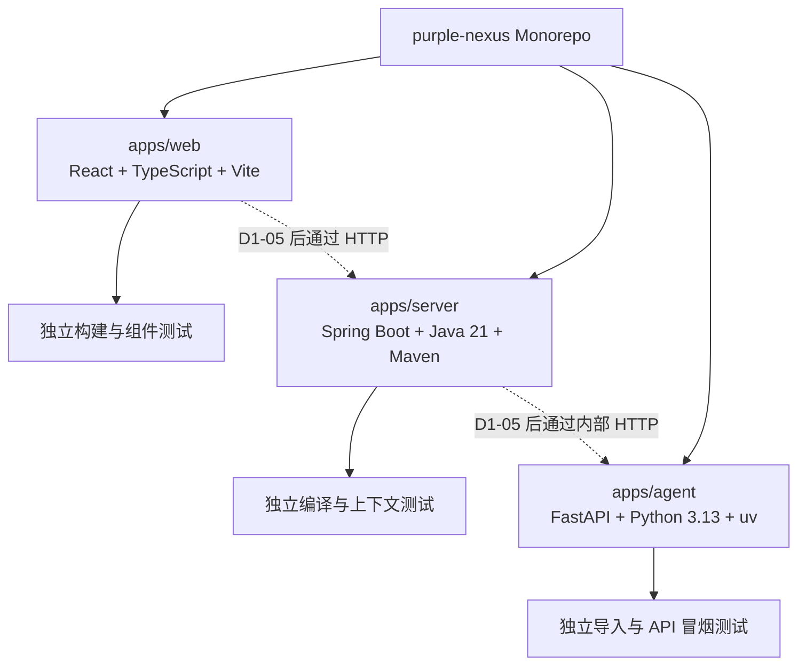

# D1-03 Monorepo 脚手架规划

## 1. 文档职责

本文档只规划 D1-03“Monorepo 脚手架”阶段的目标、边界、技术输入、任务拆分、预期结构、风险和验收标准。

本文档不包含脚手架生成命令、安装命令、完整代码、配置文件内容、Git 命令或执行日志。上述内容只在用户明确要求执行 D1-03 后，于对话中按 Web、Server、Agent 的顺序逐项提供。

D1-03 执行并通过验收前，不规划或执行 D1-04 本地基础设施。

## 2. 阶段入口与当前事实

### 2.1 已满足的前置条件

- D1-02 已通过验收。
- 当前开发分支为 `chore/bootstrap`，并跟踪同名远程分支。
- `main`、`develop` 和 `chore/bootstrap` 具有共同提交基线。
- 根级 `.gitignore` 与 `.gitattributes` 已建立。
- GitHub 远程仓库和默认分支已确认。
- JDK 21、Node.js 24、pnpm 11、Python 3.13 和 uv 已在 D1-01 确认。

### 2.2 已确认的工程输入

| 项目 | D1-03 采用值 |
| --- | --- |
| 仓库模式 | Monorepo，三个应用独立构建 |
| Web 标识 | `purple-nexus-web` |
| Server 标识 | `purple-nexus-server` |
| Agent 标识 | `purple-nexus-agent` |
| Java | JDK 21 |
| Java 根包名 | `com.purple` |
| Server 构建工具 | Maven Wrapper |
| Web 运行时与包管理器 | Node.js 24、pnpm 11 |
| Agent 运行时与包管理器 | Python 3.13、uv |

`docs/06-decisions.md` 当前存在用户尚未提交的 ADR-012 修改，其中记录了上述项目标识和工程决策。D1-03 必须保留该修改，不覆盖、不回退。该 ADR 中“仓库当前尚未创建”的执行前描述已被 D1-02 改变，执行开始时应校正为不依赖临时状态的长期决策表述。

## 3. 本步目标与原理

### 3.1 要做什么

建立 `apps/web`、`apps/server` 和 `apps/agent` 三个最小应用，使每个应用都拥有独立的依赖声明、锁定机制、源码入口和最小测试，并能够在不依赖业务功能或本地基础设施的情况下完成构建与测试。

### 3.2 为什么采用独立应用骨架

Purple Nexus 是同仓库、不同运行时的多应用系统。Monorepo 统一版本历史和跨服务变更，但不应把三个技术栈强行包装成一个构建系统。

本阶段遵循以下原则：

- 根目录只管理共同规范，不建立无实际收益的统一构建包装层。
- Web、Server 和 Agent 分别由 pnpm、Maven Wrapper 和 uv 管理。
- 每个应用先证明自身可以构建和测试，再接入跨服务通信与基础设施。
- 脚手架只保留长期需要的最小结构，删除生成器演示资源和示例业务代码。
- 依赖按实际阶段引入，不为未来功能提前安装全部库。

## 4. 应用关系



虚线关系只表达后续通信方向，本阶段不实现 API 契约、代理请求或服务联调。

## 5. 脚手架技术边界

### 5.1 Web

本阶段包含：

- React、TypeScript 和 Vite 的最小应用入口。
- pnpm 锁文件和包管理器声明。
- TypeScript 严格检查基线。
- ESLint 基线。
- 最小组件渲染测试及其测试环境。
- 去除生成器演示图片、计数器和无关样式。

本阶段不包含：

- 首页、导航、主题视觉和业务组件。
- Tailwind CSS、shadcn/ui、Radix、Motion 或 GSAP。
- Axios、React Query、路由和后端 API。
- `.env.example` 或端口配置。

这些依赖分别在设计系统、页面开发或 D1-05 配置阶段按真实用途引入。

### 5.2 Server

本阶段包含：

- Spring Boot 3.5.x、Java 21 和 Maven 工程。
- Maven Wrapper。
- `com.purple` 根包与唯一应用入口。
- Spring Web、参数校验和测试基础。
- 不依赖外部基础设施的最小上下文测试。

本阶段不包含：

- Controller、Service、Mapper 等业务分层实现。
- PostgreSQL、Redis、MyBatis 和 Flyway 的运行配置。
- 数据表、迁移、缓存、鉴权和业务接口。
- 应用健康端点和跨服务调用。

MyBatis、Flyway、PostgreSQL 与 Redis 在基础设施可用后统一接入，避免当前应用因缺少数据源配置而无法独立启动。

### 5.3 Agent

本阶段包含：

- `src` 布局的 Python 包。
- FastAPI 最小应用对象和明确入口。
- uv 项目声明、Python 版本约束和锁文件。
- LangChain、LangGraph 的基础依赖兼容性锁定。
- Ruff 和 pytest 的开发依赖基线。
- 不调用模型、Redis 或 Qdrant 的最小 API 冒烟测试。

本阶段不包含：

- Agent 状态、节点、Prompt、记忆、反思或工具。
- LLM、Embedding、Qdrant、Redis 和 Spring Boot 接入。
- RAG 检索、索引或流式回答。
- `.env.example`、密钥和外部服务配置。

## 6. 任务拆分

### D1-03-A：脚手架前置复核

目标：确认三个生成过程使用唯一版本基线，且不会覆盖现有项目资产。

任务：

- 确认当前分支与工作区状态。
- 识别并保护 `docs/06-decisions.md` 的现有用户修改。
- 校正 ADR-012 中已经被 D1-02 改变的仓库临时状态描述，不改动已确认决策。
- 复核 JDK、Node.js、pnpm、Python 和 uv 的实际可用版本。
- 确认 `apps/` 尚不存在，避免生成器覆盖已有目录。
- 执行时从官方来源确认与既定主版本兼容的当前稳定补丁版本。

预期结果：三个应用的生成输入唯一，现有文件无覆盖风险。

### D1-03-B：建立 Web 骨架

目标：形成可独立构建和测试的 React TypeScript 应用。

任务：

- 在 `apps/web` 生成 Vite React TypeScript 工程。
- 将应用标识固定为 `purple-nexus-web`。
- 固定 pnpm 包管理器信息并生成锁文件。
- 清理演示资源，只保留最小应用入口和基础样式入口。
- 建立最小渲染测试。
- 验证类型检查、测试和生产构建不依赖后端。

预期结果：Web 具备稳定的开发入口、构建产物和最小回归测试。

### D1-03-C：建立 Server 骨架

目标：形成可独立编译和测试的 Spring Boot 应用。

任务：

- 在 `apps/server` 建立 Maven Spring Boot 工程。
- 固定 JDK 21、Spring Boot 3.5.x、应用标识、构建坐标和 `com.purple` 根包。
- 保留 Maven Wrapper，避免依赖全局 Maven。
- 只加入当前可实际使用的 Web、校验和测试基础。
- 建立最小应用上下文测试。
- 验证打包与测试不要求 PostgreSQL、Redis 或 Agent 服务。

预期结果：Server 能在没有业务模块和基础设施配置时通过 Maven 验证。

### D1-03-D：建立 Agent 骨架

目标：形成可独立导入、启动和测试的 FastAPI 应用。

任务：

- 在 `apps/agent` 建立 `src/purple_nexus_agent` 包结构。
- 固定应用标识、Python 3.13 约束和 uv 锁文件。
- 声明 FastAPI、LangChain、LangGraph 与测试、格式检查所需的最小依赖。
- 建立唯一 FastAPI 应用入口，不创建 Agent 业务节点。
- 建立只验证应用装配的最小测试。
- 验证格式、静态检查和测试无需模型密钥及外部基础设施。

预期结果：Agent 包可以被正确导入，基础 API 测试稳定通过。

### D1-03-E：统一结构与阶段验收

目标：证明三个应用既共享仓库规范，又保持独立构建边界。

任务：

- 建立根级编辑器格式基线。
- 检查生成文件未重复创建根级 Git 配置。
- 检查应用名称、目录名、包名和运行时版本与既定决策一致。
- 检查锁文件、Wrapper 和最小测试齐全。
- 分别执行三个应用的安装、测试和构建验收。
- 检查没有提前加入业务逻辑、基础设施配置、真实密钥或主题实现。
- 检查工作区只包含已解释的脚手架与既有用户修改。

预期结果：D1-03 通过验收，三个应用成为后续阶段可靠的开发起点。

## 7. 预期工程结构变化

```text
purple-nexus/
├── apps/
│   ├── web/
│   │   ├── src/
│   │   │   ├── test/
│   │   │   ├── App.test.tsx
│   │   │   ├── App.tsx
│   │   │   └── main.tsx
│   │   ├── eslint.config.js
│   │   ├── index.html
│   │   ├── package.json
│   │   ├── pnpm-lock.yaml
│   │   ├── tsconfig.json
│   │   └── vite.config.ts
│   ├── server/
│   │   ├── .mvn/
│   │   │   └── wrapper/
│   │   ├── src/
│   │   │   ├── main/
│   │   │   │   ├── java/com/purple/
│   │   │   │   └── resources/
│   │   │   └── test/
│   │   │       └── java/com/purple/
│   │   ├── mvnw
│   │   ├── mvnw.cmd
│   │   └── pom.xml
│   └── agent/
│       ├── src/
│       │   └── purple_nexus_agent/
│       │       ├── __init__.py
│       │       └── main.py
│       ├── tests/
│       │   └── test_app.py
│       ├── .python-version
│       ├── pyproject.toml
│       └── uv.lock
├── docs/
├── plans/
├── .editorconfig
├── .gitattributes
└── .gitignore
```

实际生成器可能拆分额外的 TypeScript 或 Maven 配置文件；只有具备明确构建职责的文件才保留。目录树不要求通过空占位文件维持。

## 8. 预期交付物

- `apps/web` React TypeScript Vite 应用及 pnpm 锁文件。
- `apps/server` Spring Boot Maven 应用及 Maven Wrapper。
- `apps/agent` FastAPI uv 应用及 uv 锁文件。
- 三个应用各自的最小源码入口。
- 三个应用各自的最小自动化测试。
- 根级 `.editorconfig`。
- 可解释、无业务逻辑的 Monorepo 初始结构。

## 9. 验收标准

### 9.1 Web

- 应用标识为 `purple-nexus-web`。
- 依赖安装严格使用 pnpm 锁文件。
- TypeScript 检查、最小测试和生产构建通过。
- 生成器演示内容已移除。
- 不依赖 Server、Agent 或环境变量。

### 9.2 Server

- 应用标识为 `purple-nexus-server`。
- 使用 JDK 21、Spring Boot 3.5.x 和 Maven Wrapper。
- 根包为 `com.purple`，不存在 `com.example`。
- 最小上下文测试和 Maven 验证通过。
- 不依赖数据库、Redis、Agent 或本地环境变量。

### 9.3 Agent

- 应用标识和 Python 包分别为 `purple-nexus-agent`、`purple_nexus_agent`。
- Python 3.13 约束、`pyproject.toml` 和 `uv.lock` 一致。
- FastAPI、LangChain 与 LangGraph 的依赖能够在同一锁定环境中解析。
- Ruff 检查、格式检查和 pytest 通过。
- 测试不调用 LLM、Qdrant、Redis 或 Spring Boot。

### 9.4 仓库整体

- 三个应用均位于 `apps/` 下，并保持独立构建边界。
- Wrapper、锁文件和测试文件均被 Git 跟踪规则允许。
- `.editorconfig` 与 `.gitattributes` 不冲突。
- 未创建 `compose.yaml`、`infra/`、`.env.example`、CI Workflow 或业务代码。
- 未引入真实密钥、个人路径或 VM 地址。
- `docs/06-decisions.md` 的现有用户修改保持完整。
- 当前阶段所有新增文件和依赖都具有明确用途。

任一应用无法独立完成自身测试与构建时，D1-03 保持未完成。

## 10. 风险与处理原则

| 风险 | 影响 | 处理原则 |
| --- | --- | --- |
| 生成器默认版本与项目基线不一致 | 运行时或 CI 漂移 | 执行前核对官方稳定版本与兼容矩阵 |
| 生成器写入嵌套 Git 仓库 | Monorepo 历史被割裂 | 生成后检查并禁止应用内 `.git` |
| 一次引入全部未来依赖 | 锁文件膨胀且职责不清 | 只引入当前可验证的最小依赖 |
| Server 提前启用数据层 | 无配置时无法启动 | 数据与缓存集成留到基础设施和配置阶段 |
| Web 保留演示资产 | 后续主题开发建立在无关结构上 | 验收前移除演示内容 |
| Agent 测试调用外部模型 | 测试不稳定且需要密钥 | 当前只测试应用装配与本地响应 |
| 自动格式化覆盖用户文档 | 破坏现有修改 | 工具只作用于对应应用目录 |
| 锁文件未生成或未验证 | 无法复现依赖环境 | 每个包管理器都必须生成并使用锁定结果 |

## 11. 阻塞条件

出现以下任一情况时暂停 D1-03：

- 当前分支不再是 `chore/bootstrap`。
- 现有用户修改无法与脚手架工作安全隔离。
- JDK 21、Node.js 24、pnpm 11、Python 3.13 或 uv 无法使用。
- 官方生成器或关键依赖与既定运行时主版本不兼容。
- 依赖下载失败且无法确认锁文件完整性。
- 任一生成器试图覆盖仓库根文档或创建嵌套 Git 历史。
- 任一应用必须依赖尚未实施的基础设施才能通过最小测试。

阻塞解除前不得用跳过测试或手工伪造锁文件代替验收。

## 12. 规划完成与执行入口

本文档完成只表示 D1-03 已规划，不表示任何应用、依赖、锁文件或测试已经创建。

下一次推进只能进入：

```text
D1-03 Monorepo 脚手架执行
```

执行时仍按以下顺序逐项推进并验收：

```text
前置复核 -> Web -> Server -> Agent -> 整体验收
```

Stop & Check：

> D1-03 规划已就绪。请检查三个应用的依赖边界、目标目录和验收标准；确认后请明确回复“执行 D1-03”。在收到执行指令前，不创建 `apps/`、不生成脚手架、不安装依赖。
