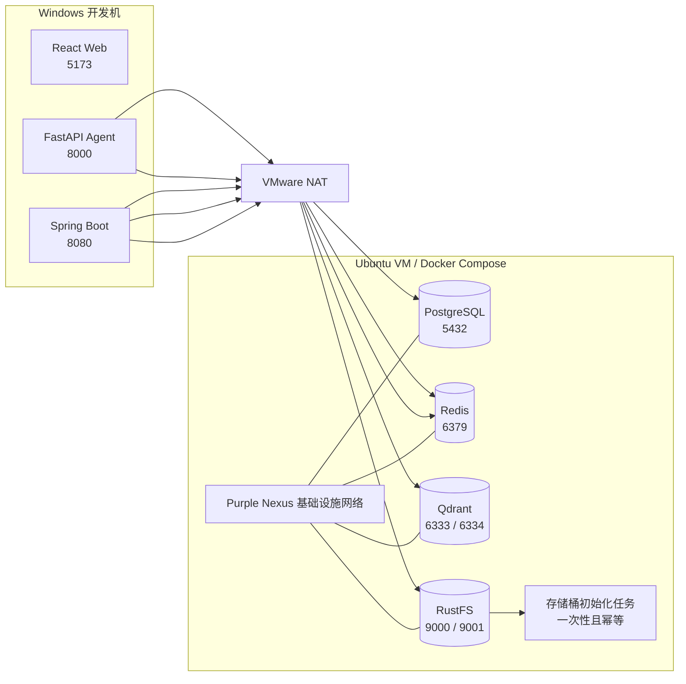

# D1-04 本地基础设施规划

## 1. 文档职责

本文档只规划 Purple Nexus 的本地基础设施编排、持久化、网络边界、健康检查和生命周期验收。

本文档不包含镜像拉取命令、Compose 配置内容、环境变量具体值、凭据、逐条操作教程或执行日志。上述内容只在用户明确要求执行 D1-04 后，于对话中按工程切片逐步提供。

D1-04 尚未执行并通过验收前，不规划或执行 D1-05 配置与应用健康检查。

## 2. 阶段入口与当前事实

### 2.1 已满足的前置条件

- D1-03 已通过验收，提交 `8cc986f` 已推送到 `origin/chore/bootstrap`。
- 当前分支为 `chore/bootstrap`，规划开始前工作区干净。
- Windows 负责运行 React、Spring Boot 和 FastAPI 应用。
- Ubuntu VMware 虚拟机负责运行 Docker Engine、Docker Compose 和本地基础设施。
- Windows 与 Ubuntu 通过现有单 NAT 网络通信，不增加 Host-only、桥接或 Docker 远程 TCP API。
- D1-01.1 已建立 Docker 与 containerd 的基本可用性和重启稳定性要求；D1-04-A 仍需复核当前状态。
- 仓库当前不存在 `compose.yaml`、`infra/`、基础设施凭据或持久化数据。

### 2.2 已确认的基础设施输入

| 组件 | 用途 | Ubuntu 发布端口 |
| --- | --- | ---: |
| PostgreSQL | Spring Boot 业务主数据 | `5432` |
| Redis | Spring Boot 缓存与会话、Agent 状态 | `6379` |
| Qdrant HTTP/UI | Agent 向量检索、健康与开发管理入口 | `6333` |
| Qdrant gRPC | Agent 向量客户端的可选通信入口 | `6334` |
| RustFS S3 API | 图片和附件的 S3 兼容接口 | `9000` |
| RustFS Console | 本地对象存储管理界面 | `9001` |

本阶段沿用以下既定决策：

- PostgreSQL 是业务事实来源，Qdrant 只保存可重建的 AI 派生索引。
- Spring Boot 与 FastAPI 可以共用一个 Redis 实例，但后续必须使用独立命名空间。
- RustFS 只作为本地 S3 兼容实现，应用不得依赖其专有接口。
- Qdrant 使用单节点开发模式，不发布集群通信端口 `6335`。
- 个人 VM 地址、绝对路径和真实凭据不得进入仓库。

## 3. 本步目标与原理

### 3.1 要做什么

建立一套可重复启动、停止、检查和恢复的本地基础设施，使 PostgreSQL、Redis、Qdrant 和 RustFS 在 Ubuntu Docker 中共享明确的网络与生命周期规则，同时保持各自独立的数据卷和健康状态。

本阶段需要形成以下结果：

1. 根级 Compose 成为四项基础设施的唯一编排入口。
2. 镜像版本可复现，不因浮动标签自动跨版本升级。
3. 每项有状态服务使用独立持久化卷。
4. 每项长期运行服务都有能够表达“可接受请求”的健康检查。
5. RustFS 的开发存储桶可以幂等初始化。
6. 普通停止、启动和容器重建不会误删数据。
7. Windows 应用所需端口可通过 NAT 访问，但不会额外暴露 Docker 管理接口或 Qdrant 集群端口。

### 3.2 为什么统一使用根级 Compose

四项基础设施属于同一个本地开发运行单元。由根级 Compose 统一管理，可以固定以下契约：

- 服务名是容器网络中的稳定地址。
- 启动、停止和状态检查具有统一入口。
- 网络、端口、卷和健康检查可以整体校验。
- 数据生命周期与容器生命周期分离。
- 后续 D1-05 只需消费已稳定的连接契约，不再重复定义基础设施。

Compose 只负责基础设施编排，不负责承载 Windows 上运行的三个应用，也不替代应用配置管理。

### 3.3 为什么健康检查必须验证就绪状态

容器处于运行状态只说明主进程没有退出，不代表数据库、缓存、向量服务或对象存储已经可以接受请求。

因此健康检查必须使用组件自身的就绪能力：

- PostgreSQL 验证目标实例能够接受数据库连接。
- Redis 验证命令往返正常。
- Qdrant 验证官方就绪端点。
- RustFS 验证服务自身的健康状态或 S3 API 可用性。
- RustFS 初始化任务只有在对象存储就绪后运行，并以成功完成作为存储桶已准备好的证据。

## 4. 运行拓扑



图中的连接只表示后续应用允许消费的基础设施契约。本阶段不修改应用依赖或建立应用到基础设施的真实连接。

## 5. 技术与安全边界

### 5.1 镜像与版本

- 每个长期运行服务使用官方或项目官方维护的容器镜像。
- Compose 中固定经过核验的明确版本标签，不使用 `latest` 作为提交基线。
- 同一阶段不混用多个 PostgreSQL、Redis、Qdrant 或 RustFS 实现。
- 镜像升级必须是显式工程变更，并重新执行持久化和健康验收。
- 不为 Day 1 自行维护基础设施镜像或 Dockerfile。

### 5.2 网络与端口

- 四项基础设施加入同一个专用 Compose 网络。
- 只发布 ADR-012 已确认且 Windows 应用需要的端口。
- Qdrant `6335`、Docker daemon 和内部初始化接口不发布。
- 不将个人 NAT 地址写入 Compose；Windows 侧地址由后续本地配置提供。
- 不增加反向代理、域名、TLS 或公网入口。
- Ubuntu 防火墙和 VMware NAT 继续承担宿主机访问边界，执行时必须验证没有桥接到公共局域网。

### 5.3 凭据与本地输入

- PostgreSQL、Qdrant 和 RustFS 所需凭据通过运行时输入提供，不硬编码真实值。
- D1-04 可以使用未跟踪的本地输入完成启动，但不提交真实密钥。
- 必需输入缺失时应明确失败，不能静默退回弱默认值。
- D1-05 再统一建立应用侧配置示例和连接校验；本阶段不提前创建三个应用的 `.env.example`。
- Redis 是否启用本地认证以应用连接契约和最小开发安全为准，但不得产生硬编码凭据或与 D1-05 不一致的双重配置。

### 5.4 持久化与数据边界

- PostgreSQL、Redis、Qdrant 和 RustFS 分别使用独立命名卷。
- 普通停止和重建容器不得删除命名卷。
- 删除卷属于破坏性重置操作，不作为日常关闭流程。
- 本阶段不创建业务表、Flyway 迁移、正式 Qdrant Collection 或测试业务数据。
- RustFS 只创建后续应用需要的开发存储桶，不上传正式素材。
- 若 RustFS 镜像对卷权限有特定用户要求，应使用可重复的初始化机制处理，不依赖一次性的宿主机手工修复。

### 5.5 明确不引入的组件

本阶段不引入：

- Grafana、Prometheus、OpenTelemetry、Jaeger 或其他观测栈。
- pgAdmin、RedisInsight 或额外数据库管理工具。
- Kafka、RabbitMQ、Elasticsearch 或未被架构采用的中间件。
- Spring Boot、FastAPI 或 React 容器。
- 生产级集群、复制、负载均衡、备份、灾难恢复和 TLS。

这些能力都不是 D1-04“最小可靠本地基础设施”的验收条件。

## 6. 任务拆分

### D1-04-A：基础设施前置复核

目标：证明 Ubuntu Docker 环境、端口和镜像策略能够支撑本阶段实施。

任务：

- 复核 Ubuntu 上 Docker Engine、Compose 插件、containerd 和磁盘空间。
- 复核 Docker 服务在虚拟机重启后可以正常恢复。
- 检查六个计划发布端口在 Ubuntu 上不存在未处理冲突。
- 确认 Windows 仍可通过既有 NAT 与 SSH 入口访问 Ubuntu。
- 核对四个官方镜像的架构支持、稳定版本、数据路径、健康能力和必要运行参数。
- 确认 RustFS 的容器用户、数据卷权限和 S3 客户端兼容性。
- 明确本地运行所需的变量语义，但不提交具体凭据。

预期结果：版本、端口、权限和运行环境不存在猜测，允许建立 Compose。

### D1-04-B：建立 Compose 基线与状态服务

目标：形成统一编排边界，并先建立 PostgreSQL 与 Redis 两项基础状态服务。

任务：

- 建立根级 Compose 编排入口和稳定的项目命名空间。
- 建立专用网络以及 PostgreSQL、Redis 的独立命名卷。
- 为 PostgreSQL 和 Redis 固定明确镜像版本与重启策略。
- 只发布已确认端口，并通过运行时输入提供必要配置。
- 为两项服务建立就绪型健康检查。
- 验证配置解析、容器启动、健康状态和 Windows 到端口的可达性。
- 验证普通停止与重新启动不会更换或删除数据卷。

预期结果：关系数据与缓存状态层可以独立启动、检查和恢复。

### D1-04-C：加入 Qdrant 向量服务

目标：建立单节点、可持久化且具有明确安全边界的向量数据库。

任务：

- 使用项目官方镜像和明确版本。
- 建立独立 Qdrant 数据卷并挂载到官方数据路径。
- 发布 HTTP/UI 与 gRPC 端口，不发布集群通信端口。
- 按本地安全边界处理 API 访问凭据。
- 使用官方就绪端点建立健康检查。
- 验证 HTTP、Dashboard、gRPC 监听、数据卷和容器重建行为。
- 不创建正式 Collection、Embedding 或业务索引。

预期结果：Qdrant 作为独立派生数据服务健康运行，且没有提前进入 RAG 实现。

### D1-04-D：加入 RustFS 与存储桶初始化

目标：建立可替换的本地 S3 兼容对象存储，并使开发存储桶可重复准备。

任务：

- 使用 RustFS 官方镜像和明确版本，以单节点单盘模式运行。
- 建立独立数据卷，并按镜像用户要求处理卷权限。
- 发布 S3 API 与 Console 端口。
- 通过运行时输入提供访问凭据，不保留默认弱凭据。
- 建立能够反映 RustFS 就绪状态的健康检查。
- 增加一次性、幂等的存储桶初始化任务。
- 验证 S3 客户端能够创建、列出和访问开发存储桶。
- 不引入 RustFS 官方完整示例中的观测组件。

预期结果：RustFS 健康运行，开发存储桶在重复启动时保持稳定且不会重复失败。

### D1-04-E：联合生命周期与阶段验收

目标：证明四项基础设施可以作为一个可靠的本地开发运行单元。

任务：

- 验证 Compose 配置可以完整解析，且不存在未使用或隐式弱默认输入。
- 统一启动全部服务并等待长期服务达到健康状态。
- 验证一次性初始化任务成功完成且重复执行保持幂等。
- 从 Ubuntu 本机和 Windows 宿主机分别验证必要端口与服务协议。
- 使用非业务验收数据验证四个命名卷在容器重建后仍然有效，并在验收后清理临时数据。
- 验证普通关闭不删除卷，重新启动后服务恢复健康。
- 检查日志中不存在持续重启、权限错误、I/O 错误或初始化失败。
- 检查 Docker 与虚拟机重启后的恢复能力。
- 检查仓库中没有真实凭据、个人 VM 地址、基础设施运行数据或越界组件。

预期结果：D1-04 通过验收，四项基础设施能够被后续配置与健康检查阶段可靠消费。

## 7. 预期工程结构变化

```text
purple-nexus/
├── apps/
│   ├── web/
│   ├── server/
│   └── agent/
├── infra/                         # 仅在存在真实配置或初始化资源时创建
├── plans/
│   └── day1/
│       └── 04-local-infrastructure.md
└── compose.yaml
```

约束：

- `compose.yaml` 是本阶段必需交付物。
- `infra/` 不是为了目录外观而创建；只有 RustFS 权限初始化、服务配置或其他真实运行资源无法安全保留在根级 Compose 中时才创建。
- 本地 Docker 卷、容器数据和未跟踪凭据不属于仓库结构。
- 本阶段不创建三个应用的环境变量示例或健康端点。

## 8. 预期交付物

- 根级 `compose.yaml`。
- PostgreSQL、Redis、Qdrant 和 RustFS 四项长期运行服务。
- RustFS 幂等存储桶初始化任务。
- 一个专用 Compose 网络。
- 四个相互独立的命名卷。
- 明确固定的官方镜像版本。
- 四项长期运行服务的就绪型健康检查。
- 可解释的端口发布、重启策略和凭据输入边界。
- 必要时存在的最小 `infra/` 配置或初始化资源。

## 9. 验收标准

### 9.1 Compose 与镜像

- 根级 Compose 配置可以完整解析。
- 四项基础设施均使用官方或项目官方维护镜像。
- 镜像使用明确版本，不使用 `latest`。
- 服务、网络和卷命名可识别且不存在无关资源。
- 未构建自定义基础设施镜像。

### 9.2 服务健康

- PostgreSQL 能够接受目标用户和数据库的连接。
- Redis 能够正常完成命令往返。
- Qdrant 官方就绪端点返回健康状态。
- RustFS 健康且 S3 API 可以响应。
- RustFS 初始化任务成功并可以安全重复。
- 全部长期运行容器达到健康状态，不以“正在运行”代替健康。

### 9.3 网络与安全

- Windows 可以通过既有 NAT 访问六个既定开发端口。
- Qdrant `6335` 和 Docker daemon 未发布。
- 未增加 Host-only、桥接或公网暴露。
- 浏览器产品代码未直接接入数据库、Redis、Qdrant 或 RustFS。
- 仓库中不存在个人 VM 地址、绝对路径或真实凭据。
- 必需凭据缺失时不会静默使用弱默认值。

### 9.4 持久化与生命周期

- PostgreSQL、Redis、Qdrant 和 RustFS 分别使用独立命名卷。
- 容器重建后非业务验收数据仍可读取。
- 普通关闭流程不删除卷。
- 重复启动不会造成重复初始化失败。
- Docker 与虚拟机重启后服务可以恢复健康。
- 日志中不存在未处理的权限、文件系统、I/O 或持续重启错误。

### 9.5 阶段边界

- 未创建业务表、Flyway 迁移、正式 Qdrant Collection 或业务数据。
- 未将 React、Spring Boot 或 FastAPI 加入 Compose。
- 未创建应用 `.env.example`、应用依赖连接或应用健康端点。
- 未创建 CI Workflow。
- 未引入观测、管理、消息队列或生产集群组件。

任一长期服务无法达到健康状态、数据卷无法保持、凭据进入仓库或 Windows 无法访问必要端口时，D1-04 保持未完成。

## 10. 风险与处理原则

| 风险 | 影响 | 处理原则 |
| --- | --- | --- |
| 使用浮动镜像标签 | 重建时自动跨版本，数据格式和行为漂移 | 提交明确版本，升级时重新验收 |
| RustFS 数据卷权限不正确 | 容器启动但无法读写对象 | 按官方容器用户建立可重复权限初始化 |
| 只检查容器运行状态 | 依赖尚未就绪却被判定成功 | 使用组件原生就绪能力 |
| PostgreSQL 数据路径随大版本变化 | 卷挂载位置错误或升级异常 | 执行前核对所选大版本官方数据路径 |
| Qdrant 使用宿主机共享目录 | 文件系统语义或权限导致数据风险 | 使用 Docker 命名卷和官方存储路径 |
| Redis 未启用持久化 | Agent 状态或缓存验收在重建后丢失 | 明确本地持久化策略并验证重建 |
| RustFS 使用默认弱凭据 | NAT 网络中的其他主体可直接访问 | 通过本地运行时输入提供非默认凭据 |
| 发布不必要端口 | 扩大开发环境攻击面 | 只发布 ADR-012 已确认端口 |
| 将 VM 地址写入 Compose | 仓库无法跨环境复现 | 地址保留在本地应用配置边界 |
| 普通关闭误用卷删除 | 本地数据不可恢复 | 将销毁数据视为单独的破坏性操作 |
| VMware 异常断电或不一致快照 | Docker 元数据或服务卷损坏 | 正常关闭服务与虚拟机，并执行重启恢复验收 |
| 一次引入完整观测栈 | 资源占用和故障面超出 Day 1 | 只保留四项核心基础设施 |

## 11. 阻塞条件

出现以下任一情况时暂停 D1-04：

- 当前分支不再是 `chore/bootstrap`，或工作区出现无法解释的用户修改。
- Ubuntu Docker、Compose、containerd 或 NAT/SSH 入口不可用。
- 任一计划端口存在未处理冲突。
- 官方镜像不支持当前 `x86_64` 环境或无法获得明确稳定版本。
- RustFS 无法在可重复权限策略下使用持久化卷。
- 镜像拉取失败且无法确认镜像完整性。
- 任一服务只能依靠禁用认证、提交真实凭据或开放额外高风险端口才能运行。
- 任一健康检查只能验证进程存在，无法证明服务可以接受请求。
- Docker 或 VMware 重启再次出现未处理的数据损坏、文件系统或 I/O 错误。

阻塞解除前不得用浮动标签、跳过健康检查、临时删除卷或扩大网络暴露代替验收。

## 12. 规划完成与执行入口

本文档完成只表示 D1-04 已规划，不表示 Compose、容器、网络、卷、凭据或开发存储桶已经创建。

下一次推进只能进入：

```text
D1-04-A 基础设施前置复核
```

Stop & Check：

> 本步规划已就绪。请检查基础设施范围、任务拆分和验收标准；确认后请明确回复“执行 D1-04”，我们再从 D1-04-A 前置复核开始。在收到执行指令前，不创建 Compose、不拉取镜像、不启动容器。
