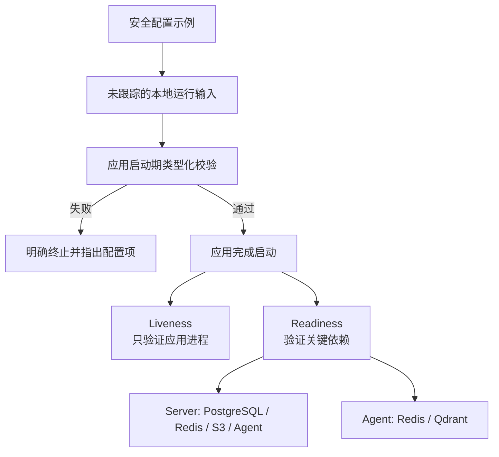

# D1-05 配置契约与应用健康检查规划

## 1. 文档职责

本文档只规划 D1-05“配置与健康检查”阶段的目标、边界、配置契约、健康语义、任务拆分、预期结构、风险和验收标准。

本文档不包含环境变量具体值、配置文件内容、依赖安装命令、实现代码、Git 命令、逐条操作教程或执行日志。上述内容只在用户明确要求执行 D1-05 后，于对话中按工程切片逐步提供。

D1-05 尚未执行并通过验收前，不规划或执行 D1-06 质量门禁与 CI。

## 2. 阶段入口与当前事实

### 2.1 已满足的前置条件

- 用户已确认 D1-04 完成。
- 当前分支为 `chore/bootstrap`，并跟踪 `origin/chore/bootstrap`。
- D1-04 提交为 `73585fe`，仓库工作区在本规划开始前保持干净。
- 根级 `compose.yaml` 已包含 PostgreSQL、Redis、Qdrant、RustFS 和 RustFS 存储桶初始化任务。
- 四项基础设施具有独立命名卷、专用网络、固定镜像版本和健康检查。
- Windows 继续运行 Web、Server 和 Agent，Ubuntu VMware 虚拟机继续运行 Docker 基础设施。

D1-05 执行开始时仍需只读复核分支、工作区、基础设施健康状态和 NAT 连通性。若外部运行状态与 D1-04 验收结论不一致，应先恢复 D1-04 契约，不得在应用配置中绕过故障。

### 2.2 当前应用状态

| 应用 | 当前配置状态 | 当前健康能力 | D1-05 缺口 |
| --- | --- | --- | --- |
| Web | Vite 配置尚未读取业务运行变量 | 通过页面和构建证明进程可用 | 缺少 API 基地址示例、集中读取和启动期校验 |
| Server | 仅配置应用名称 | 无应用健康端点 | 缺少数据库、Redis、对象存储、Agent 配置绑定与健康分组 |
| Agent | 只有最小 FastAPI 应用 | 根路径返回脚手架状态 | 缺少类型化配置、标准存活/就绪端点及 Redis、Qdrant 检查 |
| 根级 Compose | 运行时要求基础设施变量 | 容器健康检查已存在 | 缺少可提交的安全输入示例 |

当前仓库不存在根级或三端应用的 `.env.example`，也不存在被跟踪的真实 `.env`。

### 2.3 已发现的配置契约差异

`compose.yaml` 已要求 Redis 使用密码认证，但 `docs/03-development-guide.md` 当前列出的 Spring Boot 必需变量没有包含 Redis 密码。

D1-05 必须在实现前统一该契约，并在执行阶段同步修正开发指南。应用不得通过取消 Redis 认证或硬编码密码来迁就旧文档。

## 3. 本步目标与原理

### 3.1 要做什么

为基础设施和三个应用建立唯一、可验证的最小运行契约，使配置缺失时应用能够在启动阶段给出明确错误，配置完整时能够通过标准健康入口区分“进程仍存活”和“已经可以接收业务请求”。

本阶段需要形成以下结果：

1. 根级 Compose 与三个应用均有安全、完整且无真实凭据的配置示例。
2. Web、Server 和 Agent 各自集中读取配置，禁止在业务入口散落环境变量访问。
3. 必需配置缺失、格式错误或相互矛盾时快速失败。
4. Server 与 Agent 分别提供语义清晰的存活和就绪检查。
5. Server 可以验证 PostgreSQL、Redis、RustFS 和 Agent 的必要连通性。
6. Agent 可以验证 Redis 和 Qdrant 的必要连通性。
7. 自动化测试不依赖真实 VM、真实密钥或常驻基础设施。

### 3.2 为什么配置必须先形成契约

环境变量不只是“把地址放到文件里”，而是应用与运行环境之间的接口。若变量命名、必需性和验证时机不明确，同一应用会在终端、编辑器、测试和 CI 中表现不同，并把配置错误延迟成难以定位的连接异常。

D1-05 采用以下原则：

- 仓库只提交变量语义和安全示例，不提交个人 VM 地址或真实凭据。
- 每个应用只通过一个集中配置入口读取外部输入。
- 框架已有的类型转换和配置绑定能力优先于手写字符串解析。
- 当前阶段只要求已经存在的基础设施和服务契约，不提前要求 LLM、Embedding 或业务模块配置。
- 测试配置与本地运行配置职责分离，测试不能依赖开发机私有环境。

### 3.3 为什么区分存活与就绪

存活检查回答“应用进程是否还能正常响应”，不应因外部依赖短暂故障而要求重启应用。

就绪检查回答“应用当前是否具备处理目标请求的条件”，必须反映关键配置与依赖故障。将两者混为一个始终返回成功的端点，会掩盖数据库、缓存、对象存储或向量服务不可用的问题。

### 3.4 个人项目的适度实现原则

D1-05 只建立个人项目当前运行所需的最小配置和健康能力，不以生产平台的完整观测体系作为 Day 1 标准：

- 框架已有的配置绑定和健康检查直接复用，不再包装一层自定义抽象。
- 自定义健康检查只回答依赖是否可用，默认使用 `UP` / `DOWN`，不预先设计完整错误码和故障分类体系。
- 每个自定义配置或健康组件只覆盖正常行为与一个代表性失败场景；不穷举 SDK、网络和框架已经定义的全部异常组合。
- 配置、客户端装配、健康检查和测试分小轮次教学与验收，不在一次执行中同时展开多个陌生概念。
- 只有安全、数据完整性或明确运行风险要求时才增加额外配置、超时或测试；不为假设中的未来部署复杂度提前设计。

## 4. 配置与健康关系



Web 是浏览器静态应用，不伪造服务端健康端点。它通过构建、开发服务器响应和集中运行配置校验证明自身可用；后端健康状态由 Server 与 Agent 的真实端点表达。

## 5. 上游约束

| 来源 | D1-05 采用的约束 |
| --- | --- |
| `docs/02-architecture.md` | Spring Boot 是公开动态服务入口；FastAPI 与基础设施保持内部访问；业务数据与 AI 派生数据分离 |
| `docs/03-development-guide.md` | 三端环境变量职责、本地启动边界和质量命令 |
| `docs/05-agent-design.md` | Agent 使用 Redis 保存状态、使用 Qdrant 保存派生索引，依赖故障必须明确降级 |
| `docs/06-decisions.md` | 服务间使用 HTTP；对象存储只依赖 S3 契约；应用与基础设施端口采用 ADR-012 |
| `plans/day1/00-day1-overview.md` | 缺少配置时明确失败，配置完整时健康检查通过 |
| `plans/day1/04-local-infrastructure.md` | Compose 已稳定定义四项基础设施的端口、认证、健康和生命周期 |

环境变量的最终清单应由执行后的 `.env.example` 和应用配置代码共同维护；开发指南只保留开发者需要准备的变量名称，不重复实现细节。

## 6. 范围边界

### 6.1 本阶段包含

- 为根级 Compose 建立安全配置示例。
- 为 Web、Server 和 Agent 分别建立 `.env.example`。
- 明确本地、测试和后续 CI 环境的配置输入边界。
- 为三个应用建立集中、类型化的配置读取与校验。
- 为 Server 补齐当前阶段需要的 PostgreSQL、Flyway、MyBatis、Redis、S3 和健康检查基础。
- 为 Agent 补齐当前阶段需要的配置管理、Redis、Qdrant 和健康检查基础。
- 为 Server 建立存活与就绪健康分组。
- 为 Agent 建立存活与就绪端点。
- 通过 S3 标准能力验证 RustFS，不让应用依赖 RustFS 专有接口。
- 验证 Server 到 Agent、Server 到基础设施以及 Agent 到基础设施的必要连通性。
- 为配置校验和健康语义建立不依赖真实外部服务的自动化测试。
- 修正开发指南中与最终配置契约不一致的变量清单。

### 6.2 本阶段不包含

- 业务表、业务实体、Mapper、Service、Controller 或 CRUD。
- Flyway 业务迁移文件和初始化业务数据。
- Redis 缓存 Key、Session、限流或 Agent Checkpoint 实现。
- 正式 Qdrant Collection、向量、Embedding 或文档索引。
- 对象上传、下载、封面、附件或预签名 URL。
- LangGraph 节点、RAG、模型调用、Prompt 或 LLM 配置校验。
- 所有者认证、CSRF、业务写权限或浏览器登录。
- Web 业务请求、React Query、Axios、页面健康面板或正式错误 UI。
- 将 Web、Server 或 Agent 加入 Compose。
- CI Workflow、README、生产观测、公网监控或告警。

## 7. 配置契约规划

### 7.1 配置文件职责

| 文件 | 职责 | 安全边界 |
| --- | --- | --- |
| 根级 `.env.example` | 描述 Compose 启动四项基础设施所需输入 | 只包含安全示例，不含个人地址和真实凭据 |
| `apps/web/.env.example` | 描述浏览器可见的公开 API 基地址 | 只允许公开值，禁止任何服务密钥 |
| `apps/server/.env.example` | 描述 Server 连接数据库、Redis、S3 和 Agent 的输入 | 密钥只在 Server 进程中使用 |
| `apps/agent/.env.example` | 描述 Agent 运行环境、Redis、Qdrant 和内部服务凭据 | 不提前加入模型服务真实密钥 |

真实 `.env` 继续由根级忽略规则排除。示例文件必须能够被 Git 跟踪，但不得使用看似可用的默认弱凭据诱导直接部署。

### 7.2 Server 配置边界

Server 配置至少覆盖：

- 应用环境与监听边界。
- PostgreSQL 数据源及凭据。
- Redis 地址、端口和认证信息。
- S3 Endpoint、访问凭据、存储桶及实现标准 S3 连接所需属性。
- Agent 服务基地址和服务间凭据。
- 健康端点暴露和存活、就绪分组。

Redis 的 Server 命名空间必须与 Agent 隔离。具体 Key 或数据库编号不在本阶段固定为业务规则，但执行结果必须证明两端不会无意共用同一状态空间。

### 7.3 Agent 配置边界

Agent 配置至少覆盖：

- 应用环境与监听边界。
- Redis 连接信息及独立命名空间。
- Qdrant 地址和 API 凭据。
- Spring Boot 调用 Agent 时使用的服务间凭据。
- 健康检查必要的连接超时；当前只需表达可用或不可用，不要求细分全部失败类型。

LLM、Embedding 和 Prompt 版本属于后续 Agent 阶段。当前应用不得因为尚未配置模型密钥而无法启动或通过 D1-05 健康验收。

### 7.4 Web 配置边界

Web 当前只需要公开的 Spring Boot API 基地址：

- 配置读取集中在单一模块。
- 缺失值、非法 URL 或不允许的协议必须明确失败。
- 浏览器构建产物不得包含 Agent Token、数据库、Redis、Qdrant 或 S3 访问凭据。
- D1-05 不发起正式业务请求，也不建立临时健康页面。

## 8. 健康检查规划

| 检查主体 | 存活语义 | 就绪语义 |
| --- | --- | --- |
| Web | 开发服务器或静态资源可以正常响应 | 运行配置能够通过校验；不创建伪后端健康端点 |
| Server | Spring 应用上下文和 HTTP 线程可以响应 | PostgreSQL、Redis、S3 存储桶和 Agent 就绪检查均满足必要条件 |
| Agent | FastAPI 事件循环和路由可以响应 | Redis 与 Qdrant 可以在受控超时内完成最小无副作用检查 |
| 基础设施 | 沿用 D1-04 的容器健康检查 | 不在应用代码中复制 Compose 内部实现细节 |

健康检查约束：

- 存活检查不得依赖 PostgreSQL、Redis、Qdrant、RustFS 或其他应用。
- 就绪检查失败时返回明确的非就绪状态，不把异常吞掉后返回成功。
- 健康响应只暴露服务名、总体状态和必要的组件状态，不暴露地址、用户名、Token、堆栈或内部配置值。
- 检查操作必须轻量、只读、可重复，并设置受控超时。
- Server 对 RustFS 的检查通过 S3 兼容接口完成。
- Server 对 Agent 的检查只依赖稳定健康契约，不调用尚未存在的 AI 业务接口。
- Agent 不直接检查 PostgreSQL、RustFS 或 Spring Boot，保持架构数据边界。
- 当前健康响应以总体和组件 `UP` / `DOWN` 为主；只有出现实际排障需求时才增加安全的错误类别，不返回异常消息或堆栈。

## 9. 任务拆分

### D1-05-A：前置复核与契约定稿

目标：确认 D1-04 的运行契约仍然有效，并将文档、Compose 与三端实际需求统一为一份配置清单。

任务：

- 复核当前分支、工作区和 D1-04 提交。
- 复核四项基础设施的健康状态、认证方式和 Windows 可达性。
- 盘点 Compose 已要求的运行输入与三端当前缺失配置。
- 解决 Redis 密码、S3 客户端属性和 Redis 命名空间等契约差异。
- 区分当前必需配置与后续 LLM、业务或生产配置。
- 确认示例文件不包含真实凭据、个人 VM 地址或本机绝对路径。

预期结果：根级与三端配置输入唯一，不存在同一变量在文档、Compose 和应用中的不同解释。

### D1-05-B：建立安全配置示例

目标：让每个运行单元都能从自身目录识别需要准备的配置，同时保持真实值不进入仓库。

任务：

- 建立根级 Compose 配置示例。
- 建立 Web、Server 和 Agent 的配置示例。
- 检查变量名称、职责、必需性和安全边界一致。
- 检查根级忽略规则继续排除真实环境文件并保留所有示例文件。
- 修正开发指南中已经确认的配置契约差异。

预期结果：新开发环境可以仅根据示例文件了解需要提供哪些输入，不需要从源码猜测变量。

### D1-05-C：建立 Server 配置与健康骨架

目标：使 Spring Boot 能够验证当前运行配置，并通过标准健康分组表达进程和依赖状态。

任务：

- 补齐 PostgreSQL、Flyway、MyBatis、Redis、S3 和应用健康所需的最小依赖。
- 使用框架配置绑定和校验能力集中管理自定义配置。
- 保持框架标准数据源与 Redis 配置，避免重复包装。
- 建立存活与就绪健康分组。
- 为 S3 和 Agent 建立最小自定义健康检查。
- 保证测试环境可以在不连接真实 VM 的情况下装配应用。
- 自定义健康检查只覆盖正常状态和一个代表性失败状态，不重复测试 Spring Boot 已提供的数据库与 Redis 实现细节。
- 不创建业务迁移、Mapper 或业务接口。

预期结果：配置错误在启动阶段暴露；配置正确且依赖可用时 Server 就绪，依赖故障时仅就绪失败而不是伪装健康。

### D1-05-D：建立 Agent 配置与健康骨架

目标：使 FastAPI 能够集中校验配置，并以独立端点表达存活和 Redis、Qdrant 就绪状态。

任务：

- 补齐类型化配置、Redis 和 Qdrant 客户端所需的最小依赖。
- 建立单一配置对象和应用生命周期内复用的客户端。
- 将脚手架根路径状态迁移为明确的健康契约。
- 建立返回简单状态的存活与就绪端点，不提前设计状态模型层级。
- 为依赖检查设置必要超时，失败时统一报告非就绪；只有出现真实排障需求时再增加安全错误分类。
- 使用最小依赖替换建立无外部服务测试，每类端点只覆盖正常行为和一个代表性失败。
- 不创建 Collection、LangGraph 节点或模型客户端。

预期结果：Agent 进程健康与依赖就绪可以被独立判断，测试仍然不需要真实基础设施。

### D1-05-E：建立 Web 运行配置入口

目标：让 Web 对公开 API 基地址采用单一读取入口，并在配置无效时快速失败。

任务：

- 建立集中运行配置模块。
- 让应用入口消费已验证的公开配置。
- 为正常配置和一个代表性的无效配置建立测试。
- 检查浏览器环境只包含允许公开的变量。
- 保持现有脚手架页面，不提前实现业务请求或健康面板。

预期结果：Web 构建与启动不再依赖散落的环境变量读取，且不会把后端密钥带入前端。

### D1-05-F：联合连通性与阶段验收

目标：证明配置完整时三个应用可以在既定 Windows + Ubuntu 拓扑中启动，并正确报告健康状态。

任务：

- 使用未跟踪的本地输入启动基础设施和三个应用。
- 验证 Web 配置校验、Server 存活与就绪、Agent 存活与就绪。
- 验证 Server 到 PostgreSQL、Redis、RustFS 和 Agent 的实际连通性。
- 验证 Agent 到 Redis 和 Qdrant 的实际连通性。
- 为 Server 和 Agent 各选择一个可恢复的代表性依赖故障，确认存活与就绪语义不会混淆，不穷举全部依赖组合。
- 验证一个代表性的必需配置缺失场景会明确失败。
- 运行三端现有及新增测试，确认测试不依赖个人 VM 或真实凭据。
- 检查日志和健康响应没有泄露敏感配置。

预期结果：D1-05 通过验收，D1-06 可以直接围绕已经稳定的命令和测试建立质量门禁。

## 10. 预期工程结构变化

```text
purple-nexus/
├── .env.example
├── apps/
│   ├── web/
│   │   ├── .env.example
│   │   └── src/
│   │       └── config/                 # 公开运行配置与测试
│   ├── server/
│   │   ├── .env.example
│   │   ├── pom.xml
│   │   └── src/
│   │       ├── main/
│   │       │   ├── java/com/purple/
│   │       │   │   ├── config/         # 类型化配置
│   │       │   │   └── health/         # 非框架内置健康检查
│   │       │   └── resources/
│   │       └── test/                    # 配置与健康语义测试
│   └── agent/
│       ├── .env.example
│       ├── pyproject.toml
│       ├── uv.lock
│       ├── src/purple_nexus_agent/
│       │   ├── config.py
│       │   └── health/                  # 健康路由与依赖检查
│       └── tests/
├── docs/
│   └── 03-development-guide.md          # 对齐最终变量契约
└── plans/
    └── day1/
        └── 05-configuration-and-health.md
```

实际文件名在执行时按框架习惯确定，但职责边界必须保持：

- 配置读取与业务入口分离。
- 框架已提供的健康检查不重复实现。
- 自定义健康代码只覆盖 S3、Agent 或框架未提供的契约。
- 不为保持目录外观创建空文件。

## 11. 预期交付物

- 根级 Compose 配置示例。
- Web、Server 和 Agent 三份应用配置示例。
- 三端集中、类型化且可测试的配置入口。
- Server 存活与就绪健康分组。
- Agent 存活与就绪健康端点。
- PostgreSQL、Redis、RustFS、Agent 和 Qdrant 的必要连通性检查。
- Server 的 PostgreSQL、Flyway、MyBatis、Redis、S3 最小依赖基线。
- Agent 的配置管理、Redis、Qdrant 最小依赖基线。
- 覆盖正常路径和代表性失败的最小自动化测试。
- 与实际配置契约一致的开发指南变量清单。

## 12. 验收标准

### 12.1 配置与安全

- 根级和三端 `.env.example` 均存在，变量职责无冲突。
- 示例文件不包含真实密钥、个人 VM 地址或本机绝对路径。
- 真实 `.env` 继续被 Git 忽略。
- Web 构建产物只包含允许公开的配置。
- Server 和 Agent 的密钥不会出现在健康响应或普通日志中。
- Redis 密码和命名空间契约在 Compose、文档与应用之间一致。
- 当前阶段未把 LLM 或 Embedding 配置错误标记为启动必需项。

### 12.2 启动失败语义

- 缺少必需配置时，应用在启动期明确失败并指出配置类别。
- URL、端口或其他类型不合法时，不延迟到首次业务请求才失败。
- 错误凭据或网络不可达时至少明确表现为启动失败或非就绪；当前不要求健康响应细分全部故障类别。
- 不存在静默弱默认凭据或回退到个人本机地址的行为。

### 12.3 Server 健康

- 存活检查不依赖外部服务。
- 就绪检查能够反映 PostgreSQL、Redis、S3 存储桶和 Agent 状态。
- RustFS 检查只依赖 S3 标准能力。
- 任一关键依赖不可用时 Server 仍可报告存活，但不得报告就绪。
- 未创建业务表、业务迁移、Mapper 或业务接口。

### 12.4 Agent 健康

- 存活检查不调用 Redis、Qdrant 或模型服务。
- 就绪检查能够反映 Redis 与 Qdrant 状态。
- 依赖检查轻量、无副作用、可重复且具有受控超时。
- Agent 不访问 PostgreSQL、RustFS 或 Spring Boot 业务数据。
- 未创建 Qdrant Collection、向量索引、Agent 节点或模型调用。

### 12.5 Web 与测试

- Web 只通过集中配置入口读取公开 API 基地址。
- Web 的正常配置和一个代表性无效配置有自动化测试覆盖。
- 三端测试不需要真实 VM 地址、真实密钥或常驻外部服务。
- 三端原有脚手架测试继续通过。
- 联合运行时三个应用及四项基础设施能够在既定拓扑中达到预期状态。

任一应用只能通过跳过配置校验、返回固定健康状态、提交真实凭据或依赖个人机器隐式配置才能运行时，D1-05 保持未完成。

## 13. 风险与处理原则

| 风险 | 影响 | 处理原则 |
| --- | --- | --- |
| `.env.example` 与代码各自维护不同变量 | 新环境无法按示例启动 | 执行时逐项对照配置绑定与示例文件 |
| Spring 测试自动连接真实基础设施 | 测试不稳定且无法进入 CI | 只在必要边界使用简单隔离配置或最小替身 |
| 健康端点始终返回成功 | 基础设施故障被隐藏 | 明确区分存活与就绪，并覆盖一个代表性故障 |
| 将所有外部依赖都放入存活检查 | 短暂故障导致错误重启 | 存活只验证进程，就绪才检查依赖 |
| Server 使用 RustFS 专有健康接口 | 生产替换 S3 服务时需要改业务代码 | 只通过标准 S3 能力验证 |
| 每次健康请求新建客户端 | 连接泄漏和额外延迟 | 在应用生命周期内复用受管理客户端 |
| 健康响应暴露地址或异常堆栈 | 泄露内部拓扑和凭据 | 默认只返回最小组件状态，不提前增加错误详情 |
| 提前要求 LLM 密钥 | Day 1 无模型能力却无法启动 Agent | 只校验当前阶段真实使用的依赖 |
| Redis 两端未隔离 | 缓存和 Agent 状态相互污染 | 在配置契约中明确独立命名空间 |
| 为健康检查创建业务表或 Collection | 越过 Day 1 边界 | 只执行无副作用连接和协议检查 |

## 14. 阻塞条件

出现以下任一情况时暂停 D1-05：

- 当前分支不再是 `chore/bootstrap`，或工作区出现无法解释的用户修改。
- D1-04 任一长期服务无法恢复健康，或 Windows 到 Ubuntu 的必要端口不可达。
- Compose、开发指南和应用对同一凭据或地址无法形成唯一契约。
- 必须提交真实凭据、个人 VM 地址或本机绝对路径才能启动。
- 所选客户端不能在当前 JDK 21、Spring Boot 3.5.x 或 Python 3.13 基线上稳定工作。
- Server 或 Agent 健康测试只能依赖真实外部服务才能完成。
- 健康检查需要执行写操作、创建业务资源或访问不属于该服务的数据。
- 配置失败只能通过关闭验证、使用弱默认值或吞掉异常解决。

阻塞解除前不得用固定成功响应、跳过测试或扩大网络暴露代替验收。

## 15. 规划完成与执行入口

本文档完成只表示 D1-05 已规划，不表示配置示例、依赖、健康端点或应用连接已经实现。

执行仍按以下顺序逐项推进并验收：

```text
前置复核与契约定稿
-> 安全配置示例
-> Server 配置与健康
-> Agent 配置与健康
-> Web 运行配置
-> 联合验收
```

下一次推进只能进入：

```text
D1-05-A 前置复核与契约定稿
```

Stop & Check：

> D1-05 规划已就绪。请检查配置边界、健康语义、任务拆分和验收标准；确认后请明确回复“执行 D1-05”，我们再从 D1-05-A 前置复核与契约定稿开始。在收到执行指令前，不创建配置示例、不安装依赖、不修改应用健康端点。
