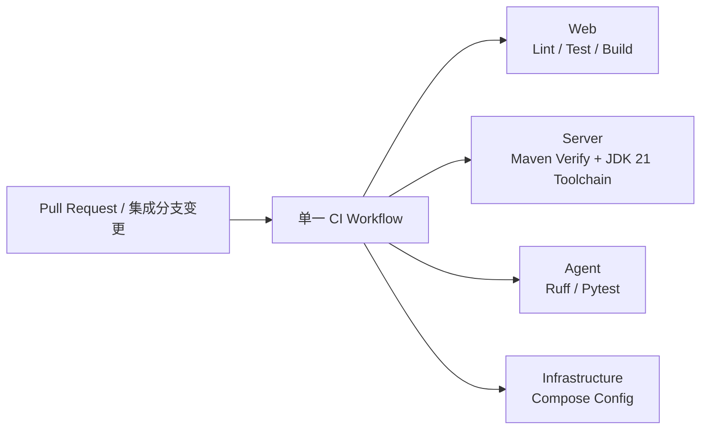

# D1-06 质量门禁与 CI 规划

## 1. 文档职责

本文档只规划 D1-06“质量门禁与 CI”的目标、范围、门禁契约、任务拆分、预期交付物、风险和验收标准。

本文档不包含 GitHub Actions YAML、依赖安装命令、质量命令的逐条操作方式、构建配置修改、Git 命令或执行日志。上述内容只在用户明确要求执行 D1-06 后，于对话中按当前切片提供。

D1-06 尚未执行并通过验收前，不规划或执行 D1-07“README 与全新启动验收”。

## 2. 阶段入口与当前事实

### 2.1 已满足的前置条件

- D1-05 已完成，提交为 `b147d01`。
- 当前分支为 `chore/bootstrap`，并跟踪 `origin/chore/bootstrap`。
- 当前 HEAD 为 `11d1f25`；该提交仅调整根目录 `AGENTS.md`，没有改变 D1-05 的应用实现或质量入口。
- 本规划开始前工作区干净。
- Web、Server、Agent 的构建文件、锁文件和现有测试已经进入仓库。
- 根级 `compose.yaml` 与安全配置示例已经进入仓库。
- `.github/workflows/` 当前不存在，因此仓库尚无 CI Workflow。

D1-06 执行开始时仍需只读复核分支、工作区和上述文件状态。若质量入口或锁文件在规划后发生变化，应先重新确认门禁映射，不得让 CI 与本地开发约定分叉。

### 2.2 已确认的质量入口

| 范围 | 已有门禁 | 仓库依据 | 外部依赖边界 |
| --- | --- | --- | --- |
| Web | Lint、测试、生产构建 | `package.json`、pnpm 锁文件、现有 ESLint/Vitest/Vite 配置 | 不连接后端或基础设施 |
| Server | Maven `verify` 生命周期 | Maven Wrapper、`pom.xml`、现有测试配置 | 使用测试隔离，不连接真实 PostgreSQL、Redis、RustFS 或 Agent |
| Agent | Ruff 静态检查、Ruff 格式检查、Pytest | `pyproject.toml`、uv 锁文件、现有测试替身 | 不连接真实 Redis 或 Qdrant |
| 基础设施 | Compose 配置解析 | 根级 `compose.yaml` 与 `.env.example` 契约 | 只解析配置，不启动容器或连接 Ubuntu VM |

这些入口已经由 `docs/03-development-guide.md` 统一记录。D1-06 只负责把同一组入口接入自动化，不新增平行命令、测试框架、格式化工具或自定义聚合脚本。

### 2.3 Java 基线

- Windows 默认 Java 继续保持 17。
- 本机 JDK 21 只通过项目级 Maven Toolchains 使用。
- CI 运行器需要准备可被 Maven Toolchains 发现的 JDK 21，但不得引用或提交本机 JDK 绝对路径。
- D1-06 不修改用户或系统 `JAVA_HOME`、PATH，也不改变项目的 Java 21 目标版本。

## 3. 本步目标与原则

### 3.1 要做什么

建立一个最小 GitHub Actions Workflow，使 Pull Request 和集成分支变更能够在无个人环境、无真实密钥、无外部基础设施的干净运行器上，可靠执行 Web、Server、Agent 和 Compose 已有质量门禁。

本阶段只需证明两件事：

1. 本地已有质量入口仍能组成一套完整、无重复的合并前检查。
2. 同一套入口能在 GitHub Actions 中独立、稳定地执行。

### 3.2 最小充分原则

- 仓库只新增一个 CI Workflow，不建设可复用 Workflow、复合 Action 或多层流水线。
- 一个 Workflow 内按 Web、Server、Agent、基础设施划分四个独立作业，便于定位失败，同时保持三端工具链互不污染。
- 每个作业只完成依赖准备和该范围已有门禁，不增加额外扫描、覆盖率阈值、制品发布或部署动作。
- 初版对触发范围内的变更执行全部四项门禁，不引入路径过滤、动态矩阵或变更检测脚本，避免个人项目因条件遗漏而跳过检查。
- 同一作业内按现有顺序执行检查；依赖安装、Lint、测试和构建是一个完整工程切片，不拆成多个对话轮次或多个 Workflow。
- 本地只做一轮完整门禁验证，远端只以一次完整成功运行证明 CI 契约；二者分别证明本地基线和 CI 可复现性，不追加重复验证。

## 4. 最小 Workflow 模型



四个作业之间没有运行依赖。任一作业失败都表示整体质量门禁未通过，但不会阻止其他作业给出自己的结果。

## 5. 范围边界

### 5.1 本阶段包含

- 复核四类已有质量入口与锁文件、Wrapper、测试隔离配置的一致性。
- 创建一个 GitHub Actions Workflow。
- 为 Web 准备 Node.js 与 pnpm 环境，并复用锁文件执行现有 Lint、测试和构建入口。
- 为 Server 准备 JDK 21 与 Maven Toolchains 环境，并通过 Maven Wrapper 执行现有 `verify` 门禁。
- 为 Agent 准备 Python 3.13 与 uv 环境，并复用锁文件执行现有 Ruff 与 Pytest 门禁。
- 为 Compose 配置解析提供临时、安全、非真实的必需输入。
- 在 CI 中只解析 Compose 配置，不启动或访问任何基础设施。
- 让 Workflow 覆盖面向 `develop`、`main` 的 Pull Request 与集成分支更新。
- 以一次本地完整门禁和一次 GitHub Actions 完整成功运行完成验收。

### 5.2 本阶段不包含

- 新增业务测试、集成测试、端到端测试或覆盖率目标。
- 新增测试框架、Lint 工具、格式化工具、类型检查器或安全扫描器。
- 修改 D1-05 的配置契约、健康端点、依赖检查或测试设计。
- 连接 Ubuntu VM，启动 Compose 服务，或访问真实 PostgreSQL、Redis、Qdrant、RustFS。
- 使用真实密钥、仓库 Secrets、个人 VM 地址或本机绝对路径。
- 将 Web、Server 或 Agent 容器化。
- 路径过滤、并发取消、构建矩阵、可复用 Workflow、自托管 Runner 或多操作系统测试。
- 构建制品上传、镜像构建、发布、部署、环境审批或通知集成。
- 分支保护规则、必需状态检查和 GitHub 仓库治理配置。
- CI 徽章、README 启动说明或 D1-07 的全新环境验收。

## 6. CI 运行契约

### 6.1 触发与权限

- Pull Request 是合并前质量反馈的主要入口。
- `develop` 与 `main` 的更新需要再次执行同一 Workflow，确认集成后的提交仍然有效。
- Workflow 只需要读取仓库内容，不申请写入仓库、发布包或访问部署环境的权限。
- 初版不按路径跳过作业；四项门禁始终给出明确结果。

### 6.2 Web 作业

- 使用仓库声明的 Node.js 与 pnpm 版本基线。
- 严格依据 pnpm 锁文件恢复依赖，避免 CI 静默改写依赖解析结果。
- 在同一作业内依次完成现有 Lint、测试和生产构建。
- 不连接 Server，不注入后端密钥；构建只使用允许进入浏览器的安全公开配置。

### 6.3 Server 作业

- CI 运行器准备 JDK 21，并使其通过 Maven Toolchains 被项目构建发现。
- 使用仓库内 Maven Wrapper 和现有 `pom.xml`，不依赖运行器预装 Maven 版本。
- 只执行现有 Maven `verify` 门禁，不额外拆分编译与测试。
- 复用 D1-05 的测试隔离配置，不启动数据库、缓存、对象存储或 Agent。
- CI 不引用 Windows 本机 JDK 21 路径，也不改变开发机默认 Java 17。

### 6.4 Agent 作业

- 使用仓库声明的 Python 3.13 基线与 uv 锁文件。
- 恢复包含开发质量工具的锁定依赖环境。
- 在同一作业内执行现有 Ruff 静态检查、Ruff 格式检查和 Pytest。
- 复用测试中的假配置与依赖替身，不提供真实 Redis、Qdrant 或服务间凭据。

### 6.5 基础设施作业

- 只验证 Compose 文件能够在必需变量齐全时完成解析。
- 必需变量使用仅在当前 CI 作业内生效的安全占位输入，不从 `.env.example` 的空值推断真实凭据。
- 不拉起服务、不等待容器健康、不访问 Ubuntu VM，也不持久化任何卷。
- 本作业只证明配置结构与变量契约有效，不重复 D1-04 的运行健康验收。

## 7. 任务拆分

### D1-06-A：建立最小质量门禁 Workflow

目标：把四类已有质量入口映射到一个易读、可定位失败且无外部依赖的 GitHub Actions Workflow。

任务：

- 复核当前分支、工作区、质量入口、锁文件和 Maven Wrapper。
- 确认 D1-05 测试隔离仍能支持无基础设施运行。
- 创建单一 Workflow，并划分 Web、Server、Agent、基础设施四个独立作业。
- 为各作业准备与仓库版本基线一致的运行时和锁定依赖。
- 让 Server 在 CI 中通过 Maven Toolchains 使用 JDK 21。
- 为 Web 和 Compose 提供最小安全公开输入或占位输入。
- 保持 Workflow 只读、无真实密钥、无 VM 连接和无部署能力。
- 对 Workflow 做一次结构复核，确认没有重复门禁或超出范围的自动化。

预期结果：仓库形成唯一 CI 入口，四个作业与本地质量契约一一对应。

### D1-06-B：本地与远端单次验收

目标：分别证明现有门禁在本地仍然成立，并且同一契约能在 GitHub 托管运行器上复现。

任务：

- 在本地对 Web、Server、Agent 和 Compose 各执行一次既有完整门禁。
- 本地 Server 继续通过项目级 Maven Toolchains 使用 JDK 21，不修改全局 Java。
- 将 Workflow 置于可触发的远端变更中，观察一次完整 GitHub Actions 运行。
- 确认四个作业均执行且成功，失败信息能够明确定位到对应应用或基础设施配置。
- 核对运行日志未泄露真实密钥、个人 VM 地址或本机绝对路径。
- 达到验收标准后停止，不追加重复运行、故障演练或性能优化。

预期结果：本地门禁与 CI 门禁保持同源，D1-06 可以结束并为 D1-07 提供稳定质量基线。

## 8. 预期工程结构变化

```text
purple-nexus/
├── .github/
│   └── workflows/
│       └── ci.yml
└── plans/
    └── day1/
        └── 06-quality-gates-and-ci.md
```

D1-06 的预期工程文件变化只有一个 Workflow。若现有质量入口无法在其已声明的版本和隔离边界内运行，应先将其视为上游阻塞，不以新增工具、重写测试或扩大 D1-06 范围解决。

## 9. 最小交付物

- 一个 GitHub Actions Workflow。
- Web、Server、Agent、基础设施四个可独立定位失败的质量作业。
- CI 中可被 Maven Toolchains 发现的 JDK 21 环境。
- 不依赖真实基础设施、真实密钥、个人 VM 地址或本机路径的 CI 输入边界。
- 一次本地完整门禁通过结果。
- 一次 GitHub Actions 四作业完整通过结果。

## 10. 验收标准

### 10.1 Workflow 结构

- 仓库只有一个承担 D1-06 职责的 Workflow。
- Workflow 在面向 `develop`、`main` 的 Pull Request 和集成分支更新时运行。
- Web、Server、Agent、基础设施分别形成独立作业，失败位置清晰。
- Workflow 只具备读取源码和执行检查所需的最小权限。
- 没有部署、发布、制品上传、自托管 Runner 或外部通知步骤。

### 10.2 门禁一致性

- Web 作业完整覆盖现有 Lint、测试和生产构建入口。
- Server 作业通过 Maven Wrapper 与 JDK 21 Toolchains 完成现有 `verify` 门禁。
- Agent 作业完整覆盖现有 Ruff 静态检查、Ruff 格式检查和 Pytest。
- 基础设施作业只完成 Compose 配置解析。
- CI 没有新增本地不存在的平行质量入口，也没有遗漏 `docs/03-development-guide.md` 已确认的门禁。

### 10.3 隔离与安全

- CI 不连接 Ubuntu VM，也不启动 PostgreSQL、Redis、Qdrant 或 RustFS。
- Server 和 Agent 测试不需要真实外部服务。
- Workflow 不依赖真实密钥或 GitHub Secrets。
- Compose 校验只使用临时安全占位输入。
- 日志与 Workflow 文件不包含个人 VM 地址、本机 JDK 路径或真实凭据。
- Windows 默认 Java 17 与用户、系统环境变量均未被改变。

### 10.4 结果

- 四类本地质量门禁各完成一次并全部通过。
- 一次 GitHub Actions 运行中的四个作业全部执行并通过。
- CI 失败时能够直接从作业与步骤名称判断所属范围。
- 未通过跳过测试、放宽检查、增加弱默认配置或连接真实基础设施来获得成功结果。

任一门禁只能依赖个人机器隐式状态、真实密钥或外部常驻服务才能通过时，D1-06 保持未完成。

## 11. 风险与处理原则

| 风险 | 影响 | 处理原则 |
| --- | --- | --- |
| 本地命令与 CI 使用不同入口 | 本地通过但远端失败，门禁失去可信度 | CI 直接复用构建文件中已有入口，不创建包装脚本 |
| Maven Toolchains 在 CI 中找不到 JDK 21 | Server 在编译前失败 | 由 CI 显式准备可发现的 JDK 21，不提交本机路径 |
| Server 测试读取真实运行配置 | CI 需要数据库或密钥 | 复用现有测试 Profile；若隔离失效，作为 D1-05 回归阻塞 |
| Agent 测试发起真实网络请求 | CI 不稳定或泄露配置 | 保持现有假配置和依赖替身，不启动 Redis 或 Qdrant |
| Compose 必需变量为空 | 配置解析在结构检查前失败 | 使用作业内临时安全占位输入，不使用真实 Secrets |
| 为缩短时间过早增加路径过滤 | 跨目录变更可能跳过必要作业 | 初版始终执行四项门禁，出现真实耗时问题后再评估 |
| 工具版本漂移 | 本地与 CI 结果不一致 | 复用 packageManager、锁文件、Wrapper、Python 和 Java 版本基线 |
| 为修复 CI 扩大到构建重构 | D1-06 越界且难以验收 | 发现上游缺陷时暂停，单独确认修复范围 |

## 12. 阻塞条件

出现以下任一情况时暂停 D1-06：

- 当前分支或工作区出现无法解释的变更。
- 任一已确认质量入口在本地无法通过，且原因不是 CI Workflow。
- 现有锁文件、Maven Wrapper 或版本声明无法支持干净环境恢复。
- Server 必须连接真实 PostgreSQL、Redis、RustFS 或 Agent 才能完成 `verify`。
- Agent 必须连接真实 Redis 或 Qdrant 才能完成测试。
- Compose 配置解析必须使用真实凭据或个人 VM 地址。
- Maven Toolchains 只能依赖本机绝对路径才能找到 JDK 21。
- 完成 Workflow 必须新增质量工具、业务测试或重新设计 D1-05。

阻塞解除前不得通过跳过检查、移除测试、放宽规则、硬编码凭据或连接个人环境代替验收。

## 13. 规划完成与执行入口

本文档完成只表示 D1-06 已规划，不表示 Workflow 已创建，也不表示本地或远端质量门禁已经执行。

执行预计分为两个工程切片：

```text
D1-06-A 建立最小质量门禁 Workflow
-> D1-06-B 本地与远端单次验收
```

下一次推进只能进入：

```text
D1-06-A 建立最小质量门禁 Workflow
```

Stop & Check：

> D1-06 规划已就绪。请检查最小 Workflow 范围、四类门禁映射、外部依赖边界和验收标准；确认后请明确回复“执行 D1-06”。在收到执行指令前，不创建 GitHub Actions Workflow、不修改构建配置，也不运行 D1-06 质量门禁。
