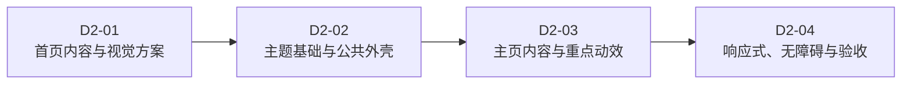

# Purple Nexus Day 2 总体任务规划

## 1. 文档职责

本文档定义 Purple Nexus Day 2 的总体目标、阶段边界、依赖关系、预期产物、风险和完成标准。

本文档只记录任务规划，不包含安装命令、依赖版本、组件代码、样式参数、页面成品、逐条操作教程或执行日志。Day 2 继续遵循：

```text
当前阶段规划 -> 当前阶段执行 -> 下一阶段规划 -> 下一阶段执行
```

只有当前阶段执行并通过验收后，才创建下一阶段的详细规划。

## 2. Day 2 入口状态

Day 1 已建立可复现的 Monorepo 工程基线：

- Web、Server 和 Agent 具备最小可运行骨架。
- 本地基础设施、配置契约、健康检查和质量门禁已经建立。
- Web 当前仍是最小状态页，尚未建立正式设计 Token、公共页面外壳或业务页面。
- 首页尚未确认实际文案、素材、字体、构图、动效和移动端降级方式。

因此 Day 2 从首页内容与视觉方案确认开始，不重新设计 Day 1 的工程基础。

## 3. Day 2 总体目标

Day 2 聚焦“设计系统首次落地与个人主页”，目标是交付一个可以代表 Purple Nexus 品牌、承担站点欢迎功能并可作为后续公开页面入口的正式主页：

- 明确首页体验目标、最小内容层级、主题素材和滚动叙事。
- 将现有设计原则落为前端可复用的语义 Token 和必要基础能力。
- 建立只服务于当前真实页面需求的公共页面外壳、导航和页脚。
- 完成桌面端完整构图与重点动效。
- 保证移动端核心内容可用，并覆盖键盘焦点和 Reduced Motion。
- 仅在主页存在真实动态数据需求时建立必要的数据读取链路。

Day 2 的成功标准不是依赖、组件或目录数量，而是主页视觉、内容、交互和工程结构形成一个可验证的完整切片。

## 4. 工程取舍原则

### 4.1 成熟方案优先

- 通用组件、可访问交互、动画编排、图标和样式基础优先采用成熟且与当前技术栈匹配的方案。
- 不重复实现框架、组件库或浏览器平台已经可靠提供的能力。
- 引入方案时关注当前收益、维护活跃度、许可证、包体影响和适配边界。
- 只有成熟方案无法满足核心需求，或存在明确的安全、性能、授权与维护约束时才自行实现。

### 4.2 依赖按需引入

- 不为未来可能使用的页面提前安装依赖或生成组件。
- shadcn/ui、Radix、Motion、GSAP 等方案依据实际页面交互分别判断，不要求成套引入。
- 同一个组件或交互场景不混用多套职责重叠的方案。

### 4.3 合理抽取

- 组件、Hook、工具函数、常量和配置按职责边界、真实复用与复杂度进行抽取。
- 不以文件越少为目标，也不为了目录形式拆分没有独立职责的代码。
- 只在出现明确跨页面或跨区块复用后，将实现提升到公共层。

### 4.4 个人项目尺度

- 不建立独立组件站点、全量组件目录或尚未使用的页面骨架。
- 不为展示型静态内容强制建设后端接口。
- 如果主页需要由所有者持续维护、与后续业务共享或从服务端聚合的数据，可以规划必要的最小后端读取链路。
- 测试聚焦关键渲染、交互、配置与降级行为，不对纯装饰细节建立脆弱断言。

## 5. 范围边界

### 5.1 Day 2 包含

- 首页内容和视觉方案确认。
- 主页所需字体、主题素材、图标和资源组织。
- 语义颜色、排版、间距、形状、阴影、玻璃和动画 Token。
- 公共页面外壳、导航、页脚及其必要交互。
- 首页主视觉、功能入口和重点滚动叙事。
- 主页真实需要的最小数据读取能力。
- 桌面端完整体验与移动端基础降级。
- 键盘访问、可见焦点、对比度、Reduced Motion 和关键溢出检查。
- 与实现风险相匹配的前端测试和阶段质量验收。

### 5.2 Day 2 不包含

- 作品列表、作品详情及作品管理。
- 博客列表、Markdown 阅读及博客管理。
- 所有者认证、写接口和管理后台。
- RAG、Agent 对话、记忆、反思或工具调用。
- 为后续页面预先建立数据库表、空接口或完整布局。
- 深色主题、多套角色主题切换、Three.js 或大型粒子系统。
- 独立 Storybook、通用设计系统包或完整组件目录建设。
- 生产部署、域名、HTTPS、监控和备份。

## 6. 阶段拆分与依赖



### D2-01：首页内容与视觉方案

确定首页要表达的信息、主题素材、视觉方向、桌面构图、滚动叙事、移动端降级和实现边界，避免编码后反复推翻结构。

预期产物：

- 经确认的首页内容结构与文案职责。
- 经确认的素材范围、来源边界和使用角色。
- 经确认的桌面构图、重点动效与移动端降级原则。
- D2-02 可以直接使用的实现约束和验收重点。

### D2-02：主题基础与公共外壳

根据 D2-01 的真实方案选择并引入必要依赖，建立语义 Token、全局样式、公共页面外壳、导航和页脚。

预期产物：

- 可复用且职责清晰的主题基础。
- 可访问的公共页面外壳。
- 支撑主页开发的必要组件与资源入口。

### D2-03：主页内容与重点动效

实现首页内容区块、特色入口和滚动叙事，并在确有必要时接入最小数据读取链路。

预期产物：

- 完整的桌面主页内容与交互。
- 与内容结构匹配的重点动效。
- 清晰的组件职责和数据流。

### D2-04：响应式、无障碍与验收

集中处理移动端降级、键盘访问、Reduced Motion、关键兼容问题和阶段质量门禁。

预期产物：

- 移动端可用的核心内容与操作。
- 可验证的无障碍和动效降级行为。
- Day 2 的最终质量检查与验收结论。

## 7. 总体预期交付

- 正式的 Purple Nexus 个人主页。
- 首页首次落地的语义 Token 与全局视觉基础。
- 公共页面外壳、导航与页脚。
- 已纳入来源管理的主题素材和必要免责声明。
- 桌面端完整构图与重点动效。
- 移动端核心内容、键盘操作和 Reduced Motion 支持。
- 与当前实现相匹配的必要测试。

不单独创建与源码重复的组件清单、执行日志或设计系统副本文档。

## 8. 总体风险

| 风险 | 影响 | 处理原则 |
| --- | --- | --- |
| 首页内容和素材未确认就开始编码 | 页面结构反复推翻 | D2-01 验收前不进入实现 |
| 同时引入多套职责重叠的方案 | 包体、认知和维护成本增加 | 按实际交互逐项选型 |
| 为追求抽象而拆出大量薄包装 | 阅读路径变长且没有复用收益 | 抽取必须对应职责或复用 |
| 为追求精简而把所有逻辑塞入单文件 | 组件职责混乱、难以维护 | 按页面结构和交互边界拆分 |
| 官方素材来源或用途不清 | 版权说明缺失、资源难以替换 | 区分官方与原创素材并保留来源 |
| 桌面演出直接压缩到移动端 | 内容溢出、交互不可用 | 为移动端设计明确降级路径 |
| 动画依赖滚动劫持或持续高负载 | 操作不适、性能下降 | 不劫持滚动并提供 Reduced Motion |
| 为首页提前建设业务后端 | Day 2 越界并增加无效维护 | 只为真实数据需求建立最小链路 |

## 9. Day 2 完成标准

只有同时满足以下条件，Day 2 才视为完成：

- 首页能够通过视觉、动画和交互建立 Purple Nexus 主题印象，并提供清晰的后续内容入口。
- 首页不依赖个人经历、技术栈列表或教学性说明证明技术能力。
- 视觉方案符合浅色、丁香紫、浅青、玻璃与科技感的主题原则。
- 桌面目标视口具备完整构图和重点动效。
- 移动端能够阅读核心内容并完成主要导航，不存在关键内容溢出。
- 所有可操作元素可以通过键盘访问，焦点持续可见。
- Reduced Motion 下不保留持续运动、大幅位移或依赖动画才能理解的内容。
- 官方素材与原创素材边界清楚，页脚包含非官方项目声明。
- 代码抽取与依赖引入均有真实职责和使用场景。
- 没有为了后续功能创建空页面、空接口或未使用依赖。
- Web 针对性测试、静态检查和构建全部通过。

## 10. 阶段推进规则

Day 2 始终按照第 6 节定义的依赖顺序推进。当前步骤以对应的阶段规划文档和对话为准，本总览不维护执行进度或待办状态。

任一步骤未执行并通过验收前，不规划其后续步骤；下一步骤规划完成并得到确认前，不进入实现。
