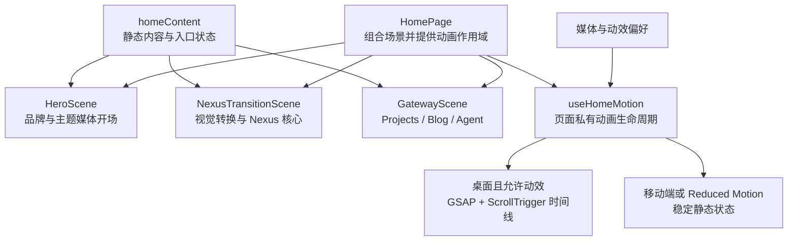

# D2-03 主页内容与重点动效规划

## 1. 文档职责

本文档只规划 D2-03「主页内容与重点动效」的稳定目标、实现边界、职责拆分、风险和验收标准。

首页内容、素材角色、视觉节奏、桌面滚动叙事、移动端降级和实现取舍以 `01-home-content-and-visual-brief.md` 第 12 节为唯一上游事实来源；主题 Token、全局样式和公共外壳以 `02-theme-foundation-and-shell.md` 第 14 节为冻结基线。本文档不重复改写两份前序文档已经确认的结论。

D2-03 规划完成后必须停下来等待用户确认；在用户明确要求执行前，不安装动画依赖、不引入首页素材，也不修改 Web 源码。D2-03 执行并通过验收前，不规划 D2-04 的具体实现。

## 2. 上游输入与当前基线

### 2.1 已确认输入

- 首页是以视觉、动画和交互能力为核心的主题体验入口，不承担简历、技术教程或完整站点导航职责。
- 首页采用 Hero、Nexus 转换和 Gateway 三段连续叙事，形成明亮珍珠紫、深紫宇宙、明亮玻璃的视觉节奏。
- 首页整体采用现代二次元视觉方向；Purple Heart 与 Purple Sister 是重要主题灵感和可使用的内容元素，但不再作为所有媒体、UI、动效与文案必须服从的唯一母题。
- Projects、Blog、Agent 是 Gateway 的三个入口；尚未开放的能力必须显示真实状态，不创建伪链接。
- 稳定内容由前端静态配置提供，本阶段不需要后端接口、远程状态或客户端数据请求方案。
- 桌面端使用自然滚动承载重点叙事，不劫持滚轮；移动端与 Reduced Motion 使用可直接阅读和操作的稳定最终状态。
- Tailwind 负责布局、间距、响应式、排版和常见状态；复杂渐变、遮罩、伪元素、场景特效与页面级发光允许使用普通 CSS。
- 复杂桌面时间线由页面私有动画 Hook 集中管理，使用 GSAP、ScrollTrigger、官方 React 集成和媒体条件完成作用域、生命周期及清理。

### 2.2 当前工程基线

- `App` 已只渲染 `HomePage`，首页具备 Header、唯一一级标题、`main`、Footer 和跳至主要内容能力。
- Tailwind 已通过 Vite 接入，语义工具类与普通 CSS 共享 `theme.css` 中的主题 Token。
- 全局样式只负责画布、字体、文字选择、焦点和 Reduced Motion 基线，首页具体视觉仍可保持页面私有。
- `HomeHeader` 与 `HomeFooter` 已作为首页私有组件存在，当前不需要路由、公共导航或跨页面布局抽象。
- 现有针对性组件测试已经覆盖首页外壳语义，可在原测试职责内扩展真实场景与入口断言。

## 3. 本步目标

D2-03 要在现有主题基础和公共外壳上完成首个真实可用的首页体验：

1. 建立单一、清晰的首页静态内容契约。
2. 实现 Hero、Nexus 转换和 Gateway 三个职责明确的场景组件。
3. 完成与实际媒体相适配的首屏主题构图、连续视觉转换和三个特色入口的真实桌面内容。
4. 只为关键滚动叙事引入并集中管理 GSAP 动画能力。
5. 同步提供移动端与 Reduced Motion 可用的静态状态，使 D2-04 可以在不重构场景的前提下集中完善响应式和无障碍。

本步不追求覆盖所有设备和兼容性细节。成功标准是桌面主页叙事完整、内容语义真实、动画生命周期可靠，并已具备后续集中收口所需的结构。

## 4. 页面结构与运行关系



`HomePage` 只负责组合场景、连接静态内容并提供动画作用域，不承载各场景的细节布局。场景组件负责自己的语义结构和可见内容；动画 Hook 只读取约定的场景目标并控制时间线，不生成业务内容，也不接管组件状态。

## 5. 实施原则

### 5.1 内容和静态状态先成立

三个场景在没有 JavaScript 动画时也必须形成完整、可理解的页面。桌面动画是对既有内容的渐进增强，不得成为标题、入口状态或核心主题信息出现的唯一条件。

### 5.2 场景职责保持独立

- `HeroScene` 负责唯一一级标题、与实际媒体相适配的首屏构图和进入体验的视觉提示。
- `NexusTransitionScene` 负责从明亮开场进入深紫高潮的连续视觉转换，以及 Nexus 核心和数据界面的视觉表达。
- `GatewayScene` 负责 Projects、Blog、Agent 三个入口的真实状态、操作语义和明亮收束。
- `HomeHeader` 与 `HomeFooter` 继续承担既有外壳职责，不因场景开发扩展成站点级公共组件。

单次使用的装饰元素保留在所属场景内；只有出现真实复用或独立复杂职责时才抽成局部组件。

### 5.3 CSS 与 GSAP 各自负责适合的问题

- Tailwind 与页面私有 CSS 定义稳定布局、最终视觉状态、静态响应式和简单交互。
- CSS 负责不依赖滚动进度的悬停、按钮反馈、环境光和基础淡入效果。
- GSAP 与 ScrollTrigger 只负责关键滚动区间中的连续变换、场景衔接和时间线编排。
- 不使用滚轮劫持，不用 JavaScript 设备检测决定布局，不用动画运行结果保存业务状态。

### 5.4 动画生命周期集中且可清理

页面私有 `useHomeMotion` 使用官方 React 集成建立作用域，通过 `gsap.matchMedia()` 区分桌面动效与静态回退，并在组件卸载或条件变化时统一还原动画上下文。场景组件不各自注册零散的 ScrollTrigger。

### 5.5 素材来源与视觉职责一起落地

进入仓库的外部素材必须在资源目录旁保留来源记录。素材优先满足可追溯性、构图适配和画面质量，而不是单纯追求角色对应、数量或分辨率；普通二次元媒体可以承担首要视觉职责，UI 在复用全局语义 Token 的前提下根据实际画面调整局部色彩、装饰和动效，不强制套用角色专属符号。

## 6. 范围边界

### 6.1 本步包含

- 首页私有静态内容配置及入口可用状态。
- Hero、Nexus 转换和 Gateway 三个真实场景组件。
- 支撑三个场景的首页私有样式与必要装饰。
- 首页实际使用的二次元媒体、主题界面素材和相邻来源记录。
- GSAP、ScrollTrigger 与官方 React 集成在首次真实使用时的最小接入。
- 页面私有动画 Hook、桌面时间线、媒体条件和清理逻辑。
- 移动端与 Reduced Motion 所需的稳定静态状态基础。
- Projects、Blog、Agent 的真实可用与未开放语义。
- 现有首页组件测试中与场景内容和入口状态直接相关的针对性断言。
- 主要桌面视口下对构图、自然滚动、场景衔接和动画清理的浏览器验证。

### 6.2 本步不包含

- Projects、Blog、Agent 的真实子页面、路由或后端能力。
- Axios、React Query、远程配置、鉴权、后台管理或数据库读取。
- Motion、Three.js、Rive、粒子引擎、轮播库或完整 UI 组件库。
- 独立的通用动画框架、跨页面场景 DSL 或为未来页面预建的抽象层。
- 滚轮劫持、强制分页滚动、无限粒子背景或持续高成本特效。
- D2-04 负责的最终移动端精修、完整无障碍检查、关键兼容性收口和 Day 2 全量质量门禁。
- 对已经冻结的主题入口和公共外壳进行无关重构。

## 7. 任务拆分

### D2-03-A：建立内容契约与素材入口

根据 D2-01 已确认内容建立首页私有静态配置，明确三个场景读取的标题、短文案、入口状态和操作语义；同时放入实际会使用的二次元媒体及主题素材，并记录外部素材来源。

预期结果：内容、状态和素材职责有唯一来源，场景组件不散落重复文案或来源信息。

### D2-03-B：建立三个场景的语义与静态最终状态

将现有首页主内容拆成 Hero、Nexus 转换和 Gateway 三个场景，先完成无动画时也成立的文档顺序、标题层级、入口状态和稳定视觉落点。

预期结果：关闭或跳过动画时仍能完整阅读首页，D2-03 后续动效不会改变核心语义。

### D2-03-C：完成 Hero 主题媒体构图

围绕唯一一级标题、实际媒体内容和明亮二次元视觉开场完成桌面首屏。通过裁切、明暗层级以及与素材协调的玻璃、发光或图形装饰建立焦点，并保留后续转换场景需要的视觉承接点；UI、动效和文案根据画面内容适配，不强制加入角色专属符号或作品剧情。

预期结果：首屏在基准桌面视口中清楚表达 Purple Nexus 品牌和统一的现代二次元风格，同时与实际媒体内容一致，没有角色误认、剧情错配、简历式说明或多余入口竞争焦点。

### D2-03-D：完成 Nexus 转换与重点滚动动效

实现从 Hero 到深紫 Nexus 核心高潮的连续视觉转换，在首次实际使用时接入最小动画依赖，并由页面私有 Hook 统一注册桌面时间线、媒体条件与清理。

预期结果：自然滚动可以推动关键场景变化，有限的固定或粘性区域最终能够正常离场；移动端和 Reduced Motion 不依赖复杂时间线。

### D2-03-E：完成 Gateway 与页面收束

实现明亮玻璃环境中的 Projects、Blog、Agent 三个入口，根据静态配置渲染真实可用状态；未开放能力保持可识别但不可误操作，Footer 在场景之后自然出现。

预期结果：首页叙事由高潮回到可操作入口，三个方向权重清楚且没有伪链接。

### D2-03-F：完成针对性验证与清理

扩展现有首页组件测试，证明核心场景内容和入口状态；在约定的桌面视口检查构图、自然滚动、场景离场、动画条件与清理，并移除实施中产生的无效样式、素材或抽象。

预期结果：桌面主页形成一条可验证的真实体验路径，同时保留 D2-04 集中收口所需的清晰基线。

## 8. 预期工程变动

以下结构描述职责边界，不要求为了目录形式创建没有实际内容的文件：

```text
apps/web/src/
├─ assets/home/
│  ├─ official/                 # 实际使用且可追溯的外部素材
│  ├─ original/                 # 项目原创主题装饰
│  └─ SOURCES.md                # 外部素材来源与用途
├─ pages/home/
│  ├─ components/
│  │  ├─ HomeHeader.tsx
│  │  ├─ HeroScene.tsx
│  │  ├─ NexusTransitionScene.tsx
│  │  ├─ GatewayScene.tsx
│  │  └─ HomeFooter.tsx
│  ├─ hooks/
│  │  └─ useHomeMotion.ts
│  ├─ styles/
│  │  └─ home.css
│  ├─ homeContent.ts
│  └─ HomePage.tsx
└─ App.test.tsx
```

若实际内容不足以支撑某个目录层级，应保留更扁平的页面私有结构；只有已经使用的素材和职责才进入工程。

## 9. 内容与状态边界

- `homeContent` 保存稳定文案、场景标签、Gateway 条目及其可用状态，不保存 DOM 引用、动画参数或视觉坐标。
- 场景组件将配置转换为语义化界面，并负责可访问名称、不可用状态和装饰性素材边界。
- CSS 保存可复用的页面视觉参数和稳定最终状态，不复制 `theme.css` 已有品牌 Token。
- 动画 Hook 只管理选择器或引用、媒体条件、时间线和清理，不决定入口是否可用，也不动态拼装页面内容。
- 尚未开放的 Gateway 条目不渲染成链接；未来真实路由出现时再根据实际目标升级其交互语义。

## 10. 验收标准

D2-03 只有同时满足以下条件才通过：

- 首页真实包含 Hero、Nexus 转换和 Gateway 三个连续场景，Footer 位于第三场景之后。
- Hero 的媒体、UI、动效与文案表达彼此一致，三个场景具有连续的现代二次元视觉语言；Purple Heart 与 Purple Sister 相关元素只在适合实际素材和场景时出现，不把普通二次元人物误写成角色本人或强加作品剧情。
- 页面形成明亮珍珠紫、深紫宇宙高潮、明亮玻璃收束的视觉节奏，玻璃与发光没有制造多个竞争焦点。
- 首页内容来自页面私有静态配置，没有接入不必要的后端、远程状态或路由。
- Projects、Blog、Agent 均可识别；未开放能力明确显示状态且不是伪链接。
- 没有 JavaScript 动画或在 Reduced Motion 条件下，核心内容、入口状态和页面顺序仍然完整可用。
- 桌面重点动效使用自然滚动，有限固定区域可以正常离场，不劫持滚轮或强制分页。
- GSAP 时间线集中在页面私有 Hook 中，并具备明确作用域、媒体条件和统一清理；场景组件没有分散注册难以回收的触发器。
- 移动端不运行复杂滚动时间线，能够复用同一组件、内容和素材呈现稳定状态。
- 外部素材具有相邻来源记录，仓库中没有未使用或来源不明的候选素材堆积。
- 首页组件测试覆盖核心场景内容、三个 Gateway 条目及其不可用语义。
- 桌面基准视口和 D2-01 已确认的补充桌面视口完成针对性浏览器检查，没有关键遮挡、横向溢出或无法离开的场景。
- D2-04 可以在不重写场景职责、内容契约和动画生命周期的前提下完成最终响应式与无障碍收口。

## 11. 验证边界

本阶段只执行一次能够证明真实首页结构和入口状态的针对性组件测试，并使用浏览器验证无法由组件测试证明的桌面构图、自然滚动、时间线切换和清理行为。

移动端与 Reduced Motion 在本阶段只验证静态回退架构确实生效，不提前完成 D2-04 的全部尺寸精修和无障碍验收。完整测试、静态检查、生产构建和 Day 2 综合浏览器验收统一在 D2-04 收口。

## 12. 风险与处理原则

| 风险 | 影响 | 处理原则 |
| --- | --- | --- |
| 媒体素材与主题 UI 或文案叙事不一致 | 普通二次元人物被误认成角色，页面同时出现多套视觉语言 | 先确认素材在场景中的职责，再使用统一 Token、裁切、遮罩和主题装饰完成适配；文案不虚构素材中没有发生的剧情 |
| 动画先于静态内容成立 | 页面在加载失败、移动端或 Reduced Motion 下缺失核心信息 | 先完成语义结构和稳定最终状态，再把桌面滚动时间线作为渐进增强 |
| 场景各自注册动画 | 生命周期分散，条件切换后残留样式或触发器 | 统一由页面私有 Hook 建立作用域、媒体条件和清理 |
| 追求视觉冲击导致持续高成本特效 | 滚动卡顿、文本难读或移动端负担过高 | 把高强度效果限制在主题转换高潮，其他区域使用静态 CSS 与克制反馈 |
| 为三个入口提前建立真实页面能力 | D2-03 越界并产生伪导航或空模块 | 只呈现真实状态；没有目标页面时保持非链接语义 |
| 桌面固定场景无法自然离场 | 破坏普通网页滚动和 Footer 可达性 | 固定行为只服务有限区间，必须能够回到正常文档流 |
| 一次抽取过多装饰组件或动画工具 | 页面职责被空抽象分散 | 单次使用内容留在场景内，只有真实复用或复杂独立职责才抽取 |

## 13. 阻塞条件

出现以下任一情况时，暂停 D2-03 执行并先完成必要确认：

- 可获得的候选素材在来源、使用边界或画面质量上都无法进入仓库，也无法通过项目自有的主题界面层建立稳定视觉锚点。
- 候选素材的权利边界、来源记录或仓库使用方式存在明显冲突。
- Gateway 的条目名称、状态或操作语义与 D2-01 已确认结果不一致。
- 重点动效只能通过滚轮劫持、强制分页或无法可靠清理的方式实现。
- 当前场景结构无法为移动端或 Reduced Motion 提供完整静态状态。
- 实施需要推翻 D2-02 已冻结的主题入口或公共外壳，而不是对其进行必要扩展。

## 14. 执行入口

D2-03 执行阶段应继续采用导师式小任务推进：

1. 每轮先解释当前小任务的目标、运行原理、职责边界和预期文件影响。
2. 在代码或配置前补充简短开发步骤骨架，再按职责片段交错讲解并提供可执行实现。
3. 用户亲自修改代码和配置，Codex 随后直接检查真实文件和针对性结果。
4. 每轮只验证当前行为所需的一条证据，不把 D2-04 的完整门禁提前搬入本阶段。
5. 达到本规划验收标准后立即停止，等待用户明确要求规划 D2-04。

> D2-03 规划已就绪。请确认本阶段的目标、范围、素材边界、场景职责、动画生命周期和验收标准；确认后请明确回复“执行 D2-03”。在此之前不安装依赖、不引入首页素材、不修改 Web 源码，也不规划 D2-04。

## 15. 确认结果清单

本节只记录 D2-03 已确认且会影响后续工作的最终结论，不记录命令、代码、依赖版本、执行日志或临时过程。

- [x] D2-01 第 12 节是首页内容、素材角色、视觉节奏、桌面叙事、移动端降级和实现边界的唯一上游事实来源。
- [x] D2-02 第 14 节是主题 Token、全局样式、公共外壳、字体和现有语义测试的冻结基线。
- [x] D2-03 使用前端静态配置承载稳定首页内容和 Gateway 状态，不建立后端或远程数据读取链路。
- [x] D2-03 完成三个真实场景、桌面重点动效和可用静态回退基础；最终响应式、无障碍、兼容性及 Day 2 全量质量门禁由 D2-04 集中收口。
- [x] 首页文案采用克制、现代、直接的信息表达，二次元风格主要由媒体、配色、构图和动效承担，避免依赖特定作品的世界观术语堆叠气氛。
- [x] 首页媒体素材放宽为来源可追溯、画面质量可用的普通二次元插画、动态图片、视频和原创科技装饰，不要求每项资源直接描绘 Purple Heart 或 Purple Sister，也不再预设“两张独立透明全身立绘左右并排”的 Hero 构图。
- [x] Purple Nexus 的整体 UI 放宽为现代二次元风格；Purple Heart 与 Purple Sister 是重要主题灵感和可使用的内容元素，但不再作为全站 UI 的唯一设计母题，也不要求普通媒体通过角色专属配色、Processor Unit 或双核心叙事进行统一。
- [x] Hero、转换场景、Gateway、动效命名和可见文案都必须根据实际媒体内容进行适应性设计；可以保留项目统一的语义 Token、排版层级和交互规范，但不照搬素材自带 UI，也不使用变身、战斗或特定世界观叙事解释无关画面。
- [x] Hero 首屏采用用户提供的 Plana 4K MP4 动态壁纸原文件，不制作或替换为低分辨率版本；文件的实际来源信息、可见水印和使用范围在素材进入仓库时如实记录，不用无法核实的同名网页补全来源。
- [x] 前端源码、样式和前端测试改由 Codex 直接实现，用户负责产品方向、交互取舍和视觉验收；D2-03 仍按既定小任务顺序推进，不因角色变化扩大单轮范围。
- [x] 桌面滚动动效由页面私有 `useHomeMotion` 集中管理；`ScrollTrigger` 仅在浏览器具备 `matchMedia` 且满足桌面、非 Reduced Motion 条件时注册，静态测试与降级环境不伪造浏览器动画能力。
- [x] Gateway 使用明亮紫白渐变与低透明度网格承接 Nexus 高潮；Projects、Blog、Agent 的 `building` 状态以徽标呈现但继续保持不可聚焦的 `article` 语义，Footer 在 Gateway 之后自然收束。
- [x] 桌面浏览器验证确认 Hero → Nexus 时间线可逆，回滚后 Hero 与 Nexus 恢复静态初始状态；页面可自然滚到底部，Footer 可达且运行时无错误。
