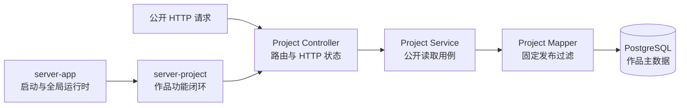

# D3-01 作品主数据与公开读取契约规划

## 1. 文档职责

本文档只规划 D3-01「作品主数据与公开读取契约」的稳定目标、实现边界、职责拆分、预期工程影响、风险和验收标准。

本文档不记录数据库完整字段、接口 JSON、安装命令、依赖版本、完整代码、逐条操作教程、执行进度或排障日志。具体实现细节由 Maven 配置、迁移、Java 源码和测试维护。

D3-01 只完成 Server 公开读取契约。作品 Web 列表、详情页面与首页入口接入分别属于后续阶段，在 D3-01 执行并通过验收前不创建其详细规划或源码。

## 2. 上游输入与工程基线

### 2.1 稳定上游输入

- `plans/day2/04-responsive-accessibility-and-acceptance.md` 第 10 节冻结了当前首页结构、Gateway 状态语义、响应式、键盘访问、媒体失败和 Reduced Motion 基线。
- `docs/01-product-scope.md` 规定访客只能浏览已发布作品，并要求列表与详情具备加载、空数据和异常状态。
- `docs/02-architecture.md` 规定 Spring Boot 是公开业务请求的统一入口和安全边界，PostgreSQL 是作品业务主数据的事实来源。
- `docs/03-development-guide.md` 规定 Maven 模块、Flyway 迁移、环境配置和 Server 质量门禁的维护方式。
- `AGENTS.md` 规定后端、数据库和基础设施由用户亲自编写，Codex 负责导师式讲解、真实文件检查和问题纠正。

### 2.2 D3-01 工程基线

- Server 已具备 Spring Boot 启动入口、全局配置、健康检查、MyBatis、Flyway 和 PostgreSQL 基础能力。
- Server 尚未形成作品领域的完整公开查询链路和对应业务验收证据。
- Web 仍以 Day 2 首页为冻结基线，本阶段不修改 `apps/web`。
- 当前没有作品写入、认证、缓存、搜索或其他必须兼容的作品业务实现。

## 3. 本步目标

D3-01 要交付首个真实的 Server 业务功能切片：

1. 建立只服务于当前作品功能的模块化单体边界。
2. 使用 PostgreSQL 约束作品公开标识、发布状态和发布时间之间的一致性。
3. 建立列表与详情所需的最小公开读取投影。
4. 完成 Controller -> Service -> Mapper 查询链路，并在所有公开路径中强制发布隔离。
5. 明确列表、详情、未发布、不存在和基础服务异常的稳定语义。
6. 通过针对性 Server 测试证明公开查询边界，而不是只证明代码能够启动。

本阶段不以 Web 页面或人工伪造数据替代 Server 契约验收。成功标准是后续 Web 可以直接依赖一条语义明确、不会泄露草稿的真实接口。

## 4. 模块与运行关系



- `server-app` 负责 Spring Boot 启动、全局配置、健康检查和运行时组装，不保存作品业务实现。
- `server-project` 负责作品迁移、读取模型、Mapper、Service、Controller 和作品测试。
- `server-app` 可以依赖 `server-project` 完成组装；作品模块不得反向依赖启动模块。

## 5. 实施原则

### 5.1 功能模块内部保持分层

- Controller 只处理公开路由、输入边界和 HTTP 状态，不直接访问 Mapper。
- Service 表达公开读取用例和领域失败语义，不承担 JSON 拼装或数据库字段映射。
- Mapper 负责参数化 SQL、结果映射和不可绕过的已发布过滤，不承担 HTTP 转换。
- 读取投影只承载当前列表或详情真实需要的信息，不暴露内部数据库 ID、草稿状态和无关审计字段。

### 5.2 发布过滤不可由调用方控制

- 列表查询固定只读取已发布作品，不接受客户端传入“是否包含草稿”的参数。
- 详情查询同时使用公开标识和已发布状态定位作品。
- 不存在与未发布统一表现为公开详情不可用，不能返回标题、摘要、正文或其他可用于确认草稿存在的信息。
- 后续新增查询入口时必须复用同一发布语义，不能形成列表安全而详情泄露的分叉。

### 5.3 数据约束保护长期事实

- 公开标识必须稳定且唯一，能够支持后续可复制、可直达的详情地址。
- 发布状态与公开发布时间保持一致，非法组合应在业务事实来源处被拒绝。
- 公开列表排序应稳定；相同发布时间仍需具备确定顺序。
- 测试数据不进入生产迁移，已执行迁移不通过原地修改修复。

### 5.4 HTTP 语义保持简单

- 列表查询成功但没有已发布作品时，返回成功状态和空集合，不把空数据视为异常。
- 已发布详情返回成功状态和公开内容。
- 不存在与未发布详情统一返回未找到状态。
- 数据库或其他基础服务异常不能伪装成空集合或未找到，应保留为服务失败。
- 当前响应直接使用职责清晰的读取投影，不增加没有额外语义的统一响应包装。

### 5.5 只验证真实风险

- 测试重点保护发布过滤、列表稳定顺序、详情不可泄露和 HTTP 状态。
- 不为 Spring 依赖注入、Record 访问器或简单委托方法建立重复测试。
- 涉及 PostgreSQL 约束或 SQL 行为时，验证方案必须能够代表真实数据库语义，不能用与生产数据库明显不同的行为替代安全结论。

## 6. 范围边界

### 6.1 本步包含

- Maven 聚合父工程与当前作品功能所需的模块关系。
- `server-app` 中现有启动、全局配置与健康检查职责的保留和运行时组装。
- `server-project` 中的作品迁移、读取投影、Mapper、Service 和公开 Controller。
- 已发布作品列表和按稳定公开标识读取详情。
- 空列表、公开详情、未找到、未发布和基础服务异常语义。
- 发布状态、发布时间、公开标识和稳定排序所需的数据约束。
- 覆盖发布隔离和主要 HTTP 语义的针对性 Server 测试。
- 一次能够证明当前模块与公开读取链路成立的针对性验证。

### 6.2 本步不包含

- `apps/web` 中的路由、API 适配、作品列表、详情页面或首页入口修改。
- 作品新增、修改、删除、草稿管理和发布操作。
- 所有者认证、Session、CSRF 或管理端接口。
- 封面上传、对象存储业务封装或媒体管理页面。
- 搜索、复杂筛选、分页、推荐、标签导航或 Redis 缓存。
- 博客、Markdown、知识库、RAG 或 Agent 功能。
- 为未来业务提前创建共享模块、统一异常平台、通用仓储层或空接口。

## 7. 任务拆分

D3-01 是一个完整的 Server 公开读取切片。以下内容按职责分段教学与实现，不拆成彼此失去业务意义的独立阶段。

### D3-01-A：建立作品功能模块边界

将 Server 调整为聚合父工程、应用组装模块和作品功能模块；迁移现有启动、全局配置和健康检查时保持其行为不变，只改变职责归属。

预期结果：启动模块只组装运行时，作品模块可以独立维护业务闭环，依赖方向单向且没有空共享模块。

### D3-01-B：建立作品主数据与公开读取模型

通过 Flyway 建立作品主数据、公开标识、发布状态、公开时间和稳定排序所需约束；分别定义列表与详情的最小读取投影。

预期结果：数据库能够拒绝非法发布状态，读取模型不暴露内部写入与审计信息，也不依赖封面才能表达核心内容。

### D3-01-C：建立不可绕过的公开数据查询

使用 MyBatis Mapper 与相邻 XML 查询实现已发布列表和详情读取。列表与详情都在 SQL 查询中固定发布条件，调用方不能请求包含草稿。

预期结果：空列表是正常结果；不存在和未发布详情统一为空查询结果；列表顺序稳定。

### D3-01-D：建立公开查询用例与 HTTP 契约

由 Service 暴露作品公开读取用例，由 Controller 提供列表和详情路由，并将空详情转换为未找到状态；基础服务异常继续表现为服务失败。

预期结果：后续 Web 只需依赖明确的公开接口，不直接理解 Mapper、发布状态或数据库结构。

### D3-01-E：完成发布隔离验证与模块收口

围绕公开列表、公开详情、草稿隔离、不存在详情、稳定排序和主要 HTTP 状态建立必要测试；确认模块组装没有破坏原有启动与健康职责，并清理迁移过程中遗留的旧目录或重复配置。

预期结果：Server 具备一条自动化证据支持的公开读取契约，且没有加入 Web、管理写入或未来模块的占位实现。

## 8. 预期工程变动

以下结构描述职责边界，不要求为了目录形式创建没有实际内容的文件：

```text
apps/server/
├─ pom.xml
├─ server-app/
│  ├─ pom.xml
│  └─ src/
│     ├─ main/
│     │  ├─ java/com/purple/
│     │  └─ resources/application.yml
│     └─ test/
└─ server-project/
   ├─ pom.xml
   └─ src/
      ├─ main/
      │  ├─ java/com/purple/project/
      │  │  ├─ controller/
      │  │  ├─ service/
      │  │  ├─ mapper/
      │  │  └─ read/
      │  └─ resources/
      │     ├─ com/purple/project/mapper/
      │     └─ db/migration/
      └─ test/java/com/purple/project/
```

- 父 `pom.xml` 只维护聚合关系和真正共享的构建信息。
- Spring Boot 可执行打包只属于 `server-app`。
- 作品 SQL 与 Mapper 接口相邻组织；迁移仍使用全局 Flyway 位置。
- 不提前创建 `server-common`、`server-blog`、`server-agent` 或横向 Controller/Service/Mapper 模块。

## 9. 公开契约与失败边界

- 列表与详情使用同一个稳定公开标识建立导航关系。
- 列表只返回卡片展示需要的公开信息，详情在其基础上提供完整公开介绍。
- 列表没有已发布数据时返回空集合；这不是服务异常。
- 详情不存在或尚未发布时采用相同的未找到语义，不返回可区分两者的业务内容。
- 封面属于可选字段，缺失不会影响 Server 返回核心文本。
- 数据库连接、SQL 执行或映射失败必须与正常空结果区分，不在 Controller 中吞掉异常。
- 本阶段不冻结面向未来写入、搜索、分页或标签功能的字段和参数。

## 10. 预期产物

- 职责清晰且依赖单向的 `server-app` 与 `server-project`。
- 受数据库约束保护的作品业务主数据。
- 列表与详情各自明确的公开读取投影。
- 强制发布过滤的 MyBatis 查询。
- 清晰的 Service 用例边界和公开 HTTP 路由。
- 覆盖发布隔离、失败语义和主要 HTTP 状态的针对性测试。
- D3-02 可以直接使用且无需理解草稿状态的 Server 契约。

## 11. 验收标准

D3-01 只有同时满足以下条件才通过：

- Maven 聚合、应用组装和作品功能模块的职责及依赖方向清晰。
- 原有 Spring Boot 启动、配置和健康检查职责没有因模块迁移而丢失或重复。
- 数据库约束能够保证公开标识唯一，并拒绝发布状态与公开时间的非法组合。
- 公开列表只读取已发布作品，结果顺序稳定，没有公开作品时返回空集合。
- 公开详情只读取已发布作品；不存在和未发布统一采用未找到语义且不泄露内容。
- Controller 通过 Service 访问 Mapper，不存在 Controller 直接查询数据库或由客户端控制发布过滤的路径。
- 基础服务异常没有被错误转换为空集合或未找到。
- 读取投影不暴露内部数据库 ID、草稿状态和无关审计字段。
- 真实 PostgreSQL 测试能够证明发布隔离和稳定排序，运行时接口验证能够证明列表与详情的主要 HTTP 语义。
- 本阶段没有修改 Web，也没有新增管理写入、认证、博客、Agent 或未使用依赖。

## 12. 验证边界

- 模块迁移只复用一份能够证明原有启动和健康职责仍成立的现有验证，不重复建立等价测试。
- 作品领域自动化测试集中证明发布隔离和稳定排序；简单 HTTP 状态转换通过运行时接口验证，不为无逻辑委托建立重复测试。
- 涉及 PostgreSQL 约束、排序和 SQL 过滤的结论必须由能够代表真实数据库行为的证据支持。
- D3-01 只运行一次足以证明当前 Server 切片的针对性验证；完整 Server 质量门禁与 Web 综合检查在 Day 3 最终验收阶段集中执行。
- 本阶段不通过浏览器、静态 Web 假数据或人工隐藏草稿替代 Server 安全边界验证。

## 13. 风险与处理原则

| 风险 | 影响 | 处理原则 |
| --- | --- | --- |
| 模块按技术层横向拆分 | 作品功能跨多个模块扩散，维护路径变长 | 按业务功能内聚，模块内部再分层 |
| Controller 直接调用 Mapper | HTTP、业务语义和数据访问耦合 | 保留 Service 作为公开读取用例边界 |
| 只在列表查询过滤草稿 | 详情直达地址泄露未发布内容 | 列表与详情分别固定发布条件 |
| 将数据库异常转换成空结果 | 访客误以为没有内容，问题难以发现 | 保持正常空数据与服务失败的区别 |
| 为响应格式增加通用包装 | 当前契约出现无收益的 DTO 与嵌套 | 直接使用职责清晰的读取投影和 HTTP 状态 |
| 使用测试迁移插入演示数据 | 测试内容进入真实环境 | 测试数据只存在于测试设施或验收环境 |
| 为后续写入提前设计完整领域模型 | D3-01 被 Day 4 需求拖大 | 只实现当前公开读取需要的约束与投影 |
| 只验证 Java 委托而不验证 SQL | 发布隔离仍没有可信证据 | 测试优先覆盖真实过滤和数据库约束 |

## 14. 阻塞条件

出现以下任一情况时，暂停 D3-01 执行并先完成必要确认：

- 公开标识、发布状态或未发布详情语义需要改变产品范围。
- 作品主数据无法同时满足列表与详情，必须提前引入管理写模型才能继续。
- 发布隔离只能依赖 Web 过滤或客户端参数才能实现。
- 当前模块依赖必须形成 `server-project -> server-app` 的反向关系。
- 可靠验证必须新增影响本地环境、依赖或基础设施边界的方案，但其成本和必要性尚未确认。
- 实现需要修改 Day 2 首页、提前创建 Web 作品页面或引入认证、博客、Agent 能力。

## 15. 执行入口

D3-01 执行阶段继续采用导师式小任务推进：

1. 每轮先检查当前真实文件，再解释当前小任务的目标、运行原理、职责边界和预期文件影响。
2. 在代码或配置前给出简短开发步骤骨架，再按职责片段交错讲解可执行实现。
3. 用户亲自修改 Server、数据库与测试，Codex 随后直接检查真实文件和针对性结果。
4. 每轮只验证当前行为所需的一条证据，不提前执行 Day 3 完整门禁。
5. 达到本规划验收标准后立即停止，等待用户明确要求规划 D3-02。

> 本文档已按 Day 2 的阶段粒度与当前规范重新收敛。请确认 Day 3 的三阶段关系和 D3-01 的 Server-only 边界；确认前暂停继续修改 Server/Web 源码，也不规划 D3-02。

## 16. 确认结果清单

本节只记录 D3-01 已确认且会影响后续工作的最终结论，不记录命令、代码、依赖版本、执行进度或临时过程。

- [x] Day 3 按“Server 公开读取契约 -> Web 列表与详情浏览 -> 首页入口与综合验收”分阶段推进，D3-01 只承担 Server 公开读取契约。
- [x] 访客公开读取只允许已发布作品，发布隔离由 Spring Boot 查询链路负责，Web 不承担草稿过滤。
- [x] 后端采用按功能组织的模块化单体；当前只建立 `server-app` 与 `server-project`，作品模块内部保持 Controller -> Service -> Mapper 分层。
- [x] `server-app` 负责启动与全局运行时职责，`server-project` 负责作品功能闭环，依赖方向不反转。
- [x] 公开列表和详情使用同一发布语义；不存在与未发布详情不会通过公开读取路径泄露内容。
- [x] 当前不提前引入认证、管理写入、缓存、搜索、分页、博客、Agent 或共享空模块。
- [x] Server、数据库和基础设施由用户亲自编写；Codex 负责导师式讲解、真实文件检查和问题纠正。
- [x] 公开查询已通过真实 PostgreSQL 集成测试验证：已发布作品可被列表与详情读取，草稿在两条查询路径中均不可见，测试数据由事务回滚。
- [x] 公开列表已通过真实 PostgreSQL 集成测试验证：发布时间相同时继续按数据库内部 ID 倒序返回，列表顺序保持确定。
- [x] 当前测试边界保持最小充分：SQL 发布隔离与排序使用自动化测试，Controller 的列表 200 与空详情 404 使用 Swagger 运行时验证，不增加重复的 MockMvc 委托测试。
- [x] `server-app` 迁移后的启动、配置与健康源码和测试保持原有实现，旧 `apps/server/src` 已清理，模块依赖方向保持 `server-app -> server-project`。
- [x] D3-01 已通过范围收口：公开列表与详情基本业务链路成立，发布隔离与稳定排序具备真实 PostgreSQL 证据，且未修改 Web 或引入范围外功能。
